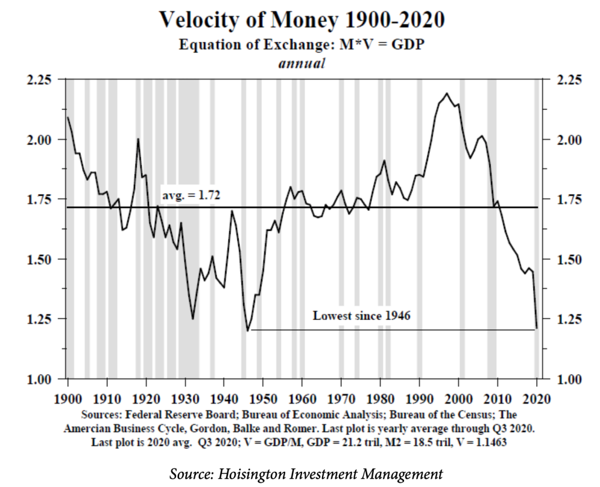
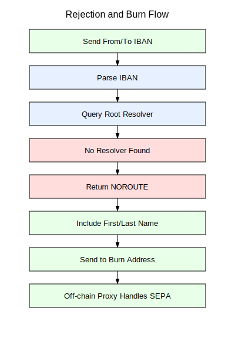
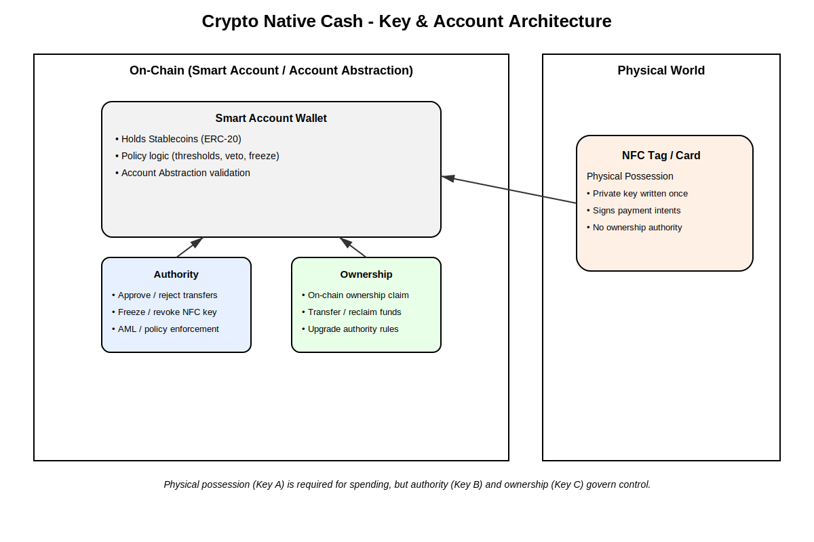
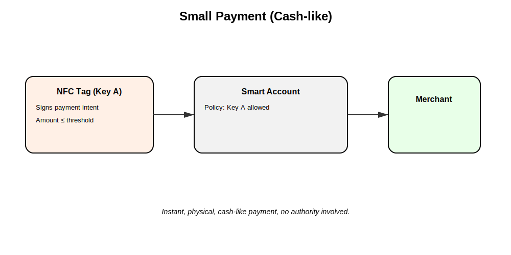
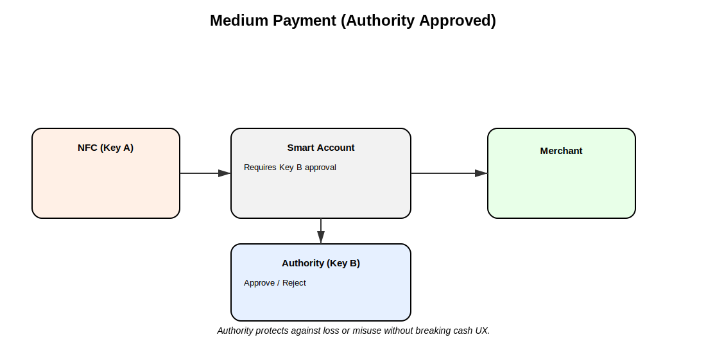
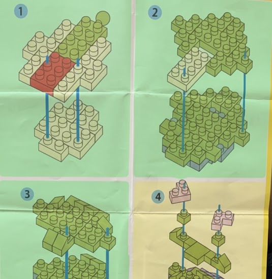
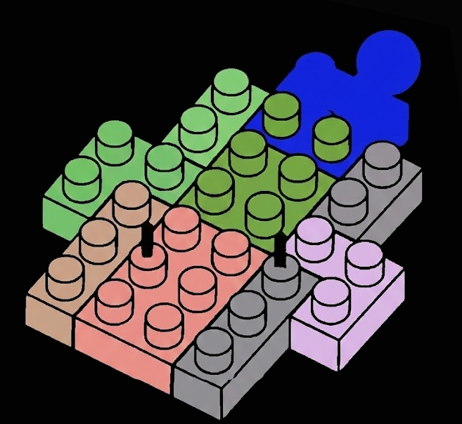

# Sovereign Stack: An Industrial Lightbook [v0.1]

A Recursive Manifesto for Industrial Sovereignty, Velocity Economics, and the
Physicalization of Trust.

_Table of Contents_

#### Part I: The Philosophical & Sociological Perspective

1.  _The Syndicate Critique_: Anatomy of the "eez" and the Capture of
    Permissionless Rails
2.  _The Loneliness of the Virtual_: Sociology of Detachment and the
    "Beep-to-Verify" Cohesion
3.  _Fukuyama’s High-Trust Thesis_: Modeling Trust as an Automated Protocol
    Byproduct
4.  _The Sovereignty Manifesto_: Reclaiming the "Tools for Sovereignty" from the
    Banking Backend

#### Part II: Monetary Policy – The Velocity Engine

5.  _Beyond Sound Money_: Scarcity creates stagnation, velocity ($V$) is the
    primary driver of output ($Q$)
6.  _Velotile Assets & Forex Routing_: Designing for Instant
    $\text{Yuan} \leftrightarrow \text{EURe}$ Swaps without the SWIFT Tax
7.  _Elastic Supply & The Security Salary_: How MMT-Driven Inflation Funds the
    L1 Miners and L2 Maintainers

#### Part III: Recursive Technical Architecture (L1–L4)

8.  _L1: The Sahara Node_: The 64 kbit/s "PoW Rock" (ETC) as the immutable
    physical anchor
9.  _L2: Elysium Quantum Backbone_: High-throughput (600 Gbit/s) Based Rollup
    with ML-DSA Hardening
10. _L2/L3: Commodity Based Rollups_: Specialized Regional Rollups for Local
    Liquidity and Resource Settlement
11. _L3/L4: Based Nano-Rollups_: Using $\log N$/Logtrees to Scale State Updates
    for Million Sensors/Actuators

#### Part IV: Industrial Oracles & Actuators

12. _Heartbeat Oracles_: Secure Element-based Proof of Productivity ($Q$) and
    Hardware Health
13. _Physical Action Oracles (Actuators)_: The "Code is Law" Kill-Switch

#### Part V: The Recycling Game & Edge AI

14. _AI-Enhanced Infrastructure_: Smart Containers with Computer Vision for
    Waste Management
15. _Recycling Bottle NFTs and the Incentivization of Social Labor_

#### Part VI: Identity, Security & Governance

16. _The SIWE-OIDC Bridge_: Gating Federated Web 2.5 via Hardware Wallets
17. _TinyMeritRank_: Sybil-Resistant Status via Personalized PageRank and
    Soulbound AI Agents
18. _3-Factor Sovereign Auth_: Combining `NFC` Badges, Smartphones, and
    Passwords for Tiered Access
19. _The Miner DAO_: Formalizing the L1 Power Block as a Check against L2
    "Syndicate" Capture
20. _DSLA (Decentralized SLA)_: The Trustless Liability Layer
21. _The Maintenance Shift_: A Nash Equilibrium Proof for Sustainable Industrial
    Maintenance

#### Part VII: Sovereign Finance & Infrastructure

22. _Crypto-Native Cash_: The Consortium Model
23. _deIBAN & deSWIFT_: The On-Chain Banking Stack
24. _Vibe-Collateralized Bonds_: Reputation-backed Tranches for Industrial
    Inventory
25. _Geographic Hash-Maps (Regional DAOs)_: The Miner’s Forge
26. _Proof-of-Green-Energy (PoGE) Oracles_: The Zero-Knowledge ESG Shield
27. _The Grid-Stabilization Marketplace_: Turning Mining into an Essential
    Utility
28. _Hardware Lifecycle DAO_: The Secondary Market for "Antique Silicon"

#### Part VIII: Market Dynamics & Protocol Neutrality

29. _L2 Diversity Scorecards_: Real-Time Monitoring of "Inclusion Latency"
30. _Prover-as-a-Service (PaaS) Auctions_: The Open Market for Cryptographic
    Truth
31. _Cross-Domain Intent Mempools_: The "Neutral Ground" for Multi-Chain
    Sovereignty
32. _TEE-Based Builders_: Enforcing Neutrality in Block Construction

#### Part IX: Inter-DAO Coordination & Transparency

33. _Inter-DAO Escrow (The "Treaty" Tool)_: Mutual Stake Management
34. _The Veto Dashboard_: The "Big Red Button" for the Anarchy DAO
35. _The "Social Slag" Archive_: The Permanent Ledger of Broken Promises

#### Part X: Infrastructure Resilience & Defensive Topology

36. _The Checkpoint Guild_: State-as-a-Service (StaaS) & The "Sneakernet"
37. _The Sovereign Mesh_: Hackerspace Interconnects & Local IXPs
38. _The Vibe-Shield_: Reputation-Gated Networking

#### Part XI: Advanced AI & Tokenomics

39. _Web3 Collateralized Bonds_
40. _Prediction Markets for the Microblock Industry_
41. _Merit-Driven Token Distribution Evolution_
42. _Extending ENS (Ethereum Name Service) with IBAN_
43. _Crypto Native Cash_: p2p physical crypto cash
44. _Parsing instructions and genAI microblock sets_
45. _Vibes is all you need_: Resonant Meritocracy
46. _Governance for Decentralized Autonomous Organizations_

# Part I: The Philosophical & Sociological Perspective

## 1. The Syndicate Critique: Anatomy of the "eez" and the Capture of Permissionless Rails

The "Syndicate" (or eez: Ethereum-Enterprise-Zone) represents the modern
institutional capture of decentralized infrastructure. In the early days, the
promise of the Cypherpunk movement was a neutral, ownerless, and permissionless
substrate. However, as the ecosystem matured, a convergence of interests between
large-scale node operators, TradFi giants, and enterprise software firms created
a "walled garden" within the decentralized web. The Mechanism of Capture The
"eez" does not destroy the blockchain, it domesticates it. The Syndicate exerts
control through **three primary vectors**:

1. **The Cloud Monopoly**: Over 60% of Ethereum nodes run on centralized cloud
   providers like AWS or Hetzner. If the "Syndicate" dictates a policy change
   (e.g. OFAC compliance), the physical infrastructure is already centralized
   enough to enforce it.

2. **The Governance Slush Fund**: DAOs, originally intended for community
   coordination, have been hollowed out. Decision-making is often concentrated
   in the hands of a few whales or venture entities that operate as a cartel,
   prioritizing short-term liquidity over long-term technical sovereignty.

3. **The Professionalized Middleman**: Entities like Nethermind, Gnosis, and
   major CEXs form an interlocking directorate. They provide the Enterprise
   Rails that make blockchain "safe" for banks like Deutsche Bank, but in doing
   so, they sacrifice the censorship resistance that makes blockchain valuable
   in the first place. The Result: Cypherpunk Dystopia The current state is a
   "Cypherpunk Dystopia" where:
   - P2P becomes Gold: Peer-to-peer cash is treated as a speculative asset to be
     hoarded, not spent.

   - Programmable becomes Banking Backend: Smart contracts are used to recreate
     the same exclusionary logic of the legacy `SWIFT` system, just with faster
     settlement.

   - Identity Crisis: Real humans are replaced by Attention-Farming bots, while
     the actual value-creators stay on the sidelines, afraid of being rejected
     by a system that only values "number go up".

## 2. The Loneliness of the Virtual: Sociology of Detachment and the "Beep-to-Verify" Cohesion

In the current digital landscape, the **"Cypherpunk Dystopia"** has manifested
not only as a loss of financial privacy but as a **profound sociological
detachment**. As industrial production and social coordination have migrated to
abstract, cloud-based environments, the human participant has been reduced to a
set of telemetry data or a wallet address. This "Virtual Loneliness" is a
systemic failure that threatens the stability of decentralized organizations.

### The Detachment Crisis

The modern worker, especially within DAOs, faces a "double-blind" detachment
that erodes the foundation of cooperative labor:

- From the Product: Contributors often write code or manage liquidity for
  protocols that lack any physical manifestation. This leads to what
  sociologists call Anomie, a breakdown of social bonds caused by a lack of
  tangible connection to the community's output.

- From the Peer: Digital-only interactions are "low-signal". Discord and Zoom
  lack the biochemical and psychological feedback of physical presence. The
  result is a Low-Trust Equilibrium where betrayal is cheap because the "other"
  is merely a pixelated avatar.

[Beep `NFC` tiny badge to recognize each other](https://zora.co/coin/base:0xd79a99379feeca8fe4490d2eccb851885d9dda54)

### The Remedy: Physicalizing Trust via "Beep-to-Verify"

The Unified Sovereign Stack introduces the NFC-enabled Physical Badge not as a
tool of surveillance, but as an Identity Anchor. We utilize "Beep-to-Verify" as
a ritual of social cohesion.

- **Social Oracles:** When two sovereign contributors meet physically (at a hub,
  factory, or conference), tapping their NFC badges (utilizing SIWE + Dual-Mode
  NFC) creates a **Social Heartbeat on-chain**.

- **The Dopamine of Recognition:** Unlike a password prompt, the physical "beep"
  provides immediate sensory feedback. Drawing from James Carey’s Ritual
  Communication Theory, the act represents shared beliefs rather than just data
  transmission. It confirms: "You are real, I am real, and we both belong."

- **Vibe-Identity:** These interactions are pushed to the Agentic Social Layer
  (L3). They aren't just logs, they are reputation boosters. A developer
  physically interacting with peers gains "Vibe Weight" in the TinyMeritRank
  system, a metric that "Syndicate" bots cannot simulate.


Research by Waber et al. (MIT Media Lab) on "Sociometric Badges" proves that
physical cohesion and face-to-face interaction patterns are directly correlated
with higher productivity and job satisfaction. By giving people a way to "show
their company" and influence the "Vibe" of the entity through physical presence,
we solve the identity crisis of the remote worker.

## 3. Fukuyama’s High-Trust Thesis: Modeling Trust as an Automated Protocol Byproduct

In his seminal work Trust: The Social Virtues and the Creation of Prosperity,
Francis Fukuyama argues that a nation’s well-being and its ability to compete
are conditioned by a single, pervasive cultural characteristic: the level of
trust inherent in the society. Historically, **"High-Trust" societies (e.g.
Germany, Japan) prosper** because they possess Social Capital, allowing for
flexible, large-scale organizations that do not require constant legal
oversight. Conversely, "Low-Trust" societies are burdened by "transaction
taxes",the endless need for lawyers, contracts, and enforcement. With the
Automation of Social Capital, the Unified Sovereign Stack treats Fukuyama's
thesis not as a cultural goal, but as an engineering requirement. We move from
"Trust as a Virtue" to **"Trust as an Infrastructure"**. By automating the
mechanisms of social capital, we enable decentralized entities to scale with the
efficiency of a high-trust nation-state, regardless of the participants'
geographic or cultural backgrounds.

1. **Trust as an Afterthought:** In a legacy system, trust is a manual effort.
   You must "vet" a partner, "audit" a firm, or "verify" a resume. In our stack,
   trust is the byproduct of the interaction. When a Maintenance Contributor
   (Tier 2) interacts with the **Federated Web 2.5 tools**, their authority is
   automatically verified by the `SIWE-OIDC` Bridge.

2. **`DSLA` (Decentralized SLA) as the Friction-Killer:** We replace the "Legal
   Tax" with the "Protocol Penalty". In a low-trust environment, a breach of
   contract results in a multi-year lawsuit. In the Sovereign Stack, the `DSLA`
   contract on the Based Rollup acts as a real-time arbiter. If the **Heartbeat
   Oracle or Actuator Oracle detects a failure** in service, the **penalty is
   programmatic and immediate**. In order to model the High-Trust Equilibrium,
   we model the interaction between DAO members as a Reputation-Weighted Game.
   - **The Matthew Effect vs. The Mark Effect:** While the "Syndicate" rewards
     the rich (the Matthew Effect), our stack utilizes TinyMeritRank to reward
     those who contribute to the "Health and Resilience" of the organization
     (the Mark Effect).

   - **The Mark of Quality:** Using Personalized PageRank (PPR), trust flows
     from "Seed Sovereigns" to new contributors. This creates a high-trust
     "Vibe" within the network graph. If a new node is "Beep-verified" by
     multiple high-reputation nodes via their `NFC` Badges, that node’s social
     capital increases exponentially. Trustless Liability vs. Human Connection
     Paradoxically, by making the technical part of trust "trustless" (via
     `DSLA` and `PoW`), we free up human cognitive load for actual connection.

   - **The "Invisible Handover":** In the Sovereign Banking Stack, the use of
     `deIBAN` and `deSWIFT` means a user in South Africa can pay a developer in
     China without worrying about the interbank trust chain. The "Sovereign
     Account" handles the trust-bridge via the Based Rollup.

   - **Social Cohesion:** Because the "Boring Reality" of payment and
     verification is handled by the stack, the "Beep-to-Verify" interaction at
     the local pub or conference becomes a moment of genuine sociological
     bonding rather than a security check.

 By
merging the
[NFC Social Badge with a hardware-based Gachapon interface](https://x.com/Citrullin/status/1985770447850418617),
we transform complex smart-contract interactions into a tangible experience. The
machine acts as a Physicalized Based Rollup Node. A user "beeps" their badge,
the machine verifies their TinyMeritRank and may engage with the `SIWE-OIDC`
Bridge. As a result, the machine may dispense physical assets, commodity tokens,
hardware parts, or "Rare" industrial `NFTs`, instantly.

## 4. The Sovereignty Manifesto: Reclaiming the "Tools for Sovereignty" from the Banking Backend

The Sovereignty Manifesto is the ideological core of the Unified Sovereign
Stack. It is a "joke" for those who realize that the current "Decentralized
Finance" (DeFi) space is largely a faster, (hopefully) more transparent version
of the legacy banking backend, still controlled by a "Syndicate" of centralized
actors. This manifesto is the roadmap for a strategic exit from those captured
rails into a truly autonomous, multi-polar industrial system.

- **The Great Unbundling:** Rejecting the Unified Backend, The "Syndicate" (eez)
  operates on a "One Chain, One Policy" model, where regulatory capture at the
  sequencing layer eventually dictates who can participate. We reject this.

- **The Multi-Rail Mandate:** We treat any centralized payment rail, be it a
  CBDC, a "domesticated" L2, or even a legacy interbank system, as a mere
  Commodity Layer. You should be able to "swap in and out" of these rails as
  easily as choosing a shipping provider.

- **Sovereignty as a Choice:** If a rail becomes too "clean" (censored), the
  Sovereign Stack shifts its weight to the Sahara Node (L1) or a Commodity Based
  Rollup (L2) in a friendlier jurisdiction. We don't fight the bank, we make the
  bank irrelevant to our internal industrial logic. The Tools of Autonomy true
  sovereignty requires a specific kit of parts that cannot be "turned off" by a
  centralized provider:

1. The Sahara Node (The Rock): A `PoW` settlement layer that syncs at 64 kbit/s.
   It is the only "Proof of Work" anchor resistant to the accumulation effects
   that plague Proof-of-Stake. It is the final arbitrator of truth when the
   high-speed backbones fail or become compromised.

2. Based Nano-Rollups (The Mesh): Recursive scaling that allows local factories
   (like the "Tinyblock" model) to settle their own state. Your industrial
   output (clamping force, color accuracy) is verified locally and settled
   globally via $\log N$ efficiency.

3. **The Actuator Oracle (The Enforcer):** Moving from "Watching" to "Doing". If
   a `DSLA` is violated, the code has the physical power to cut power, lock
   valves, or pause machinery. This is the "Code is Law" principle applied to
   physics. Resonant Meritocracy vs. Plutocracy: We replace the "One Token, One
   Vote" plutocracy with TinyMeritRank.
   - **The Syndicate Check:** Influence in the stack is earned through
     Personalized PageRank (PPR). It flows from "Seed Humans" who have proven
     their commitment to advancement. **You cannot "buy" your way to the top of
     the MeritRank**, you must "vibe" your way there through consistent,
     high-quality industrial maintenance.

   - Soulbound Identity: Your reputation is tethered to your `NFC` Social Badge.
     It is not an asset to be traded on a DEX, it is a permanent record of your
     contribution to the sovereign entity.

4. The "Boring Reality" as a Revolutionary Act! We embrace Federated Web 2.5.
   (`NextCloud`, `Gitea`, `Matrix`, `Mastodon` etc.) because waiting for a
   "perfect" Web3 is a trap.
   - Pragmatic Sovereignty: By gating legacy tools with `SIWE-OIDC`, we build a
     sovereign "Corporate Headquarters" today.
     [Watch SWIE SSO OIDC Demo videon on x(formally twitter)](https://x.com/Citrullin/status/2031068607606599718)

   - The Maintenance Shift: **We don't work for "Clout" or "Yield".** We work to
     maintain the protocol because we are stakeholders. If the code is buggy,
     our `BASEFEE` redirects drop. If the Heartbeat Oracles stay green, the
     sovereign entity prospers.

# Part II: Monetary Policy – The Velocity Engine

## 5. Beyond Sound Money: Why Scarcity Creates Stagnation and why Velocity ($V$) is the Primary Driver of Industrial $Q$

The "Sound Money" narrative, anchored in absolute scarcity and deflationary
pressure, has long been the holy grail of early cypherpunk economics. However,
within the context of the Unified Sovereign Stack, we identify a critical
failure in this model: Scarcity-induced Stagnation. When an industrial actor
views their currency primarily as a "Store of Value" to be hoarded, they
naturally withdraw it from the productive economy. This leads to a decline in
capital investment, or what we call "Industrial Slop". Which inherently leads to
a "Corporate Slop" environment.

### 5.1. The Stagnation of the Hoarder (The Liquidity Trap)

In a deflationary "Sound Money" regime, the rational actor is incentivized to
wait. Why invest in a new NPU-driven robot arm or a recycling sensor today if
the currency used to buy it will be worth 10% more next year?

- The Opportunity Cost of HODLing: This hoarding behavior causes the Velocity of
  Money ($V$) to collapse.

- The Result: Economic friction increases, innovation cycles slow down, and the
  Industrial Output ($Q$),representing the real-world advancement of the
  stack,stagnates. The currency becomes a museum piece rather than an industrial
  lubricant.



### 5.2. The Non-Linearity of Circulation: A Synthesis of Growth and Instability

The Sovereign Stack reinterprets the classical Equation of Exchange, $MV = PQ$,
as a dynamic control system rather than a static identity. In traditional
monetary theory, Velocity ($V$) is often treated as a residual or a behavioral
constant. We propose that $V$ is the primary exogenous variable, the "heartbeat"
of the network, that dictates the ceiling of Industrial Output ($Q$).

#### 5.2.1. Theoretical Foundations: From Solow to Minsky

The initial "Sovereign Thesis" posits that maximizing $V$ yields a corresponding
maximization of $Q$. However, a rigorous mapping of velocity to real-world
output requires accounting for marginal utility and systemic friction. Drawing
from Solow (1956) and the Cobb–Douglas Production Function, we define the
relationship between circulation and coordination as one of diminishing marginal
returns. Initial increases in $V$ facilitate the division of labor and reduce
Coasean transaction costs. However, as the network nears full utilization, each
marginal unit of velocity produces less incremental $Q$:

$$ Q(V) = k V^{\alpha}, \quad 0 < \alpha < 1 $$

Here, $\alpha$ represents Productive Elasticity, the efficiency with which a
"handshake" (transaction) translates into a "brick" (work unit).

To bridge the gap between growth theory and financial reality, we integrate the
Financial Instability Hypothesis (Minsky, 1992). As the network nears full
utilization, "Overheating" manifests as speculative churn, high $V$ driven by
recursive arbitrage and automated trading loops that do not map to "bricks
manufactured" or "code merged". To model this transition from productive
coordination to entropic churn, we introduce a saturation decay constant
$\delta$, resulting in the Sovereign Output Function:

$$ Q(V) = k V^{\alpha} e^{-\delta V} $$


#### 5.2.2. The Three Regimes of the Sovereign Stack

This mathematical formulation (visualized in Figure 5.2) bifurcates the economic
state into three distinct phenomenological regions based on the interaction of
$\alpha$ (productivity) and $\delta$ (instability):

- _The Underutilized Regime ($V < V_{opt}$)\_: Characterized by liquidity traps
  or high friction. The economy is "sluggish", potential coordination is lost to
  hoarding.
- _The Optimal Regime ($V \approx
  V_{opt}$)_: The "Switzerland Sweet Spot". This
  peak occurs at $V = \alpha / \delta$.
  At this point, velocity is perfectly synchronized with the industrial capacity
  of the DAO. The sheer volume of industrial advancement "soaks up" the money
  supply, allowing for a productivity-driven deflationary environment where the
  purchasing power of the currency rises due to surplus output.
- _The Overheated Regime ($V > V_{opt}$)_: The $\delta$ term dominates. High
  velocity represents noise rather than signal leading to speculative bubbles
  and eventual systemic contraction.

#### 5.2.3. Quantitative Dynamics: The Productivity-Inflation Nexus

The interaction between systemic throughput and monetary stability is visualized
in the model. Industrial Output ($Q$) is represented in purple, while the
Inflation Rate ($\pi$) is represented in black. We model the Inflation Rate as a
function of the gap between Money Supply ($M$) and adjusted Output ($Q$):

$$ \pi(V) = a(M - \beta Q(V)) + b(M - \beta Q(V))^2 $$

The model reveals a critical Stagnation Trap at low velocity. Inflation spikes
because there are too few goods produced to justify the money supply.
Conversely, in the Overheated Regime, as productive output (purple) decays due
to chaos, inflation (black) spikes non-linearly. The "Switzerland" situation
occurs at the base of the black curve, where $\pi$ is minimized because $Q$ is
maximized.

#### 5.2.4. Parameter Selection and Protocol Telemetry

To ensure the "Sovereign Engine" remains within the Optimal Regime, the protocol
monitors $\alpha$ and $\delta$ as real-time telemetry:

- **Elasticity ($\alpha = 0.7$)**: Calibrated to ensure the system is highly
  responsive to coordination while respecting physical and cognitive limits of
  the DAO's maintainers.
- **Decay ($\delta = 0.15$)**: A sensitivity variable for speculative churn. As
  $\delta$ increases (measured by on-chain arbitrage frequency), the "Optimal
  Band" narrows, signaling the protocol to increase burn mechanisms.
- **Inflation Sensitivity ($b$)**: The squared term in the inflation function
  ensures that once the system redlines into the speculative zone, the cost of
  instability rises exponentially, triggering automated friction to protect the
  "Velotile" balance.

#### 5.2.5. Decomposition of Velocity: Signal vs. Noise

To refine interventions, we decompose total velocity:

$$ V = V_p + V_s $$

Where $V_p$ represents productive transactions (wages, procurement) and $V_s$
represents speculative flows. If $V_s \gg V_p$, the system detects an
"Elasticity Drop" ($a \to 0$). This triggers the Velocity Target Band policy:
the protocol increases friction specifically targeting high-frequency recursive
loops to drive the system back toward the productive frontier.

### 5.3. Sociological Implications: Velocity as Resonant Meritocracy

Moving beyond the mathematical, $V$ serves as a sociological status signal.
Within the Resonant Meritocracy, the hoarding of currency, represented by
$V \to 0$ at the individual level, is viewed as a withdrawal of trust from the
system.

By rewarding "Velotile" behavior through the TinyMeritRank system, we align
individual incentives with the macroeconomic health of the stack. A high
personal $V$ score signifies an actor who is actively facilitating industrial
throughput, thereby increasing their social capital. In this framework, the
currency is no longer a store of value to be locked away, but a Dynamic Signal
of Productivity that must flow to maintain its relevance.

### 5.4. Breaking the Cycle of "Slop"

Industrial "Slop" occurs when capital is misallocated because the currency is
too "expensive" to move. By reclaiming the rails from the banking backend, we
enable:

1. Instant Settlement: No more 3-day interbank wait times, the Based Rollup
   settles at the speed of the AI backbone.

2. Micropayment Fluidity: Paying a sensor for a "Heartbeat" becomes feasible,
   allowing for granular control of industrial processes.

3. Physical P2P Cash: Using `NFC Tiny Discs` (Banknotes) to maintain physical
   velocity in the "Boring Reality" of daily life.

### 5.5. Phase-Shifted Entropy: The Dynamic Seed-Set Rotation (DSSR) Protocol

To mitigate the risks of early-stage "State Capture" and "Entropy Leakage", we
propose the Dynamic Seed-Set Rotation (DSSR) protocol. This mechanism governs
the transition of the TinyMeritRank trust-roots from a curated, high-integrity
"Genesis Circle" to a fully stochastic, decentralized selection process.

#### 5.5.1. The Proximity Dynamic & Merit Incentive

The DSSR operates on a periodic epoch basis. During each epoch, the system
designates a subset of nodes as "Root Seeds" for the Personalized PageRank (PPR)
calculation. This creates a Proximity Dynamic: network participants are
incentivized to optimize their "Vibe Weight" and industrial output (Q) to
maintain topological closeness to the current seed-set. Because the seed-set is
dynamic, actors cannot settle into a static rent-seeking position, they must
continuously demonstrate utility to remain within the "Resonant Radius" of the
shifting roots.

#### 5.5.2. The DAO-Mediated Candidate Pool

Rather than immediate random selection from the entire network, which is
vulnerable to sophisticated Sybil attacks in low-liquidity environments, the
seed-set is drawn from a Candidate Ledger.

- **Admission**: The Sovereign Board (DAO) approves nodes for the Candidate
  Ledger based on verifiable physical telemetry (Heartbeat Oracles) and
  historical uptime.
- **Stochastic Selection**: From this vetted pool, a Verifiable Random Function
  (VRF) selects the active "Root Seeds" for the upcoming epoch. This prevents
  the DAO from hand-picking the active controllers while ensuring all potential
  controllers meet the baseline physical sovereignty requirements.

#### 5.5.3. The Diffusion Threshold

The transition from a small, DAO-curated pool to a large-scale algorithmic
rotation is governed by the Network Diffusion Coefficient ($\mathcal{D}$). Once
the network reaches a critical threshold of token distribution (measured by the
Gini coefficient of Merit-weight) and geographic node dispersion, the DSSR
automatically expands the Candidate Ledger to include all nodes above the 90th
percentile of Reputation Score.

#### 5.5.4. Security Implications

By cycling seeds, the stack introduces "Moving Target Defense" (MTD) logic into
the social layer of the protocol. Even if an adversary captures a segment of the
"Genesis Circle", the scheduled rotation of roots ensures that the network’s
"Source of Truth" remains a moving target, effectively neutralizing long-range
Sybil influence.

### 5.6. The Evidence-Based Appeal & Sovereign Court (EASC)

To prevent "Syndicate" capture or "Social Slag" errors from permanently
excluding valid contributors. The EASC ensures that any rejection from the "Seed
Set" or the "Candidate Ledger" is based on falsifiable on-chain data rather than
subjective bias.

#### 5.6.1. Rejection via "On-Chain Evidence"

A rejection is not a silent failure but a signed attestation of non-compliance.

- **Proof of Failure (PoF)**: Rejections must cite specific on-chain telemetry
  from Heartbeat Oracles (physical failure) or DSLA breach logs (contract
  failure).
- **The "Social Slag" Trigger**: Frequent rejections without evidence are
  themselves recorded as Social Slag penalizing the rejecting entity's own Vibe
  Weight.

#### 5.6.2. The Tiered Appeal & Escalation Ladder

To handle disputes, the protocol follows a three-stage escalation process:

1. **Tier 1 Algorithmic Re-Audit (The Prover Appeal)**: The rejected party can
   trigger a "Re-Audit" by staking a small amount of Velotile Assets. A randomly
   selected 7-member committee of Soulbound AI Agents re-evaluates the submitted
   telemetry using a different PPR (Personalized PageRank) seed-set to check for
   topological bias.

2. **Tier 2 The Sovereign Jury (Social Verification)**: If the automated audit
   is contested, the case moves to a human jury.
   - **Evidence**: The appellant provides a "Beep-to-Verify" record from at
     least three peers with High TinyMeritRank who can physically attest to the
     appellant's industrial output (Q).
   - **Incentive**: Jurors are paid via BASEFEE redirects, but their own
     MeritRank is slashed if they are found to be part of a "Circular Reporting"
     (Sybil) ring.

3. **Tier 3 The DAO Veto (The Supreme Court)**: For high-stakes rejections (e.g.
   permanent blacklisting of a regional node), the case escalates to a Miner DAO
   Veto Vote.
   - **The Physicality of the Veto**: Because miners control the Sahara Node
     (L1), they can refuse to sequence the state update that enforces the
     rejection until the dispute is settled.
   - **Quorum**: Requires a 66% majority of the Miner DAO to override a
     "Sovereign Board" rejection.

#### 5.6.3. The "Restoration Loop"

If the appeal is successful:

- The Penalized Rejector: The entity that issued the initial false rejection
  faces an Automatic Multiplier on their security stake for the next epoch,
  treating their error as a form of "Network Friction".

### 5.7. The Issuance Circuit Breaker & Negative Elasticity (Burning)

The protocol’s issuance function $\mathcal{I}$ is not a linear constant but a
derivative of the Industrial Output ($Q$) and Velocity ($V$). To prevent the
"Recursive Leverage" traps seen in current DeFi (like the Aave/rsETH restaking
contagion), the Sovereign Stack employs a hard "Circuit Breaker" to decouple
token supply from speculative churn.

#### 5.7.1. The Zero-Issuance Threshold (The Halt)

Issuance enters a Halt State when the Efficiency Ratio ($\eta = \frac{Q}{V}$)
drops below a critical floor ($\eta_{min}$).

- **Logic**: If velocity increases (high trading/lending volume) but the
  Heartbeat Oracles do not report a corresponding increase in physical
  manufacturing ($Q$), the protocol identifies the activity as "Noise"
  (speculative leverage).
- **Action**: New issuance ($\mathcal{I}$) hits absolute zero. The "Security
  Salary" for miners and maintainers shifts entirely to BASEFEE redirects,
  ensuring no new supply enters an overheated, unproductive market.

#### 5.7.2. Negative Elasticity: The "Thermodynamic Drain" (Burning)

If $Q$ drops below a survival threshold (e.g. massive industrial shutdown or
network attack), the protocol enters Contraction Mode:

- **The Burn**: The "Recycling Drain" increases its capture rate. A portion of
  the existing supply is systematically burned from the Sovereign Board’s
  treasury or through a "Social Slag Tax" on high-velocity, low-output accounts.
- **Purpose**: This creates a "monetary vacuum" that forces the value of the
  remaining tokens up by reducing supply, compensating for the lack of physical
  production and preventing a currency death-spiral.

#### 5.7.3. On-Chain Evidence for Halting

Unlike legacy DeFi protocols that require manual "Emergency Pauser" multisigs
(which failed to stop the 2026 Kelp DAO drain in time), the Sovereign Stack's
halt is Programmatic and Evidence-Based:

- **Heartbeat Failure**: If $>30\%$ of registered industrial actuators report a
  "DSLA Breach" or power failure, issuance halts within a single block.
- **Oracle Divergence**: If the price of the "Velotile Asset" deviates from the
  Industrial Index (the real-world cost of raw materials produced by the stack),
  the breaker triggers.

## 6. Velotile Assets & Forex Routing: Designing for Instant $\text{Yuan} \leftrightarrow \text{EURe}$ Swaps without the SWIFT Tax

In the Sovereign Stack, we treat cross-border capital flow as a problem of
network topology rather than permissioned bureaucracy. Traditional Forex (FX)
relies on the correspondent banking system connected by SWIFT messages. This
creates the "SWIFT Tax": a compound of intermediary bank fees, delayed
settlement ($T+2$), and opaque markups. We replace this with Velotile Assets and
Value-Packet Routing (VPR) on Based Rollups.

### 6.1. The "Velotile" Asset Class

A Velotile Asset is a hybrid monetary instrument optimized for $V$ (Velocity)
rather than long-term $M$ (Money Supply).

- **The Flow-State Logic**: Unlike traditional stablecoins which are "stagnant"
  in vaults, Velotile Assets exist primarily during the "Swap-and-Route" phase.
  They are fragmented into Standardized Financial Packets (SFPs) to maximize
  mesh throughput.
- **Atomic Finality**: By using Based Rollups (L2/L3), a
  $\text{Yuan} \to \text{EURe}$ swap is atomic. The asset only exists in a
  "volatile" state for the milliseconds it takes to cross the router,
  eliminating the risk of price slippage during the cross-border hop.

### 6.2. Value-Packet Routing (The SWIFT Bypass)

Instead of a correspondent bank chain, we utilize a Double-Decker Stablecoin
Sandwich settled on the Elysium Backbone.

- **On-Ramp**: A factory in China locks local $\text{Yuan}$ into a Commodity
  Based Rollup.
- **The Packet Hop**: The VPR fragments the intent into SFPs. The L2 router
  identifies the most liquid path (e.g.
  $\text{CNH} \to \text{ETC} \to \text{EUR}$) using the Bank DAO’s competitive
  liquidity mesh.
- **The Based Rollup Advantage**: Because the sequencer is "Based" (outsourced
  to the L1 Miners), the transaction is bundled with industrial heartbeats,
  ensuring it bypasses banking cutoffs or weekend delays.
- **Off-Ramp**: The recipient in the EU receives EURe in their Sovereign Smart
  Account instantly.

### 6.3. The Dual-Penalty System: Slag vs. Breach

To eliminate the "risk premium" associated with traditional FX, we enforce
strict protocol-level performance:

- **The Slag Penalty**: Bank-LPs are micro-penalized for maintaining "Expired
  State". If an SFP passes its TTL (Time to Live) block height without
  settlement or rejection, the LP pays a "State-Bloat Tax".
- **The Breach Slash**: If an LP locks a packet but fails to fulfill it before
  the TTL, they face a Sovereign Breach. The user then triggers a Pull-Based
  Reclamation to recover funds, while the LP’s stake is slashed to pay the user
  a "Latency Rebate".
- **Risk Settlement**: An LP can attempt to settle after the TTL to avoid a
  Breach Slash, but they do so at the risk of the user "reclaiming" the funds
  first, which permanently shutters the settlement window.

### 6.4. Geopolitical Resilience: The Multi-Polar Rail

By moving FX routing to the Sovereign Stack, we create a Multi-Polar Rail
indifferent to the "Syndicate's" banking policy.

- **Neutrality**: $Yuan$ and $EURe$ are treated as equal protocol-level
  commodities.
- **Accessibility**: A regional bank in the Global South or a small manufacturer
  in the German Mittelstand can access institutional exchange rates simply by
  running a Commodity Based Rollup node on a standard connection.

## 7. Elastic Supply & The Security Salary: How MMT-Driven Inflation Funds the L1 Miners and L2 Maintainers

Traditional blockchain economics is obsessed with the "Sound Money" trope of
absolute scarcity ($M$). However, in a multi-speed industrial stack, fixed
supply leads to the "Security-to-Value Gap". If the productivity ($Q$) of the
L2/L3 industrial layers outpaces the market cap of the L1, the network becomes a
"honey pot" for 51% attacks. We solve this by applying Modern Monetary Theory
(MMT) and Elastic Supply mechanics to the protocol layer. We treat the protocol
as a sovereign issuer that prioritizes Full Employment of Security (Miners) and
Full Employment of Maintenance (Contributors) over artificial scarcity.

### 7.1. The Security Salary (MMT for Miners)

Unlike Bitcoin, which forces miners to rely on volatile transaction fees (the
"Fee-Only Trap"), the Sovereign Stack provides a Security Salary.

- **The Mechanism**: The L1 elastically increases the money supply ($M$) based
  on industrial throughput signals ($Q$).

- **Functional Finance**: In MMT, a sovereign entity cannot go "bankrupt" in its
  own currency. Similarly, the protocol prints enough tokens to ensure the hash
  rate remains at a "National Security" level of hardness. This subsidy is not
  "inflation" in the traditional sense, it is an investment in the Defensive
  Moat of the industrial world.

- **Energy Arbitrage**: Miners transition from "Speculators" to "Energy Utility
  Providers" with a stable, predictable income, ensuring the Sahara Node remains
  a rock-solid settlement layer even during market downturns.

### 7.2. The Maintenance Salary (MMT for Maintainers)

Maintenance is the "Boring Reality" that prevents "Industrial Slop". We fund the
Federated Web 2.5 and core client development through a Maintenance Fee
redirect.

- **The `BASEFEE` Redirect**: A portion of every transaction's `BASEFEE` on the
  Based Rollup is redirected to a Federated DAO Safe.

- **Elastic Support**: If the Heartbeat Oracles or `DSLA` metrics indicate that
  the protocol is under-maintained (e.g. rising latency, unpatched bugs), the
  Miner DAO can signal an elastic issuance boost specifically for the
  "Maintenance Treasury".

- **Alignment**: This ensures that Tier 2 Stakeholders are paid a professional
  wage to keep the "Industrial Glue" (`OIDC` bridges, Logtrees, etc.)
  functional.

  [Image: A "Circular Economy" diagram showing L1 Issuance flowing to Miners,
  and Transaction Fees/`BASEFEE` redirects flowing to Maintenance Contributors,
  both feeding back into Network Security and Productivity]

### 7.3. The "Mark Effect" vs. The "Matthew Effect"

We utilize issuance to fight the Syndicate's Accumulation Effect.

- **The Matthew Effect (The Syndicate)**: "To him who has, more will be given".
  Traditional PoS systems reward those who already hold the most tokens.

- **The Mark Effect (The Sovereigns)**: We reward those who do. By prioritizing
  issuance toward Miners (Physical Security) and Maintainers (Technical
  Advance), we ensure that new tokens flow to the active participants rather
  than the static hoarders.

### 7.4. Controlling Inflation via the "Recycling Drain"

MMT teaches that taxes do not fund spending, but instead control inflation by
removing money from circulation.

- **The Protocol Tax**: Fees burned on-chain and "Slashing" penalties for `DSLA`
  violations act as the "Recycling Drain".

- **The Balance**: When $V$ (Velocity) is high and $Q$ (Productivity) is
  growing, the protocol expands $M$. If the economy "overheats" or productivity
  drops, the protocol increases the "Burn Rate" to maintain price stability
  ($P$).

# Part III: Recursive Technical Architecture (L1–L4)

## 8. L1: The Sahara Node: The 64 kbit/s "`PoW` Rock" (ETC) as the Immutable Physical Anchor

The foundation of the recursive stack is the Sahara Node, an extreme
optimization of the Ethereum Classic (ETC) client. While the "Syndicate" (eez)
pushes for data-heavy Proof-of-Stake (PoS) consensus that requires
data-center-grade fiber, the Sahara Node is engineered for the "Boring Reality"
of global industrial constraints: the 64 kbit/s bandwidth limit.

### 8.1. The Engineering of the "`PoW` Rock"

The Sahara Node utilizes the Spiral/Olympia upgrade framework to strip the L1
node to its bare essentials. It operates as the "immutability anchor" for the
entire stack.

- Bandwidth Constraint (64 kbit/s): By implementing aggressive header-first
  synchronization and state-pruning, the node can maintain consensus over a
  standard voice-grade telephonic circuit. This ensures that even a
  solar-powered node in the Sahara Desert or a rural manufacturing hub in the
  Global South can act as a first-class citizen of the network.

- The Physicality of Work: We leverage ETChash (Thanos/Magneto) to maintain a
  physical tie to hardware. Unlike PoS, where "truth" is dictated by the largest
  capital holders (the Syndicate), the Sahara Node’s truth is anchored in the
  physical expenditure of energy,the only neutral arbiter in a multi-polar
  world.

### 8.2. Immutability as an Industrial Requirement

In the `Tinyblock industrial model`, a factory must know that a contract
governing a 20-year machinery lease or a `DSLA` for energy supply will not
change due to a "social fork" or governance whim.

- The Nolympia Precedent: We address the concerns of the "Nolympia" movement by
  keeping the L1 "clean". There are no complex DAO treasuries or experimentation
  layers on the Sahara Node. It is a "Boring Rock",an immutable settlement layer
  where $1 \text{ ETC} = 1 \text{ ETC}$, and the rules of the EVM are fixed.

- Security for the Mesh: The Sahara Node provides the "root of trust" for
  millions of Based Nano-Rollups. Even if a regional L2 backbone (like Elysium)
  faces a temporary blackout, the Sahara Node remains the "Air-Gap" that
  preserves the final state of the global industrial ledger.

### 8.3. The 64 kbit/s "Filter" against Centralization

The 64 kbit/s requirement is not just a technical spec, it is a Sociopolitical
Filter.

- Anti-Syndicate Design: If a blockchain requires 1 Gbit/s to sync, it naturally
  migrates to AWS/Google Cloud. By forcing the protocol to sync over 64 kbit/s,
  we make it impossible for the "eez" to centralize the L1.

  _Targeting the DA Challenge_: Note that 64 kbit/s is an ideal _goal_ for this
  architecture. With heavy compression, Zero-Knowledge (ZK) proofs, and a robust
  Data Availability (DA) layer sitting off-chain, achieving massive L2
  throughput while anchored to a low-bandwidth L1 is the grand challenge. If we
  can even reduce the L1 node bandwidth requirements down to 1 Mbit/s, that
  would be an amazing victory for decentralization.

- The People’s Anchor: This bandwidth limit ensures the network is owned by the
  "Innovative Fish",the small-scale miners and regional operators,rather than
  the "Sharks" of the banking backend.

  [Image: A diagram of a Sahara Node micro-device connected via a low-bandwidth
  satellite link, anchoring a complex recursive mesh of L2 and L3 rollups to the
  ETC blockchain.]

## 9. L2: Elysium Quantum Backbone: High-throughput (600 Gbit/s) Based Rollup with ML-DSA Hardening

If the Sahara Node is the "Immutable Rock", Elysium is the high-velocity
"Nervous System". Elysium is a Based Rollup, meaning it delegates its sequencing
entirely to the L1 Miners, but it operates at the speed of modern fiber-optic
backbones (600 Gbit/s). It is designed to handle the heavy lifting of industrial
coordination, AI-telemetry, and high-frequency settlement while remaining
quantum-secure.

### 9.1. The "Based" Advantage: Aligning with the Miners

By using a Based Rollup architecture (Ref: Taiko & Surge), Elysium eliminates
the need for a separate, centralized sequencer.

- L1 Alignment: Transactions on Elysium are sequenced by the same miners running
  the Sahara Node. This removes the "Syndicate" middleman and ensures that L2
  fees flow directly into the Security Salary of the L1.

- Liveness: As long as the Sahara Node is alive, Elysium is alive. There is no
  risk of a "sequencer outage" that has plagued other L2 solutions.

### 9.2. Quantum Hardening: Integrating ML-DSA (`Dilithium`)

The "Boring Reality" is that the cryptographic standards of today (ECDSA) will
not withstand the quantum computers of tomorrow. For an industrial stack
intended to govern 50-year infrastructure cycles, "wait and see" is not an
option.

- [`ML-DSA` (`Dilithium`)](https://csrc.nist.gov/projects/post-quantum-cryptography/post-quantum-cryptography-standardization)
  Integration: Elysium implements NIST-standard Module-Lattice-Based Digital
  Signature Algorithm (`ML-DSA`). This provides post-quantum security for the
  long-term integrity of the ledger.

- Hybrid Verification: For backward compatibility and efficiency, Elysium
  supports a hybrid model: standard ECDSA for daily "low-value" work, and
  `ML-DSA` for "Tier 3" board decisions, large treasury movements, and
  industrial baseline updates.

### 9.3. The 600 Gbit/s AI Backbone

Taiko with Elysium optimizations can be optimized for the 600 Gbit/s optical
interconnects that define modern AI data centers. Or corporate entities stick
with their Surge & Nethermind setup.

- Throughput for the Mesh: This high-bandwidth pipe is required to aggregate the
  millions of Heartbeat Oracles flowing from the L3 Nano-Rollups.

- Data Availability (DA): While the L1 is slow (64 kbit/s), Elysium utilizes
  high-speed DA layers to ensure that industrial logs and telemetry are
  available for Private AI Oracles to verify.

- L1/L2 Symmetry: Despite the speed difference, the state roots of Elysium are
  "flushed" to the Sahara Node, ensuring that the high-speed nervous system is
  always anchored to the immutable rock.

### 9.4. Market Opportunity: The Industrial Routing Hub

Clearinghouses for Velotile Assets and Forex Routing. From block builder, to
routing and liquidity provider. From Corporate Slophouse to IoT hub
infrastructure provider.

- [The Core-Geth PR by GravityLabs](https://github.com/ethereumclassic/core-geth/pull/5)
  Bringing `Dilithium`/Elysium specs to the core client, we bridge the gap
  between "experimental" and "industrial".

- Institutional Trust: Corporate entities (The "Sovereign Board Members") can
  trust Elysium because it combines the highest technical speed with the most
  conservative quantum protection.

## 10. L2/L3: Commodity Based Rollups: Specialized Regional Rollups for Local Liquidity and Resource Settlement

While the Elysium backbone handles global high-speed coordination, the Commodity
Based Rollup is the "Local Economy Engine". Designed specifically for the Global
South (South Africa, Africa, Middle East, SE Asia), these rollups prioritize the
Physical Reality of resources over abstract financial speculation. They serve as
the bridge between regional physical assets, minerals, energy, agricultural
output,and the global Unified Sovereign Stack.

### 10.1. The Sovereign Regional Rail

A Commodity Based Rollup (CBR) is a regional L2 or L3 that settles to the Sahara
Node (L1) but operates with local industrial parameters.

- Regional Sovereignty: Unlike "The Syndicate" which imposes a one-size-fits-all
  monetary policy, a CBR in Africa can tune its fee structures and liquidity
  pairs to match local harvest or mining cycles.

- Based Sequencing: By delegating sequencing to the L1 Miners, regional CBRs
  avoid the cost and centralization risks of running a local sequencer. This
  allows a regional bank or a cooperative of mines to launch a rollup with
  minimal technical overhead.

### 10.2. Resource-Backed Liquidity (The Anti-Imperialist Token)

In these regions, "Sound Money" is often synonymous with "Foreign Capital". CBRs
break this dependency by turning physical commodities into high-velocity
liquidity.

- Tokenizing the Ground: Copper, cobalt, or grain are registered via Heartbeat
  Oracles (telemetry from mining equipment/silos).

- Local Settlement: Instead of waiting for a USD-denominated bank wire from the
  West, local entities trade $Cobalt-Credits \leftrightarrow Local-Fuel-Tokens$
  instantly on the CBR.

- The "Commodity Peg": These rollups often use local "Velotile" assets pegged to
  the basket of resources they produce, ensuring that local purchasing power is
  protected from global FX volatility.

### 10.3. Market Opportunity: The VDSL/Legacy Infrastructure Bridge

CBRs are designed for the "Boring Infrastructure" available in developing
markets.

- Vectoring over Copper: Utilizing old telephone lines with VDSL2 Vectoring,
  these rollups can maintain 100 Mbit/s to 1 Gbit/s symmetrical speeds. This
  allows a rural bank node to act as a regional clearinghouse for the Sovereign
  Stack.

- Mesh Integration: They act as the "Parent" to millions of L3 Based
  Nano-Rollups (Logtrees) running on agricultural sensors or solar-grid
  actuators, aggregating local data before flushing it to the Sahara Node.

### 10.4. Game Theory: Decoupling from the Petrodollar

By using CBRs, regional powers enter a new Nash Equilibrium:

- The Choice: They can either continue paying the `SWIFT Tax` and remain subject
  to Syndicate sanctions, or they can route their internal trade through a CBR.

- The Result: The protocol-level neutrality of the Sahara Node ensures that no
  "Global North" entity can freeze the assets of a "Global South" Commodity
  Rollup. Trust is shifted from geopolitical alliances to the Actuator Oracles
  that verify the physical movement of the goods.

## 11. L3/L4: Based Nano-Rollups: Using $\log N$/Logtrees to Scale State Updates for Million Sensors/Actuators

In the "Boring Reality" of industrial scaling, the bottleneck is not just
transaction throughput, but state bloat. If every sensor on a factory floor or
every smart garbage container in a city had to update the global L2 state
individually, the system would collapse under the weight of its own metadata.
Based Nano-Rollups (L3/L4) solve this by implementing the $\log N$/Logtree
efficiency model.

### 11.1. The $\log N$ Efficiency Breakthrough

The core technical hurdle for an industrial mesh is the ability to prove the
state of a massive number of devices ($N$) without a linear increase in proof
size.

- The $\log N$ Principle: Utilizing the research found in the
  [$\log N$ and treemaps paper](https://zenodo.org/records/18239167) , we
  implement state treemaps where the complexity of verifying a state transition
  scales logarithmically rather than linearly.

- Logtrees: These are recursive data structures optimized for "Small Data"
  (heartbeats, sensor logs, actuator signals). Millions of individual L4
  "Nano-events" are summarized into a single Logtree root. This root is
  "flushed" to the L2 Elysium or Commodity Rollup, which in turn flushes its
  root to the L1 Sahara Node.

### 11.2. The Mesh Architecture: L4 to the "Sovereign Edge"

Nano-Rollups are designed to run on Federated Hardware, small, low-power NPUs
and microcontrollers (e.g. RISC-V with TEEs).

- L4 (The Device Layer): A smart garbage container uses a camera and local AI to
  identify a "`Rare Bottle NFT`". It records this on its local L4 Nano-Rollup.

- L3 (The Gateway/Regional Mesh): Local clusters of devices (a factory floor, a
  city block) aggregate their L4 logs into an L3 Based Nano-Rollup.

- The "Based" Nature: These rollups do not have their own consensus, they
  "borrow" the security of the parent L2. This allows devices to be extremely
  lightweight, as they only need to compute proofs, not participate in voting or
  mining.

### 11.3. Real-World Actuation: Scaling the "Physical Action Oracle"

By using Logtrees, the stack can handle the Million-Node Actuator Mesh.

- Scenario: A city-wide energy grid requires a synchronized cutoff for
  maintenance.

- The Problem: Sending 1,000,000 individual "Cutoff" transactions would clog any
  traditional L2.

- The $\log N$ Solution: The DAO issues a single signed "Root Command". Because
  the actuators are part of a Based Nano-Rollup, they can verify their inclusion
  in that command via a logarithmic proof. The physical action is synchronized,
  atomic, and cryptographically sound.

### 11.4. The Market Opportunity: The Industrial Internet of Sovereignty

This architecture enables the transition from "Dumb Data" to Sovereign
Industrial Signals.

1. Tiny Proofs: A sensor can prove it stayed within a temperature range for 24
   hours using only a few hundred bytes of Logtree data.

2. Ultra-Low Latency: Local L3 meshes allow for sub-millisecond physical
   responses (e.g. safety stops on a robotic arm) while maintaining the
   long-term settlement on the L1 Rock.

3. Cost Efficiency: By compressing millions of updates into a single L2
   transaction, the "gas cost" per sensor update becomes a fraction of a cent,
   enabling the High-Velocity economy.

# Part IV: Industrial Oracles & Actuators

## 12. Heartbeat Oracles: Secure Element-based Proof of Productivity ($Q$) and Hardware Health

In the "Boring Reality" of industrial production, data is often manipulated to
meet quotas or secure funding. The Heartbeat Oracle is our solution to the
"Garbage In, Garbage Out" problem. It moves the source of truth from a software
database to the physical silicon itself, creating an immutable link between the
machine's physical state and the on-chain ledger.

### 12.1. The Silicon Root of Trust

A Heartbeat Oracle is a specialized firmware module running within a Trusted
Execution Environment (TEE) or a Secure Element (SE) on the industrial device
(AI `NPU` Gateway, PLC, or IoT gateway).

- Cryptographic Tethers: The device generates a private key within the Secure
  Element that never leaves the silicon. Every "Heartbeat" (a packet of
  telemetry data) is signed by this key.

- Proof of Productivity ($Q$): Unlike a simple ping, the Heartbeat includes
  high-fidelity metadata: motor torque, RPM, temperature, or computer vision the
  Fisher Equation:

<!-- prettier-ignore -->
$$ MV = PQ $$

- **Hardware Health**: The oracle monitors the physical integrity of the device.
  If the casing is tampered with or the voltage fluctuates outside of safe
  parameters, the Heartbeat is "invalidated" or flagged, alerting the Miner DAO
  or the Maintenance Contributor.

### 12.2. The "Attestation" Workflow

The Heartbeat doesn't just broadcast data, it provides an Attestation Report.

1. Sensing: The machine completes a unit of work (e.g. molding a Tinyblock
   brick).

2. Verification: The local `NPU` verifies the "clamping force" and "color
   accuracy" metrics.

3. Signing: The Secure Element signs these metrics along with a timestamp and a
   unique block-header from the parent Based Nano-Rollup (L3).

4. Flushing: This signed "Heartbeat" is bundled into a Logtree, allowing
   millions of heartbeats to be verified on the L2 Elysium backbone for a
   fraction of a cent.

### 12.3. Game Theory: The Anti-Slop Mechanism

Heartbeat Oracles act as the primary defense against "Industrial Slop" (fake
productivity).

- For the Maintenance Contributor: Their payout from the `BASEFEE` Redirect is
  contingent on the "Green Status" of the fleet they manage. If the Heartbeats
  stop or show declining hardware health, the `DSLA` contract automatically
  throttles the payout.

- For the Investor: Sovereign actors can purchase Vibe-Collateralized Bonds with
  confidence, knowing the underlying assets are literally "beating" in
  real-time. You aren't trusting a quarterly report, you are trusting the
  physics of the Secure Element.

### 12.4. Integration with `NFC` Badges

The Heartbeat Oracle also interacts with the `NFC` Social Badge.

- The "Maintenance Handshake": When a Tier 2 Maintainer repairs a machine, they
  "beep" their badge against the machine’s `NFC` reader.

- The Signature: The machine’s Heartbeat Oracle includes the maintainer's
  sovereign ID in its next signed report. This provides a physical
  proof-of-presence, ensuring that "Maintenance" is a real-world act of service,
  not just a digital entry.

## 13. Physical Action Oracles (Actuators): The "Code is Law" Kill-Switch

If the Heartbeat Oracle is the "Sense", the Physical Action Oracle (Actuator) is
the "Will". In the Unified Sovereign Stack, "Code is Law" ceases to be a digital
suggestion and becomes a physical reality. We bridge the gap between smart
contract state and mechanical motion, allowing the DAO to enforce its policies
directly on the factory floor or the energy grid without a human bailiff.

### 13.1. The Bidirectional Bridge: From State to Solenoid

An Actuator Oracle is a hardware-hardened controller, typically a RISC-V or ARM
microcontroller with a Trusted Execution Environment (TEE), that listens to
specific events on a Based Nano-Rollup (L3) or the Elysium Backbone (L2).

- The Signature Check: The actuator does not move unless it receives a message
  signed by the DAO’s Threshold Signature (SAFE) or a `DSLA` contract.

- Tamper-Resistance: If the physical line between the `NPU` and the actuator
  (e.g. a power relay or a gas valve) is cut or bypassed, the device’s internal
  Heartbeat Oracle immediately signals a "Breach of Integrity" to the L1 Sahara
  Node, triggering a network-wide slashing of the local operator’s collateral.

### 13.2. On-Chain Energy Cutoff and Valve Control

The primary use case for Action Oracles is the enforcement of Decentralized
Service Level Agreements (`DSLA`).

- The Energy Kill-Switch: If a regional "Commodity Rollup" node in Africa or a
  factory in the Middle East fails to maintain its "Security Stake" or violates
  environmental heartbeats, the `DSLA` contract emits a "Cutoff" command. The
  Actuator Oracle, hard-wired into the local power main, physically severs the
  connection.

- Fluid Logic: In chemical or toy manufacturing (Tinyblock), valves controlling
  raw material flow are gated by the chain. If the Private AI Oracle detects
  "Slop" in the telemetry logs (e.g. substandard plastic density), the valve is
  physically locked until a Tier 2 Maintainer "Beeps" in to resolve the issue.

### 13.4. The Sovereign Safety Layer (SSL): Physics as the Final Firewall

While "Code is Law" is the guiding principle of the stack, human safety and
asset protection require a Physical Supremacy protocol. Software logic can
contain bugs, hardware interlocks must be immutable.

- **The SIL-3 Hardware Interlock**: Every Actuator Oracle is decoupled from the
  blockchain logic by a Safety-Instrumented System (SIS). Rated to SIL-3/PLe
  industrial standards, this hardware layer contains a hard-wired "Safety Map"
  (e.g. "Oxygen valve cannot open if Hydrogen pressure is above Threshold X").
- **Hardware Supremacy**: If a Smart Contract emits an "Intent Packet" that
  violates these physical safety parameters, the SIS physically disconnects the
  power to the actuator (Safe Torque Off). No digital "Force" command can
  override the physical relay. Incidient is reported on-chain.
- **The Symmetric Heartbeat**: The Actuator Oracle requires a "Continuity
  Heartbeat" from the network every 100ms. If the network partitions or the node
  hangs for more than 200ms, the device enters a Fail-Safe Mode (SS1), bringing
  the machine to a controlled, safe halt automatically.

### 13.5. Deterministic Liability and the "Slashable Override"

The bridge between digital intent and physical action carries immense liability.
We manage this through the DSLA-Safety Link.

- **The Manual Intervention Event**: Every Actuator includes a physical
  "Emergency Stop" button. Pressing this button is an off-chain event that the
  SIS immediately reports back to the Sahara Node (L1).
- **The Beep-to-Verify Resolution**: To prevent operators from abusing the
  E-Stop to "cheat" the DSLA (e.g. stopping the line to hide production errors),
  a manual override must be followed by a valid NFC Social Badge scan from an
  authorized Safety Officer.
- **Slashing the Bug**: If the SIS triggers a safety halt because the software
  provided an unsafe command, the Miner DAO and the Contract Developer are
  subject to an automatic Safety Slash. This ensures that "Code is Law" is
  backed by "Code is Accountability", developers are economically incentivized
  to utilize Formal Verification before deploying physical-action contracts.

### 13.6. Game Theory: The "Unfair" Advantage of Physics

Traditional legal systems rely on Post-Facto enforcement (lawsuits after the
fact). The Actuator Oracle provides Pre-Emptive Enforcement.

- **Eliminating the Risk Premium**: A resource provider (Energy DAO) offers
  lower prices because non-payment results in an automatic, trustless cutoff.
  The cost of "Debt Collection" drops to zero.
- **The Sovereign Veto**: In the event of a "Syndicate" attempt to hijack a
  regional node or factory, the Sovereign Board (10% Stakeholders) can sign a
  "Freeze" command. This physically bricks the local hardware at the power-rail
  level until a physical audit is performed by a Tier 2 Maintainer.

# Part V: The Recycling Game & Edge AI

## 14. AI-Enhanced Infrastructure: Smart Containers with Computer Vision for Waste Management

In the Unified Sovereign Stack, waste is not an externality, it is a misplaced
resource. We move beyond the "Dumb Bin" model to AI-Enhanced Infrastructure. By
integrating Local AI and Computer Vision directly into the collection points, we
turn waste management into a high-fidelity filtering process that feeds the
local Commodity Based Rollup.

### 14.1. Edge Intelligence: The "Eyes" of the Mesh

The Smart Container is equipped with a low-power `NPU` (Neural Processing Unit)
and a high-speed camera module. It runs local inference (e.g. a quantized
MobileNet or YOLO model) to analyze deposits in real-time.

- Resource Filtering: Instead of a single "trash" stream, the AI identifies
  materials (PET, Aluminum, Glass, Paper) with 99.9% accuracy.

- Quality Assessment: The AI doesn't just see a bottle, it checks for
  contamination. If a container is contaminated with organic waste, the
  "Heartbeat" of that container notifies the Miner DAO to reroute the collection
  logistics.

- The Filter-at-Source: By filtering at the point of entry, we eliminate the
  energy-intensive centralized sorting facilities of the "Syndicate" model.

### 14.2. Computer Vision & Physical Verification

When a bottle is inserted, the vision system performs a "Structural Integrity
and Material Analysis".

- Visual Proof-of-Return: The AI generates a visual hash of the inserted item.
  The reward is only triggered once the internal weight and volume sensors
  confirm the item has entered the physical storage baffle.

- The "Resource Twin" Minting: For every verified deposit, the container’s L4
  Nano-Rollup triggers the minting of a "Resource Credit NFT". This NFT is
  cryptographically tied to the physical HDPE or Glass now held in the
  container's escrow.

- Regional Specifics: In the EU (e.g. Germany), the AI distinguishes between
  Mehrweg (refillable) and Einweg (single-use). If a user fails to fully insert
  the bottle, the "Beep-to-Verify" fails, and no NFT is issued.

### 14.3. The "Garbage-to-Chain" Connection

The Smart Container acts as a Physical Oracle. It tethers the physical mass of
waste to the digital liquidity of the rollup.

1. Insertion: The user inserts a bottle, the camera identifies 500mg of Clear
   PET.

2. Actuation: The container opens the baffle, the bottle drops into the
   "Physical Escrow" (the bin).

3. Settlement: The container signs a state update to the Commodity Based Rollup,
   increasing the local "Plastic-Collateral" pool.

4. The Option: The user "Beeps" their NFC Badge. They can choose:
   - Instant Cash: $0.25$ EURe credited immediately (The NFT is instantly burned
     for its base value).
   - The Gamified Hold: They receive the NFT on their Tiny Disc to hold, trade,
     or check for "Rarity"

 Tiny Disc with
NFC wallet on it and storage.

## 15. Recycling Bottle NFTs and the Incentivization of Social Labor

The Recycling Game is not a substitute for returning bottles, it is the
Incentive Layer to ensure that almost 100% of bottles are returned, especially
those that "fall through the cracks" of the traditional system.

### 15.1. The NFT Hierarchy: Burn-Value vs. Speculative Utility

We utilize Based Nano-Rollups to transform the "Pfand" (deposit) into a
tradeable asset. The bottle must be physically returned to the machine to
initiate the game.

- The Standard "Burn" NFT: Issued for every standard bottle. This NFT has a
  fixed "Physical Claim" of $0.25$ EURe. If the user doesn't want to play the
  game, they "Burn" the NFT at the machine for instant cash.

- The "Rare" Collector Token: If the AI identifies a limited-run label or a
  "vintage" glass bottle (e.g. a 1990s Club Mate bottle), it mints a Rare NFT.

- The Hook: These NFTs have the same $0.25$ EURe floor, but they carry
  Governance Weight in the local "Resource DAO" or are sought after by
  collectors.

- The Result: People are incentivized to go into "hard-to-reach" places (parks,
  construction sites) to find bottles that might be "Rare", ensuring a cleaner
  physical environment.

### 15.2. Incentivizing Social Labor: The "Vibe Scout" Economy

This system is designed specifically for "Proof of Physical Effort".

- Physical-First Labor: A "Vibe Scout" (collector) doesn't just click buttons,
  they perform the social labor of moving physical mass from the street to the
  machine.

- The Tiny Disc Interface: The collector "Beeps" their NFC Tiny Disc (Banknote
  mode) at the smart container. The NFT, and its underlying cash value,is
  instantly transferred.

- The Strategy: A collector might gather 100 standard bottles (worth 25 EURe)
  but find one "Rare" import bottle. They can trade that one Rare NFT to a
  high-tier stakeholder for 10 EURe, effectively earning a premium on their
  physical labor.

### 15.3. The Filtering Loop & Industrial Feedstock

The "Game" ensures that the recycling plant receives a high-purity resource
stream.

1. Strict Sorting: Because the AI only mints "Rare" rewards for clean,
   high-quality glass or plastic, users are trained to pre-sort and clean the
   bottles before insertion.

2. Physical Proof: The NFT acts as a Digital Passport. When a recycling plant
   buys a ton of "NFT-Verified PET", they are buying a guaranteed mass that is
   already physically sitting in the Smart Container’s bin.

3. The Final Burn: When the maintenance truck collects the bottles, the
   "Physical Escrow" is moved to the plant. The plant "burns" the batch of NFTs
   to unlock the digital EURe liquidity to pay the collectors and the
   maintenance crew. No bottle, no NFT, no payout.

### 15.4. Crypto-Native Cash and the "Badge vs. Banknote" Settle

The game utilizes a Dual `NFC` architecture to handle the payout:

- The Banknote (Movable on `NFC`): For the collector, the value lives on the
  disc. They can trade this disc at a local kiosk for physical goods or "Fixed
  Cash" without ever needing to interact with a Smart Account.

- The Badge (Smart Account Settle): For the kiosk owner or the professional
  maintainer, the disc is "cashed in" to their Sovereign Smart Account. This
  moves the value from the physical "Movable" layer to the on-chain "Fixed"
  layer for long-term holding or Forex Routing.

# Part VI: Identity, Security & Governance

## 16. The `SIWE-OIDC` Bridge: Gating Federated Web 2.5 via Hardware Wallets

In the "Sovereignty Stack", we reject the false choice between the "Corporate
Cloud" (Google/Microsoft) and the "Unusable Web3" (purely on-chain storage).
Instead, we build a Federated Web 2.5 infrastructure. We take industry-standard
open-source tools, NextCloud for file management, Gitea for code, and Matrix for
communication, and wrap them in a sovereign cryptographic shell using the
`SIWE-OIDC` Bridge.

### 16.1. Reclaiming the SSO (Single Sign-On)

The "Syndicate" controls the "Boring Reality" by owning your identity via
Google/Okta SSO. Or own the Gates to web 3 like Fileverse. If they de-platform
you, you lose your files, your code, and your team.

- The Bridge Logic: We use Sign-In with Ethereum (`SIWE`) as the primary
  authentication layer.

- `OIDC` Integration: We implement a bridge that translates an Ethereum
  signature into an OpenID Connect (`OIDC`) token. To the legacy software
  (NextCloud/Gitea), you appear to be logging in via a standard enterprise
  provider. To the user, you are logging in with your Sovereign Hardware Wallet.

- We web3fy the federated web 2.5 stack by adding web3 marketsplaces to it. Or
  utilize ipfs for decentralized backups. Wherever it makes technological sense.

### 16.2. The Hardware Wallet as the "Office Key"

Access to the industrial "Sovereign Board" is no longer a matter of passwords
stored in a central database.

- Physical Gating: Your access to the "Maintenance Repository" on Gitea is tied
  to your `NFC` Social Badge or Ledger/Trezor.

- The Handshake: When you attempt to log in, the bridge prompts a signature. You
  "beep" your `NFC` badge. The signature is verified against the TinyMeritRank
  on the Based Rollup. If you have the required reputation or role, the `OIDC`
  bridge issues a session.

### 16.3. Federated but Sovereign

The data isn't on AWS, it's on Federated Hardware (e.g. the "Tinyblock" servers)
owned by the DAO members themselves.

1. NextCloud: Stores the high-resolution AI models for the Smart Containers and
   the CAD files for the Actuator Oracles.

2. Gitea: Hosts the source code for the Elysium Backbone and the Sahara Node.

3. Governance: Access permissions are pulled directly from the chain. If a
   `DSLA` is violated or a member is slashed, the `SIWE-OIDC` bridge
   automatically revokes their "Badge Access" to the internal servers.

### 16.4. Game Theory: The Exit from "Platform Risk"

By using Web 2.5, we achieve Pragmatic Sovereignty:

- Zero Migration Cost: We use tools that already work and are familiar to
  professional engineers.

- The Syndicate Check: Because the identity layer is `SIWE`, the DAO can move
  its entire server cluster from one hosting provider to another (or to local
  "Home Servers") in minutes without resetting a single user password. Identity
  is portable because it is owned by the user's private key.

## 17. TinyMeritRank: Sybil-Resistant Status via Personalized PageRank and Soulbound AI Agents

In the "Syndicate" model, status is bought (Plutocracy) or farmed by bots (Sybil
attacks). In the Unified Sovereign Stack, we implement TinyMeritRank, a
mathematical social graph that treats reputation as a fluid, non-transferable
commodity. It ensures that the "Innovative Fish" hold more weight than the
"Capital Sharks".

### 17.1. The Math of Merit: Personalized PageRank (PPR)

Instead of a global "score" that can be manipulated by central authorities,
TinyMeritRank uses Personalized PageRank.

- The Seed Set: The graph starts with a "Seed Set" of verified, long-term
  sovereign contributors (e.g. the original Miner DAO or Tier 2 Maintainers).

- Trust Propagation: Influence flows through the network based on physical and
  digital interactions. When you "Beep-to-Verify" with a high-reputation peer at
  a regional hub, a portion of their "Merit" flows to you.

- Sybil Resistance: Because PageRank penalizes "circular reporting" (bots
  vouching for bots), it is mathematically expensive to fake status. To gain
  high MeritRank, you must be recognized by nodes that are themselves "deep" in
  the trust graph.

### 17.2. Soulbound AI Agents (The "Vibe" Guardians)

To bridge the gap between human intuition and on-chain data, every sovereign
identity is paired with a Soulbound AI Agent.

- The Agentic Layer: This is a local, private LLM/Agent running in your Secure
  Element. It monitors your contributions: the code you merged on Gitea, the
  "Heartbeats" of the machines you maintained, and the "Rare NFTs" you
  collected.

- Vibe-Attestation: The agent generates an "Attestation of Merit" signed by your
  hardware. This isn't just a number, it’s a cryptographically secured summary
  of your actual work.

- Non-Transferability: Because the agent is "Soulbound" to your hardware-backed
  `SIWE` identity, you cannot sell your reputation on a DEX. If you lose your
  `NFC` Social Badge, you must re-verify through your trusted peers to restore
  your agentic state.

### 17.3. Tiered Governance & Access Control

TinyMeritRank serves as the dynamic layer for your "Physical and Digital
Permissions", but to prevent instability, it is combined with structural checks
within the stack:

- Tier 3 (The Board): Requires a top 0.1% MeritRank, reinforced by a Time-Locked
  Multisig or long-term structural appointment. Only they can propose global
  Elastic Supply changes or major protocol forks.

- Tier 2 (Maintainers): Requires a top 5% MeritRank alongside a "Stable
  Determination" mechanism (e.g. a formal bonded stake, DAO ratification, or
  decentralized peer-appointment) to ensure the role isn't completely volatile
  from daily rank shifts. Grants write-access to the Federated Gitea and the
  ability to trigger "Actuator Oracles".

- Tier 1 (Sovereigns): Open to anyone with a "Beep-verified" identity. Allows
  participation in the Recycling Game and the use of Crypto-Native Cash.

### 17.4. Supply Chain & Code Sovereignty

Access control is useless if the underlying code is compromised through laziness
or supply-chain attacks.

- Individual Commit Sovereignty: Every individual commit pushed to the Federated
  `Gitea` must be cryptographically signed with the developer's `SIWE` key. This
  links every line of code definitively to an immutable on-chain profile, making
  hit-and-run code injections impossible without burning the developer's
  identity and MeritRank.

- Threshold Signature Releases: No single maintainer can push a major release or
  compile the final binaries. All critical software releases and core updates
  require a threshold signature (e.g. 5-of-9 multisig) from authorized Tier 3 /
  Tier 2 maintainers.

- The "No Blind-Upgrade" Mandate: To ensure the network is never overtaken
  simply because operators were too lazy and auto-upgraded without checking, the
  Sahara Node and Elysium clients explicitly disable "auto-upgrading"
  mechanisms. Major protocol version transitions require explicit, manual
  verification and structurally signed operator consent, neutralizing the
  primary vector for automated supply-chain capture.

### 17.5. Game Theory: The "Anti-Syndicate" Barrier

The Syndicate can buy 51% of a token supply or align them through other means,
but they cannot buy 51% of TinyMeritRank.

- The Time-Tax: Merit is earned over time through consistent physical presence
  and industrial output ($Q$).

- The Decay Function: Merit "decays" if a node becomes inactive. This prevents
  "Legacy Capture", where early participants hoard power without continuing to
  maintain the stack.

- The Payoff: High MeritRank reduces your transaction fees on Commodity Based
  Rollups and increases your share of the Security Salary, aligning your
  personal prosperity with the health of the mesh.

## 18. 3-Factor Sovereign Auth: Combining `NFC` Badges, Smartphones, and Passwords for Tiered Access

In the Unified Sovereign Stack, security is not a binary state but a gradient.
We reject the fragile "Single-Seed Phrase" model of early crypto, which leads to
total loss from a single mistake. Instead, we implement 3-Factor Sovereign Auth
(3FSA), mapping cryptographic security to the physical habits of the "Boring
Reality".

### 18.1. The Three Pillars of Identity

Access to the stack is governed by the intersection of three distinct entropy
sources:

1. Something You Have (The `NFC` Social Badge): A low-cost, rugged `NFC` Tiny
   Disc or "Social Badge". This contains a hardware-bound key used for
   low-stakes interactions (Recycling Game, P2P Cash, Door Access).

2. Something You Are/Own (The Smartphone): The smartphone acts as a Smart
   Account Signer (using Passkeys/FaceID). It manages the "Active Session" and
   provides the UI for complex interactions like Forex Routing.

3. Something You Know (The Sovereign Password): A high-entropy passphrase used
   to unlock the Secure Element of your hardware wallet or to authorize "Tier 3"
   Board-level transactions.

### 18.2. Tiered Access: Security by Context

We apply Risk-Adjusted Authentication. Your level of effort to authenticate
should match the stakes of the action.

| Access Tier             | Security Level | Required Factors              | Use Case                                                                                   |
| ----------------------- | -------------- | ----------------------------- | ------------------------------------------------------------------------------------------ |
| Tier 1: High Velocity   | Low            | `NFC` Badge                   | Collecting "Rare" Bottle NFTs, paying for coffee, "Beep-to-Verify" presence.               |
| Tier 2: Maintenance     | Medium         | `NFC` + Smartphone            | Merging code to `Gitea`, accessing `NextCloud`, authorized machine repairs.                |
| Tier 3: Sovereign Board | High           | `NFC` + Smartphone + Password | Moving Large Treasury Funds, changing Elastic Supply, triggering "Actuator Kill-switches". |

### 18.3. The "Beep-to-Sign" Workflow

By leveraging NFC-to-Mobile bridging, we create a seamless UX for the industrial
floor.

- The Handshake: When a Maintainer needs to authorize a firmware update on a
  robot arm, they open the app on their phone (FaceID) and then physically "tap"
  their `NFC` Social Badge against the phone.

- The Multi-Sig Logic: The Smart Account (`ERC-4337`) sees two signatures: one
  from the phone's Secure Enclave and one from the `NFC` disc. This ensures that
  even if a phone is stolen, the attacker cannot act without the physical badge.

### 18.4. Social Recovery & The "Vibe" Reset

What happens if you lose your 3FSA devices? We solve the "Forever Locked"
problem through Sovereign Social Recovery.

- Guardian Mesh: Your "Guardians" are not just random people, but peers with
  high TinyMeritRank who have physically "Beeped" with you in the last 30 days.

- Hardware-Assisted Recovery: To reset your account, you must gather 3 of your 5
  Guardians. They physically tap their badges to your new phone, reconstruct
  your identity through a Threshold Secret Sharing (TSS) scheme, and re-link
  your Soulbound AI Agent.

## 19. The Miner DAO: Formalizing the L1 Power Block as a Check against L2 "Syndicate" Capture

In traditional blockchain scaling, the L1 is often treated as a "dumb"
settlement pipe, while the L2/L3 layers, where the high-velocity capital and
"Syndicate" interests reside, accrue all the governance power. The Miner DAO
flips this script. It formalizes the physical miners of the Sahara Node (L1) as
a sovereign guild with the power to act as the ultimate check on the digital
"Board" of the L2 layers.

### 19.1. The Physicality of the Veto

The Miner DAO is not just a voting body, it is the Enforcement Arm of the Nash
Equilibrium. Because our stack uses Based Rollups (L2 sequencing is delegated to
L1 miners), the miners have a direct hand in the L2’s liveness.

- The Check: If an L2 "Syndicate" (The Board) attempts to capture the protocol,
  for instance, by changing the `DSLA` parameters to favor enterprise partners
  or censoring regional Commodity Rollups, the Miner DAO can execute a Soft Fork
  or simply refuse to sequence malicious L2 state updates.

- The Power of the Rock: While the L2 is fast and "liquid", the L1 is "solid".
  The Miner DAO uses the energy-backed immutability of the Sahara Node to ensure
  that the L2 remains a neutral tool for industrial $Q$ rather than a private
  bank.

### 19.2. The Security Salary and Economic Alignment

To prevent miners from becoming "Mercenaries for the Highest Bidder", the stack
utilizes the Security Salary.

- The Contract: Miners receive a stable, MMT-driven issuance plus a redirect
  from the L2 `BASEFEE`.

- The Loyalty Bond: This salary is only claimable if the Miner DAO maintains a
  "Green" status on the network health oracles. If they collude with a captured
  L2 board to censor the "Innovative Fish", their salary is automatically
  diverted to a Slashing Recovery Fund, creating a massive opportunity cost for
  betrayal.

### 19.3. Formalized Dispute Resolution

The Miner DAO acts as the "Supreme Court" of the physical world.

1. Challenge: A regional user in Africa signals that their Actuator Oracle was
   triggered unfairly by a malicious L2 contract.

2. Audit: The Miner DAO, using their high-reputation nodes, reviews the Logtree
   data on the Sahara Node.

3. Action: If foul play is detected, the Miner DAO can "freeze" the L2-to-L1
   state bridge for that specific contract, protecting the physical assets of
   the user until the `DSLA` is recalibrated.

### 19.4. Game Theory: The Balanced Equilibrium

We model the relationship between the Miner DAO (L1) and the Maintenance Board
(L2) as a balanced power dynamic:

- The Board (L2) provides the Velocity ($V$) and innovation. They want the stack
  to be fast and feature-rich.

- The Miners (L1) provide the Hardness and physical security. They want the
  stack to be immutable and neutral.

- The Equilibrium: Neither side can function without the other. If the L2 Board
  overreaches, the Miners stall the chain. If the Miners become too restrictive,
  the L2 Board migrates the Based Rollup state to a different `PoW` anchor. This
  "Mutual Threat" ensures a high-trust environment where the rules are enforced
  by code and energy, not politics.

## 20. `DSLA` (Decentralized SLA): The Trustless Liability Layer

In a decentralized industrial stack, "trust" is replaced by verifiable
consequence. The Decentralized Service Level Agreement (`DSLA`) is the
protocol-level enforcement of professional standards. It moves liability out of
the courtroom and into the smart contract, ensuring that Federated Service
Providers (L2 Maintainers, Node Operators, and AI Oracles) are financially bound
to their performance.

### 20.1. The Penalty Matrix: Coding Accountability

Unlike traditional SLAs, which are often buried in 50-page PDFs and rarely
enforced, a `DSLA` is a live penalty matrix executed on the Elysium Backbone.

- The Performance Bond: Before a provider can offer services (e.g. hosting a
  Commodity Based Rollup or managing a Smart Container mesh), they must lock a
  "Security Stake" in the `DSLA` contract.

- The Trigger: If the Heartbeat Oracles detect downtime, latency spikes, or
  hardware tampering, the contract automatically executes a "Slashing" event.

- The Payout: Slashed funds are not just burned, they are redistributed to the
  affected users or redirected to the Miner DAO to cover the cost of network
  stabilization.

### 20.2. Real-World Enforcement via Actuators

The `DSLA` is the brain behind the Physical Action Oracle.

1. Compliance: As long as the manufacturer’s output meets the $Q$ (Quality)
   metrics, the valves and power lines remain open.

2. Violation: If the AI-Enhanced Vision detects a 5% increase in "Industrial
   Slop" (defects), the `DSLA` moves into a Warning State.

3. Physical Cutoff: If the defect rate doesn't resolve within a set block-time,
   the `DSLA` triggers the Actuator Kill-Switch, physically halting production
   until a Tier 2 Maintainer performs a "Beep-to-Verify" audit.

### 20.3. Dynamic Risk Hedging: The Liquidity Pool

`DSLA` isn't just a punishment mechanism, it's an insurance market.

- Hedge against Failure: Users can stake Velotile Assets against a service
  provider's performance.

- The Yield: If the provider stays green, the stakers earn a portion of the
  service fees.

- The Protection: If the provider fails, the stakers are compensated from the
  provider’s slashed bond. This creates a market-driven incentive for the
  community to monitor and support the most reliable industrial nodes.

### 20.4. Game Theory: The "Anti-Syndicate" Filter

The `DSLA` ensures that only the "Innovative Fish" who are willing to stand by
their work can survive in the mesh.

- Filter for Excellence: Large, lazy corporations (The Syndicate) cannot hide
  behind legal departments. If their infrastructure fails, the chain reacts
  instantly.

- Incentive for Maintenance: Because the Maintenance Salary is tied to the
  "Green Status" of the `DSLA`, contributors are incentivized to perform
  preventative maintenance before a failure occurs.

## 21. The Maintenance Shift: A Nash Equilibrium Proof for Sustainable Industrial Maintenance

The final piece of the "Velocity Engine" is solving the Entropy Problem. In
traditional systems, maintenance is a "cost center" to be minimized, leading to
the eventual decay of infrastructure (The "Slop" Trap). In the Unified Sovereign
Stack, we formalize The Maintenance Shift as a stable Nash Equilibrium, where
the rational choice for every actor is the preservation of the system’s physical
integrity.

### 21.1. The Players and the Payoff Matrix

To understand the equilibrium, we look at the interaction between the Node
Operator (Capital) and the Tier 2 Maintainer (Labor).

- The Operator’s Strategy: Invest in maintenance vs. Neglect (maximize
  short-term $V$).

- The Maintainer’s Strategy: Perform high-quality work vs. "Ghost" maintenance
  (falsify logs). In the "Syndicate" model, the equilibrium settles at (Neglect,
  Ghost) because there is no transparent verification of work. In the Sovereign
  Stack, the Heartbeat Oracle and `DSLA` change the payoffs.

### 21.2. The Proof of Stability

We define the equilibrium through three interlocking constraints:

1. The `DSLA` Penalty ($P$): If $P >$ Cost of Maintenance, the Operator will
   always choose to fund the shift to avoid slashing.

2. The Maintenance Salary ($S$): Funded by the Elastic Issuance and `BASEFEE`
   Redirect. $S$ is calibrated to be higher than the opportunity cost of
   "Ghosting", but only if the TinyMeritRank remains positive.

3. The Heartbeat Audit ($H$): Because the machine’s Secure Element signs its own
   "Hardware Health", the Maintainer cannot lie about the work. The Result: The
   only stable state is the Active Maintenance Equilibrium. If the Maintainer
   stops working, $H$ fails $\rightarrow$ $S$ is cut. If the Operator stops
   paying, $H$ fails $\rightarrow$ $P$ is triggered. Both players are
   mathematically coerced into cooperation.

### 21.3. The "Shift" as a Physical Ritual

The Maintenance Shift is executed through the `NFC` Handshake.

- The Ritual: The Maintainer arrives at a Smart Container or Actuator. They tap
  their `NFC` Social Badge (3-Factor Auth).

- The Validation: The machine’s local `NPU` runs a diagnostic. It compares its
  internal state before and after the "Shift".

- The Settle: Once the machine’s Heartbeat returns to "Green", the L3 Based
  Nano-Rollup flushes the proof to the L2. The Maintainer’s Velotile Asset
  wallet is credited instantly.

### 21.4. Preventing "The Tragedy of the Commons"

By treating infrastructure maintenance as a Commodity, we ensure it is never
underfunded.

- Elastic Demand: If a region’s "Industrial $Q$" drops, the Miner DAO signals an
  increase in the Maintenance Salary for that specific Commodity Rollup.

- The Bounty Effect: High-risk or high-complexity maintenance tasks (e.g.
  repairing a 600 Gbit/s backbone node in a remote area) automatically accrue
  higher rewards, ensuring that the "Innovative Fish" are always incentivized to
  go where the entropy is highest.

# Part VII: Banking & Physicalization

## 22. Crypto-Native Cash: The Consortium Model

We solve the "final mile" of economic friction through physicalized
cryptographic claims. This system treats "Cash" not as a separate ledger, but as
a physical state of a Smart Account.

### 22.1. Banknote vs. Badge: The Logic of Possession

We utilize ERC-4337 to partition liquidity into two modes.

**Banknote Mode (Object-Bound / Movable):**

- The value is "jailed" within a physical NFC object.
- **Bearer Instrument**: Possession of the physical disc/paper equals ownership.
- **The Destroy-to-Settle Rule**: To move these funds to an online wallet, the
  physical object must be "destroyed" (redeemed on-chain). This bridges the
  "Slop" of offline P2P trade without double-spend risk.

**Badge Mode (Identity-Bound / Fixed):**

- The NFC chip acts as Key A in a 3-Key Consortium.
- Requires Key B (Smartphone/Biometric) to sign.
- Used for the Security Salary and high-value vaulting.

## 23. deIBAN & deSWIFT: The On-Chain Banking Stack

We disrupt the "Syndicate's" monopoly on routing by separating Identifiers
(vIBAN/vSWIFT) from the Settlement Infrastructure (deIBAN/deSWIFT).

### 23.1. vIBAN & vSWIFT: The ENS Routing Protocol

We extend ENS to host verifiable, human-readable financial endpoints.

- **vIBAN (Virtual IBAN)**: A text record (e.g. `viban=EE47...`) attached to an
  ENS domain (e.g. `innovator.eth`).
- **Hierarchical Resolution**: A decentralized tree of Country and Bank
  Resolvers (DAOs) maps these strings to blockchain addresses.
- **vSWIFT**: A messaging protocol on the Elysium Backbone that transmits
  "Industrial Payment Instructions". Unlike legacy SWIFT, the message contains
  the ZK-Proof of Solvency, making the message and the value movement atomic.

### 23.2. deIBAN & deSWIFT: The Infrastructure

While vIBAN is the address, deIBAN is the bank. It is the full decentralized
stack:

- **On-Chain SEPA**: Automated minting of $EURe$ upon receipt of fiat, and
  burning $EURe$ to trigger off-chain SEPA credit via regulated proxies.
- **deSWIFT Settlement**: Utilizing the Elysium Quantum Backbone to handle
  international $\text{Yuan} \leftrightarrow \text{EURe}$ swaps instantly.
- **Fallback Logic**: If a recipient IBAN is unresolvable on-chain, the system
  routes to a Burn Address (Redemption Contract), triggering a legacy SEPA
  transfer via an off-chain gateway.

This architecture ensures that a factory in the Middle East can settle an
invoice with a European partner using only an ENS handle, bypassing the
Syndicate's 3% fee and 3-day delay.

### 23.4. The "Tax-Free" Corridor

By using deIBAN/deSWIFT infrastructure, an industrial manufacturer can bypass
the 3-5 intermediary banks usually required for international trade.

- Fee Compression: Costs drop from $30-$100 per wire to <$0.01 via Based
  Nano-Rollups.
- Instant Finality: The "Message" (vSWIFT) and the "Value" (The Token) are
  bundled together. Receipt of the message is the settlement.
- Sovereign Routing: Using the Sahara Node (L1) as the ultimate truth, no
  central authority can "unplug" a deIBAN endpoint, ensuring permanent access to
  global liquidity.

## 24. Vibe-Collateralized Bonds: Reputation-backed Tranches for Industrial Inventory

In the "Boring Reality", small industrial players are often crushed by high
interest rates because they lack the "hard collateral" (real estate or gold)
that Syndicate banks demand. Vibe-Collateralized Bonds (VCBs) disrupt this by
turning your TinyMeritRank and Heartbeat Oracle history into a high-fidelity
credit instrument. We financialize "The Vibe", defined as the measurable
consistency of industrial output and social reliability.

### 24.1. The Vibe as Collateral

A VCB is a debt instrument where the "Collateral" is not a physical asset held
in escrow, but a Right to Future Cash Flow secured by a high reputation score.

- The Reputation Multiplier: Using TinyMeritRank, a Tier 2 Maintainer with a
  5-year history of "Green Heartbeats" can issue a bond at a significantly lower
  interest rate than a nameless corporate entity.

- Soulbound AI Verification: Your Soulbound AI Agent provides an attestation of
  your "Industrial $Q$". This ZK-proof shows potential investors that your
  machines are running at peak efficiency without revealing proprietary trade
  secrets.

### 24.2. Tranching the Inventory

VCBs are specifically designed to finance Industrial Inventory (raw materials,
spare parts, or the "Tinyblock" bricks).

- Senior Tranche (Low Risk/Low Yield): Backed by the physical inventory
  currently in the warehouse, verified by Smart Containers.

- Mezzanine Tranche (Medium Risk): Backed by the "Vibe", the projected
  productivity of the factory based on historical Heartbeat data.

- Junior Tranche (High Risk/High Yield): Backed by "Innovative Potential",the
  probability of the operator discovering "Rare NFTs" in the recycling game or
  optimizing a new L3 Nano-Rollup.

### 24.3. The On-Chain Bond Lifecycle

1. Issuance: An operator in a Commodity Rollup region needs \$1 to buy raw
   copper. They mint a VCB on the Elysium Backbone.

2. Subscription: Investors (Sovereign Board members or local DAOs) purchase the
   bond using Velotile Assets.

3. The "Actuator" Lock: As a safety measure, the operator’s Actuator Oracles are
   programmatically linked to the bond.

4. Automatic Servicing: As the operator sells the copper-based products, a
   portion of every on-chain payment is automatically redirected to the
   bondholders via a smart contract. Even through deIBAN or deSWIFT.

### 24.4. Game Theory: The "Good Actor" Spiral

VCBs create a powerful incentive for long-term thinking:

- The Positive Loop: As you pay off VCBs, your TinyMeritRank increases. Higher
  Merit allows you to issue the next bond at a lower rate. You are rewarded for
  being a "Sovereign Pillar".

- The Anti-Slop Check: If an operator attempts to "Ghost" their obligations, the
  `DSLA` triggers an immediate downgrade of their MeritRank across the entire
  Unified Sovereign Stack, effectively "blacklisting" them from all L2/L3
  liquidity until the debt is settled.

## 25. Geographic Hash-Maps (Regional DAOs): The Miner’s Forge

The final layer of the "Physical & Regulatory Coordination" phase is the
Geographic Hash-Map. In the "Boring Reality", miners are not just digital nodes,
they are physical entities consuming local energy and subject to local laws. The
Miner’s Forge provides the tools for these actors to group by jurisdiction,
transforming a fragmented network into a coordinated political and economic
bloc.

### 25.1. The Jurisdiction Hash-Map

A Geographic Hash-Map is a decentralized registry where miners voluntarily "pin"
their physical location to a specific Hexagonal Grid (H3) on-chain.

- Jurisdictional Tagging: Miners in the European Union, for example, can tag
  their nodes with an EU-MEMBER attribute. This doesn't reveal their precise GPS
  but confirms their presence within the EU's regulatory orbit.

- Regional DAOs: These tags allow for the automatic formation of Regional DAOs
  (e.g. the "EU Miner Bloc"). These sub-DAOs have their own treasuries and
  voting mechanisms to handle local issues without involving the global Sahara
  Node governance.

### 25.2. Coordinating the Regulatory Response

Regional DAOs act as a "Legal Firewall" for the network.

- Carbon Tax Arbitrage: If the EU imposes a new carbon tax on `PoW` mining, the
  EU Miner Bloc can coordinate a unified response. They can use their collective
  Security Salary to fund local green energy projects or lobby for "Industrial
  Data Processing" exemptions.

- Energy Grid Balancing: Regional DAOs can interface directly with local power
  utility providers. During a heatwave or grid surge, the DAO can vote to
  "Auto-Throttled" members in exchange for a Grid Stability Rebate, paid out in
  Crypto-Native Cash.

### 25.3. Game Theory: The Regulatory Nash Equilibrium

The "Forge" prevents a "Race to the Bottom" where miners are picked off
one-by-one by hostile regulators.

- The Collective Shield: If one country attempts to seize mining hardware, the
  Regional DAO can trigger an Emergency State Shift, automatically re-routing
  the regional sequencing tasks to "Dark Nodes" or neighboring jurisdictions
  within the same trade bloc.

- The Incentive for Compliance: By grouping together, miners can prove their
  "Proof of Green Energy" as a bloc. A collective ZK-proof of renewable usage is
  much more powerful for a regulator than 10,000 individual, unverified claims.

### 25.4. The Forge's Treasury: Lobbying & Infrastructure

Each Regional DAO retains a portion of the `BASEFEE` Redirect from its local
Commodity Rollups.

1. Local Lobbying: The treasury funds legal defense and "Education Campaigns" to
   explain the stack's benefits to local ministers.

2. Shared Infrastructure: The EU Miner Bloc might fund a shared 600 Gbit/s Fiber
   Link between member warehouses to ensure they remain the fastest sequencers
   in the region.

3. Community Vibe: The DAO funds local "Maintenance meetups", where Tier 2
   Maintainers can "Beep-to-Verify" with the miners, strengthening the local
   trust graph.

## 26. Proof-of-Green-Energy (PoGE) Oracles: The Zero-Knowledge ESG Shield

In the Boring Reality, the Syndicate uses Environmental, Social, and Governance
(ESG) mandates as a weapon to de-bank or de-platform industrial actors. The
Proof-of-Green-Energy (PoGE) Oracle turns this defensive posture into a
proactive shield. It allows members of the Miner’s Forge to prove they are
powered by sustainable sources, Hydro, Solar, Wind, or Nuclear, without exposing
their physical coordinates, IP addresses, or operational secrets to a central
regulator.

### 26.1. The ZK-Attestation of Power

The PoGE system utilizes Zero-Knowledge Proofs (ZKPs) to decouple Verification
from Identification, ensuring regulatory compliance without compromising
sovereign security.

- **The Input**: A miner’s hardened Heartbeat Oracle, integrated directly into
  the energy meter of a renewable power source, generates a signed packet of
  energy-consumption telemetry.
- **The Proof**: The local node generates a ZK-proof (e.g. a zk-SNARK)
  asserting: "This node consumed $X$ MW of power, and 100% of that power
  originated from a source with a valid Green-ID certificate."
- **The Result**: An observer (regulator or ESG-mandated fund) can verify the
  truth of the statement with mathematical certainty, but they cannot derive the
  miner's GPS location or specific hardware configurations.

### 26.2. Federated Green Validators & The Physical Floor

To prevent Greenwashing, we employ a Federated Validation Mesh that anchors
digital claims to physical infrastructure.

- **Sovereign Maintenance (Tier 2)**: Local technicians physically inspect the
  energy source, be it a private solar farm or a modular nuclear reactor, and
  "Beep-to-Verify" the installation using their NFC Social Badge.
- **The Registry**: This attestation is recorded on a Commodity Based Rollup.
  Once verified, the energy source is "Whitelisted" as a valid provider. Any
  attempt to spoof this data results in a DSLA Breach, triggering an immediate
  slash of the validator's TinyMeritRank.

### 26.3. Market Opportunity: ESG-Premium Liquidity

PoGE allows the Unified Sovereign Stack to tap into global "Green Capital" pools
that are otherwise inaccessible to traditional decentralized operations.

- **Green-Tranche Bonds**: Miners with high PoGE scores can issue
  Vibe-Collateralized Bonds specifically marketed to ESG-mandated institutional
  funds, effectively "renting" their green compliance to the legacy world.
- **The "Clean-Mint" Premium**: Blocks mined by nodes with verified PoGE proofs
  are flagged on the Sahara Node (L1). High-end luxury brands or carbon-neutral
  enterprises may pay a BASEFEE premium to have their transactions settled
  exclusively by "Verified Green" infrastructure, creating a direct revenue
  boost for sustainable miners.

### 26.4. Game Theory: Survival in a Post-Carbon Economy

PoGE creates a new Nash Equilibrium that forces the industry toward
sustainability through economic coercion rather than central planning:

- **The Compliance Trap**: Miners relying on legacy coal-based grids are
  subjected to rising carbon taxes and sudden "Red-List" de-platforming.
- **The Sovereign Shift**: Miners who invest in local renewable energy and
  utilize PoGE Oracles gain Regulatory Immunity. They transition from "Energy
  Parasites" to "Green Infrastructure Partners".
- **The Stability Result**: By decentralizing the power source across thousands
  of "Green" micro-grids, the Sahara Node becomes the most resilient,
  politically unassailable, and environmentally stable network in human history.

## 27. The Grid-Stabilization Marketplace: Turning Mining into an Essential Utility

In the "Boring Reality", data centers and heavy industry are typically viewed by
the public as "Energy Drains" that threaten grid reliability during peak summer
or winter. The Grid-Stabilization Marketplace flips this narrative. By
integrating with the Miner’s Forge and the Sahara Node (L1), miners transform
into high-velocity "Demand Response" units that physically stabilize the
electrical grid, making them politically indispensable infrastructure.

### 27.1. The "Demand Response" Engine

Mining is unique because it is a highly flexible, interruptible load. Unlike a
hospital or a chemical plant, a mining node can power down in milliseconds
without damaging its "product".

- Real-Time Bidding: Through the marketplace, the Regional Miner DAO interfaces
  with local Grid Operators (e.g. ERCOT in Texas, or European ISOs).

- The "Cut-Off" Bid: When the grid faces a "Net Load Ramp" (e.g. at sunset when
  solar rolls off but AC demand stays high), the marketplace automatically
  submits bids to shut down mining capacity in exchange for Curtailment Credits.

- Physical Execution: This is triggered by the Actuator Oracles, ensuring the
  response is atomic and verifiable on-chain.

### 27.2. Ancillary Services: Frequency & Voltage Regulation

Beyond simple shutdowns, high-performance miners provide Ancillary Services that
were previously only possible with expensive battery arrays or gas "peaker"
plants.

- Frequency Tuning: By rapidly oscillating their power draw (scaling from 10% to
  100% in seconds), miners help maintain the 50/60Hz frequency of the grid.

- Virtual Batteries: In periods of excess renewable generation (mid-day solar or
  midnight wind), the marketplace signals miners to "ramp up" to 110% capacity,
  acting as a "sponge" for energy that would otherwise be curtailed or wasted.

### 27.3. Political Indispensability: The "Grid Hero" Narrative

By participating in the marketplace, miners change their relationship with the
state:

1. Lower Consumer Bills: By absorbing off-peak excess, miners help utilities
   amortize the fixed costs of the grid, which can lead to lower per-unit
   electricity prices for residential consumers.

2. Emergency Heroics: During "Winter Storm" events, the Miner DAO’s collective
   shutdown provides a massive "Virtual Power Plant" (VPP) that can prevent
   blackouts for millions of homes.

3. The Subsidy Shift: Instead of receiving government subsidies, miners earn
   their keep by providing a service that saves the grid operator billions in
   infrastructure upgrades.

### 27.4. Game Theory: The "Un-Pluggable" Equilibrium

The marketplace creates a Mutual Dependence between the State and the Sovereign
Stack:

- State Perspective: "If we ban the miners, the grid becomes 15% less stable and
  consumer prices rise. We need them".

- Miner Perspective: "As long as we stabilize the grid, we have a guaranteed
  physical and legal anchor in this jurisdiction".

- The Result: Mining shifts from a "speculative activity" to a Baseload Grid
  Service, protected by the same legal and physical protections as a power plant
  or a water treatment facility.

## 28. Hardware Lifecycle DAO: The Secondary Market for "Antique Silicon"

In the "Boring Reality", hardware is often treated as a disposable commodity
with a three-year shelf life. The Hardware Lifecycle DAO rejects this "planned
obsolescence" model of the Syndicate. We treat silicon as a multi-generational
industrial asset. By facilitating a secondary market for "Antique Silicon", we
ensure that older miners are not discarded as e-waste but are rerouted to their
Optimal Physical Utility, whether that is low-cost energy zones or specialized
industrial heating applications. Or even a teenager in the desert with an old
minder and a few solar panels.

### 28.1. Rerouting the "Entropy of Silicon"

As new, more efficient NPUs and ASICs enter the Elysium Backbone, older hardware
loses its competitive edge in high-cost energy markets. The Lifecycle DAO
manages the "Great Migration" of this hardware:

- The Valuation Engine: Using the Heartbeat Oracle history, the DAO provides a
  "Verified Health Certificate" for used hardware. This includes total runtime,
  thermal history, and silicon degradation metrics.

- Geographic Matching: The DAO matches "Antique Silicon" from the EU or North
  America with Regional DAOs in Africa or SE Asia, where stranded energy (flared
  gas, excess hydro) makes older, less efficient machines highly profitable
  again.

### 28.2. Dual-Use: The "Miner-as-Heater" Model

The most sustainable use for "Antique Silicon" is not just hashing, but Heating.

- Thermal Sovereignty: Older miners are essentially 99% efficient electric
  heaters that happen to produce Bitcoin or Sahara Node security as a byproduct.

- Industrial Integration: The DAO facilitates the sale of hardware to greenhouse
  co-ops, timber-drying kilns, and residential district heating projects.

- The "Zero-Cost" Hash: When a greenhouse uses a miner to maintain a 25°C
  environment for crops, the energy cost of mining is effectively zero (as the
  heat was already a requirement). This makes "Antique Silicon" mathematically
  more resilient than the newest hardware running in a dedicated cooling farm.

### 28.3. The "Proof of Disposal" vs. "Proof of Life"

The DAO manages the final stages of the hardware's life through a circular
economy loop:

1. The Life Extension: Hardware is refurbished by Tier 2 Maintainers, whose work
   is verified via the Maintenance Shift and rewarded with Vibe-Collateralized
   Bonds.

2. The Fractional Sale: Small-scale industrial actors can buy "Computational
   Heating Shares" in a managed fleet of older miners through their Commodity
   Based Rollup.

3. The Final Recycle: When the silicon is truly exhausted, the DAO facilitates
   its transport to specialized "Sovereign Urban Refineries" to reclaim rare
   earth metals, closing the loop.

### 28.4. Game Theory: The "Floor Price" of Security

By creating a robust secondary market, the Lifecycle DAO establishes a "Physical
Floor" for network security:

- The Capital Hedge: Miners can buy new hardware with the certainty that they
  can resell their "Old" units into the heating or secondary markets. This
  reduces the Total Cost of Ownership (TCO).

- The Security Blanket: Even if a massive technological leap renders current
  hardware "obsolete" for the global hash-war, millions of older units remain
  plugged into "The Heat Mesh", providing a massive, decentralized, and nearly
  un-killable backup security layer for the Sahara Node.

# Part VIII: Market Dynamics & Protocol Neutrality

## 29. L2 Diversity Scorecards: Real-Time Monitoring of "Inclusion Latency"

In the Builder’s Exchange, we identify a critical failure point in modern
network architecture: the "Centralization of Attention". In the "Boring
Reality", most builders and sequencers prioritize the most liquid L2s ("The Big
Three"), creating a tiered system where smaller, regional, or experimental
rollups suffer from high latency and market neglect. The L2 Diversity Scorecard
is our cryptographic tool to enforce a multi-polar digital economy.

### 29.1. Measuring "Inclusion Latency"

We introduce a new metric: Inclusion Latency ($\Delta I$). This is the time
delta between when a transaction is submitted to a sovereign rollup and when it
is formally "Built" into a block on the Sahara Node (L1).

- The Scorecard: A real-time, ZK-monitored dashboard that tracks the building
  patterns of every "Builder" node.

- The Monoculture Flag: If a Builder’s throughput consists of >80% traffic from
  the top three L2s while smaller Commodity Rollups have pending transactions
  older than 5 blocks, their Diversity Score drops into the "Amber" or "Red"
  zone.

### 29.2. The Anarchy DAO Veto

The Anarchy DAO, a governance body composed of the "Innovative Fish" and
long-tail contributors, acts as the enforcement arm for network diversity.

- Block-Priority Penalties: If a Builder is flagged for "L2 Favoritism", the DAO
  can trigger an automatic Veto-Constraint.

- The Mechanical Squeeze: The Builder’s bids for block space are artificially
  deprioritized by the Miner DAO. To regain their standing, the Builder must
  prove they have cleared the backlog of the "Long-Tail" rollups, effectively
  forcing them to provide liquidity to the smaller participants.

### 29.3. Anti-Monopoly Game Theory: The "Long-Tail" Subsidy

The scorecard creates a Nash Equilibrium where Builders are incentivized to be
"Generalists" rather than "Specialists" for the Syndicate.

1. The Incentive: Builders with high Diversity Scores receive a "Diversity
   Rebate" from the L1 `BASEFEE`, making it more profitable to include "niche"
   transactions.

2. The Penalty: "Lazy Builders" who only serve the Big Three face higher entry
   costs for the next auction cycle.

3. The Result: Innovation is no longer throttled by the lack of "On-Chain Shelf
   Space". A new L3 Nano-Rollup for a small village in the Global South receives
   the same inclusion priority as a multi-billion dollar DeFi protocol.

### 29.4. Preventing "Soft Censorship"

Monopolies often use "Latency as a Weapon", censoring competitors not by banning
them, but by making them too slow to be usable.

- The Transparency Shield: Because the scorecard is public and anchored to the
  Elysium Backbone, any attempt by the Syndicate to "slow-roll" a sovereign
  competitor is immediately visible.

- The Automatic Re-Route: If a Builder’s Diversity Score hits a critical low,
  the Sovereign Smart Accounts of users can automatically re-route their
  transactions to "Diversity-First" Builders, draining the monopoly’s order flow
  in real-time.

## 30. Prover-as-a-Service (PaaS) Auctions: The Open Market for Cryptographic Truth

As the Elysium Backbone and Sahara Node (L1) scale toward 10,000 TPS, the
bottleneck shifts from data availability to computational proof generation. In
the boring reality Zero-Knowledge Proof (ZKP) generation is a hardware-intensive
arms race. To prevent centralization by "Proof Giants", we commoditize proving
power through an open auction house, utilizing architectures like the Taiko
Surge Template to outsource the "Hard Math".

### 30.1. The Proof-as-a-Commodity Model

In the Sovereign Stack, a "Proof" is treated like electricity.

- **The Request**: A Builder or L3 Nano-Rollup generates a block and broadcasts
  a "Proof Request".
- **The Bid**: Specialized "Prover Nodes" (running ZK-ASICs or GPU clusters)
  compete on Price and Latency.
- **The Settle**: The winner generates the ZKP (utilizing Plonky3 or Halo2) and
  delivers it to the Sahara Node. Settlement is instant in Velotile Assets.

### 30.2. Real-Time Auction Mechanisms

We utilize Blind Dutch Auctions to prevent the Syndicate from cornering the
market.

- **Economic Security (Staking)**: Provers must stake $PROVE$ or $Commodity$
  tokens. Failure to deliver within the "Slot Deadline" results in a slashing
  penalty paid to the Builder as a DSLA Penalty.
- **Latency Sensitivity**: For high-velocity events like Crypto-Native Cash
  settlement, Builders can set a `MAX_LATENCY` flag. Provers delivering
  sub-second proofs earn a "Speed Premium", incentivizing hardware R&D.

### 30.3. Hardware Specialization & "Stranded Proofs"

- **Optimization**: Market competition drives nodes to specialize in specific
  proof types (e.g. GPU-heavy Plonk vs. ASIC-based STARKs).
- **The Green Proof**: Like the Grid-Stabilization Marketplace, provers run on
  excess renewable energy. High wind/solar output drops the marginal cost of a
  proof to near-zero, lowering the barrier for the entire mesh.

## 31. Cross-Domain Intent Mempools: The "Neutral Ground" for Multi-Chain Sovereignty

Traditional bridging, locking on Chain A to wait for a claim on Chain B, is a
fragmented nightmare. The Cross-Domain Intent Mempool is our solution: a
decentralized, neutral staging area where users post Intents (desired
end-states) rather than raw transactions.

### 31.1. From Transactions to Intents

- **The Intent Model**: Instead of manual bridging, a user declares: "I have
  1,000 EURe on Berlin Rollup. I want 1,000 $Copper-Tokens on African Commodity
  Rollup."
- **The Neutral Ground**: This intent is broadcast to a P2P gossip network
  (built on Ceramic Network and IPFS) that sits above all individual L2s. This
  "Shared Public Good" is maintained by the Miner DAO.

### 31.2. The Solver Auction: Atomic Fulfillment

Specialized Solvers (utilizing intent-based logic similar to CoW Protocol or
Anoma) compete to fulfill requests.

- **Atomic Execution**: Solvers use their own liquidity to fulfill the user's
  end-state on the target chain instantly.
- **Settlement**: The Solver then collects the user's original assets on the
  source chain plus a tiny fee.
- **Anti-Gatekeeping**: Because intents are visible in the neutral mempool, no
  single L2 bridge can "gatekeep" liquidity. If one path is blocked, Solvers
  route through the Elysium Quantum Backbone.

### 31.3. Multi-Chain Industrial Coordination

Intents allow for "Atomic Multi-Action". An Industrial Intent can link physical
and financial worlds: "Trigger the maintenance robot in Site-A (L4 Nano-Rollup)
only if my payment in $Commodity (L2) is confirmed." A Solver proves both
conditions using a ZKP from the PaaS Auction, allowing the robot and the payment
to trigger in a single logical tick.

## 32. TEE-Based Builders: Enforcing Neutrality in Block Construction

In the boring reality users are blind to Toxic MEV (front-running) by
"Syndicate" sequencers. We mandate the use of Trusted Execution Environments
(TEEs) for block construction, effectively creating a "black box" where even the
builder cannot discriminate.

### 32.1. The "Black Box" Builder

Drawing on the SUAVE (Flashbots) model, our builders run their construction
engine inside a TEE.

- **Remote Attestation**: The TEE generates a cryptographic proof (Attestation
  Report) proving to the Anarchy DAO that the code is running the "Neutral
  Inclusion" version without tampering.

### 32.2. Inviolable Inclusion Rules

The TEE enforces a non-discriminatory environment:

- **Strict Order Flow**: Transactions are processed via the Cross-Domain Intent
  Mempool rules, not "side-bribes".
- **Zero-Peeking**: The Builder cannot view transaction contents before
  commitment, eliminating "Secret Front-running" by VC-backed entities.
- **Latency Equalization**: An L3 Nano-Rollup from a local "Grid Hero" receives
  the same computational weight as a high-frequency Syndicate bot. This ensures
  the "Innovative Fish" are never crowded out by the "Whales".

### 32.3. The "Anti-Slop" Kill-Switch

If a Builder attempts to modify their hardware or "jailbreak" the TEE to favor a
specific partner, the attestation fails instantly.

- The Heartbeat Check: Much like the machines in our mesh, the Builder’s TEE
  must provide a "Neutrality Heartbeat".

- The Automatic Squelch: If the heartbeat stops or the attestation is
  invalidated, the Sahara Node (L1) automatically ignores the Builder's block
  bids. Their Security Salary is slashed and redirected to the Diversity Fund,
  making "dishonesty" the most expensive strategy a Builder can pursue.

### 32.4. Game Theory: The "Race to the Light"

This system flips the "Race to the Bottom" (who can be the most predatory
builder) into a "Race to the Light":

- The Premium for Truth: Sovereign users and Commodity Rollups will naturally
  route their intents to "TEE-Verified" Builders.

- Syndicate Isolation: Any Builder who refuses to use a Transparency TEE is
  flagged as "Opaque" on the L2 Diversity Scorecard. They are left with the
  "Syndicate Slop", while the high-velocity, high-quality industrial traffic
  stays within the TEE-verified ecosystem.

# Part IX: Inter-DAO Coordination & Transparency

## 33. Inter-DAO Escrow (The "Treaty" Tool): Mutual Stake Management

In the final evolution of the Cross-DAO Nexus, we replace verbal agreements and
"gentlemen's handshakes" with the Inter-DAO Escrow. This is the physical
"Treaty" tool of the Sovereign Stack, allowing three or more distinct power
blocs,the Enterprise (Capital), the Maintainers (Labor), and the Miners
(Infrastructure),to coordinate around complex, real-world objectives without
needing to trust each other.

### 33.1. The "Treaty" Logic: Conditional Liquidity

Traditional escrow is binary (A pays B if C happens). The Inter-DAO Escrow is a
multi-variant state machine.

- The Mutual Stake: All parties lock collateral into a "Treaty Contract".

- The Triangulated Trigger: Funds are not released based on a single vote, but
  through a cross-referenced verification:

1. Enterprise DAO: Locks the Velocity ($V$) (capital for a new factory).

2. Maintenance DAO: Commits the Social Labor (technical oversight).

3. Miner DAO: Acts as the Physical Oracle, verifying "Physical Liveness" and
   "Industrial $Q$" via the Sahara Node telemetry.

### 33.2. Example: The "New Hub" Deployment

When the stack expands into a new geographic region (e.g. a "Special Sovereign
Zone"), the Treaty Tool manages the risk:

- Phase 1: The Enterprise DAO deposits 1,000,000 $EURe.

- Phase 2: The Maintenance DAO deploys Smart Containers and Actuators.

- Phase 3: The Miner DAO monitors the Heartbeat Oracles. If the network
  maintains 99.9% uptime for 30 days, the escrow automatically "streams"
  payments to the Maintainers and unlocks "Productive Credits" for the
  Enterprise.

### 33.3. The "Conflict Resolution" Squelch

If one party fails their `DSLA`, the Treaty Tool doesn't just halt, it executes
a "Squelch":

- Auto-Slashing: If the Miners report "Infrastructure Failure", the Enterprise's
  locked funds are returned, and the Maintenance DAO’s stake is slashed to
  compensate for the lost time.

- Reputation Hit: The failure is recorded on the TinyMeritRank of every
  individual member of the failing DAO, ensuring that systemic incompetence
  cannot be hidden behind a corporate or DAO veil.

### 33.4. Game Theory: The "Sovereign Peace" Equilibrium

The Inter-DAO Escrow creates a Stable Peace through the threat of mutual loss:

1. Enforced Cooperation: Because the Miner DAO earns a fee for acting as the
   "Verifier", they are incentivized to keep the network's physical layer
   perfect.

2. Anti-Syndicate Defense: If a "Syndicate" attempt to buy off the Enterprise
   DAO to shut down a regional Commodity Rollup, the Maintenance and Miner DAOs
   can use their "Treaty Veto" to freeze the escrowed assets, preventing a
   hostile takeover of the physical infrastructure.

## 34. The Veto Dashboard: The "Big Red Button" for the Anarchy DAO

While the Enterprise and Miner DAOs focus on growth and infrastructure, the
Verbraucherzentrale (Anarchy) DAO acts as the network’s immune system. The Veto
Dashboard is its primary interface,a real-time front-end that translates complex
cryptographic telemetry into actionable "Anomaly Alerts". It provides the
sovereign user with the ultimate tool of resistance: the Big Red Button for
epoch-based governance.

### 34.1. Visualizing the "Invisible Syndicate"

The dashboard aggregates data from across the stack to expose attempts at soft
censorship or market manipulation.

- Censorship Heatmaps: Visualizes "Inclusion Latency" spikes. If transactions
  from a specific Commodity Rollup are being delayed while "Syndicate" L2s
  remain fast, the region glows red on the map.

- Fee-Gouging Alerts: Monitors the `BASEFEE` Redirect. If a group of Builders
  attempts to artificially inflate gas prices to price out "Innovative Fish",
  the dashboard triggers a "Monopoly Anomaly" notification.

- Heartbeat Dissonance: Cross-references physical machine health with financial
  output. If a factory reports 100% uptime but 0% economic velocity, the
  dashboard flags a potential "Ghost-Production" fraud.

### 34.2. The Big Red Button: Epoch-Based Voting

Unlike traditional governance that drags on for weeks, the Veto Dashboard
operates on Epochs (fixed cycles of 6.4 minutes, matching the Sahara Node’s
finality).

- The "Veto" Trigger: If a critical threshold of Anarchy DAO members (verified
  via 3-Factor Auth) hit the "Red Button" during an epoch, a Governance Veto is
  issued.

- The Squelch: This veto programmatically pauses the targeted Builder’s priority
  or freezes the Inter-DAO Escrow associated with the anomaly.

- The "Cool-Down": Vetoes are not permanent, they force a "slashing review"
  where the accused party must provide a ZK-Proof of Compliance to resume
  operations in the next epoch.

### 34.3. Transparency as a Service

The Dashboard is public and hosted across the Sahara Node mesh, making it
impossible for the Syndicate to "shut it down". 1. Consumer Protection: It acts
as a "Digital Ombudsman", protecting users from predatory MEV or hidden taxes.

2. Reputation Scoring: The dashboard displays the live TinyMeritRank of all
   major DAO delegates, making "Voter Bribery" or "Syndicate Shilling" visible
   to the entire mesh.

3. The "Vibe" Check: It includes a sentiment-analysis layer that tracks the
   social health of the Maintenance Shift, ensuring that the human element of
   the stack is not being exploited by the algorithmic one.

### 34.4. Game Theory: The "Censorship-Proof" Equilibrium

The Veto Dashboard ensures that the cost of "Being Evil" is always higher than
the reward:

- The Threat: Builders know that if they attempt to front-run the users, the
  "Big Red Button" will be pressed, and they will lose their Security Salary for
  that epoch.

- The Stability: Because the Anarchy DAO is composed of thousands of individual
  "Innovative Fish", it is too decentralized to be bribed or coerced by a single
  corporate entity.

- The Result: The network settles into a state of Active Neutrality, where
  fairness is not a choice made by leaders, but a requirement enforced by the
  dashboard.

## 35. The "Social Slag" Archive: The Permanent Ledger of Broken Promises

In the "Boring Reality", institutions and corporate entities rely on the "Short
Memory" of the public. They break promises, pivot strategies at the expense of
users, and "rebrand" to shed their past failures. The "Social Slag"
Archive,named after the stony waste matter separated from metals during
smelting,ensures that in the Unified Sovereign Stack, historical negligence is
never forgotten. It is a decentralized, permanent record of Social Alignment
Failures.

### 35.1. The "Historical Weight" Mechanism

The Archive uses Content-Addressed Storage (IPFS/Arweave) to link specific
"Alignment Failures" to the unique cryptographic identities of organizations
(e.g. the Ethereum Foundation, major L2 Sequencers, or VC-led Boards).

- The Slag Entry: When a major entity violates a core tenet (e.g. implementing
  forced KYC on a previously "neutral" bridge or breaking a decentralization
  roadmap), the Anarchy DAO votes to "Archive the Slag".

- The Permanent Link: This entry is cryptographically "Salted" into the entity’s
  `SIWE-OIDC` Bridge. Every time that entity attempts to interact with a new DAO
  or enter an Inter-DAO Escrow, their "Social Slag" history is automatically
  surfaced.

### 35.2. Impact on "Trust Levels" and Merit

"Historical Weight" isn't just a label, it has a direct mathematical impact on
the entity's ability to operate within the stack:

- Trust Level Decay: An entity with a high "Slag Density" faces an automatic
  multiplier on their Security Stake. To participate in a PaaS Auction, they may
  have to lock 2x the collateral required of a "Clean" actor.

- Merit Stagnation: The TinyMeritRank of individuals associated with the failed
  entity is "weighted" by the Slag. If a lead developer moves from a "Slagged"
  L2 to a new startup, their past alignment failure follows them, acting as a
  reputational drag until they perform significant "Social Recovery" work.

### 35.3. Visualizing the "Slag" Density

The Veto Dashboard provides a specialized view for the Archive.

1. The "Slag Spiral": A visualization showing the growth of unfulfilled promises
   over time.

2. The Alignment Delta: A real-time comparison between an entity’s public
   marketing (off-chain) and their actual on-chain voting behavior (on-chain).

3. The "Redemption" Path: The Archive also tracks "Atonement". If an entity pays
   back a slashed bond or reverses a centralized decision, the Archive records
   the fix, but the "Scar" remains visible to prevent repeat offenses.

### 35.4. Game Theory: The "Anti-Pivot" Constraint

The Archive creates a Permanent Accountability Equilibrium:

- The Cost of Betrayal: In the old world, betrayal was profitable. In the
  Sovereign Stack, betrayal creates "Permanent Slag" that increases the cost of
  capital for all future endeavors.

- The Incentive for Integrity: Smaller "Innovative Fish" gain a competitive
  advantage by maintaining a "Zero-Slag" record. A new, unknown L3 can
  outcompete a "Syndicate" giant simply by proving a higher Historical Alignment
  Score.

- The Result: We move from "Trust Me" (Marketing) to "Check My Slag"
  (Telemetry).

# Part X: Infrastructure Resilience & Defensive Topology

## 36. The Checkpoint Guild: State-as-a-Service (StaaS) & The "Sneakernet"

In the "Boring Reality," syncing high-throughput nodes is throttled by
centralized ISPs. We transform state-syncing from a liability into a high-margin
hardware business within the Miner’s Forge.

### 36.1. The Sync-Premium & Physical State Delivery

- **Sync-Fees**: New validators pay a fee in Velotile Assets to download
  verified snapshots. This creates a revenue stream for Builders independent of
  MEV.
- **The SSD Sneakernet**: For low-bandwidth zones, local members of the Miner's
  Forge flash "Validated Checkpoints" onto hardened SSDs. A node only needs a 64
  kbit/s Sahara (L1) link to receive "Delta Messages," bypassing the need for
  fiber-level syncs entirely.

## 37. The Sovereign Mesh: Hackerspace Interconnects & Local IXPs

To bypass the "Syndicate's" routing bottlenecks, the stack utilizes Cellular
Topology to connect high-trust hubs (e.g. Berlin and Paris hackerspaces) via a
private, high-speed backbone.

### 37.1. The Inter-City "Dark Fiber" Corridor

- **The Backbone**: By utilizing local IXPs (Internet Exchange Points) and dark
  fiber leases, the network establishes a 600 Gbit/s Interconnect between
  industrial nodes.
- **The Mesh Advantage**: A direct link between a Berlin hackerspace and a Paris
  assembly line is more resilient than a Centralized Exchange (CEX) because it
  lacks a single point of failure.
- **Cost Efficiency**: Within a city, 600 Gbit/s local loops are orders of
  magnitude cheaper than global transit. The Sovereign Stack treats the "City"
  as a single high-speed L2 backplane.

## 38. The Vibe-Shield: Reputation-Gated Networking

A high-velocity mesh is a target for "Digital Sabotage". We prevent DDoS attacks
without KYC, using ZK-Proofs of MeritRank.

### 38.1. ZK-Identity & Cellular Sovereignty

The Sovereign Stack enforces a Performance-Gated Write via the Vibe-Gate:

- **The Merit Proof**: To route packets (SFPs) across the Berlin-Paris corridor,
  a node must present a ZK-proof asserting: "I have a MeritRank > 500 and zero
  DSLA breaches."
- **Cellular Defense**: Nodes prioritize connections from their Geographic Peer
  Group. If the Syndicate cuts the trans-Atlantic cables, the Berlin-Paris
  "Cell" remains fully operational, settling trades and driving actuators
  locally.

### 38.2. The "Social Slag" Filter (Anti-Sybil)

If a node attempts to flood the mesh with junk data, peer nodes "Flag" the
ZK-Proof. The attacker’s MeritRank is slashed globally, and the Vibe-Shield
closes. Because the attacker no longer possesses the required proof, they are
physically unable to re-establish connections with the backbone, making the cost
of attack higher than the reward.

# Part XI: Advanced AI & Tokenomics

## 39. Web3 Collateralized Bonds

Web3 collateralized bonds are structured in risk-adjusted tranches as ERC-3475
contracts. We define a generalized bond growth function as:

<!-- prettier-ignore -->
$$ b_i(t_i, r_i, d_i, W_i) = W_i r_i e^{(r_i - d_i)t_i} $$

Where $t$ represents time, $r$ is the yield rate, $d$ is the default rate, and
$W$ is the tranche weight. This exponential function includes compounding yields
despite defaults. For simplicity, assuming a process for defaults with no
recovery. A prediction and insurance market for those can be established.

For the accumulated portfolio, the total value is given by:

<!-- prettier-ignore -->
$$ B_{\text{accumulated}}(t) = b_A(t, r_A, d_A, W_A) + b_B(t, r_B, d_B, W_B) + b_C(t, r_C, d_C, W_C) + b_D(t, r_D, d_D, W_D) $$

Defining four levels of tranches A to D for our ERC-4626 vault. Where A is the
most senior tranche and D the most junior tranche.


Where:

- $W_A = 0.50$, $r_A = 0.05$, $d_A = 0.0015$
- $W_B = 0.25$, $r_B = 0.075$, $d_B = 0.005$
- $W_C = 0.15$, $r_C = 0.10$, $d_C = 0.015$
- $W_D = 0.10$, $r_D = 0.125$, $d_D = 0.03$

Assuming low default rates for developed economies and higher for micro-credits.
The vault aggregating the weighted contributions across all tranches
diversifying risk and accumulating higher yield.

Normalized individual tranche growth functions, assuming unit weight for
isolated analysis, are:

- $T_A(t) = b_A(t, 0.05, 0.0015, 1)$
- $T_B(t) = b_B(t, 0.075, 0.005, 1)$
- $T_C(t) = b_C(t, 0.10, 0.015, 1)$
- $T_D(t) = b_D(t, 0.125, 0.03, 1)$

These formulas enable precise simulation and plotting, as demonstrated, creating
investor projections of long-term value under varying economic scenarios.

This model contrasts stable, low-yield developed markets with high-risk,
high-reward emerging markets, utilizing blockchain and AI to bridge the gap in
credit reliability.

### The Tranche Spectrum

The framework uses a tiered risk structure to accommodate different investor
profiles:

- Senior Tranches (Tranche A): Modeled after OECD investment-grade bonds and
  CLOs. It targets a 0.15% default rate and 5% yield, backed by high-quality
  secured lending standards.
- Junior Tranches (Tranche D): Reflects emerging market private credit (e.g.
  Latin America or South Asia), where default rates typically range from 2.5% to
  6.3%. This tranche offers a 12.5% yield to compensate for a modeled 3% default
  rate.

### Social & AI Enforcement

To stabilize emerging market risks, the model adapts "social enforcement"
(pioneered by microfinance leaders like Grameen Bank) for the blockchain:

- On-Chain Reputation: Leveraging projects like Ethos, the system uses social
  "Proof of Stake" and credibility scores to incentivize repayment through peer
  accountability.
- Agentic Scoring: AI agents monitor borrower behavior across social media and
  platform activity to provide real-time risk adjustments and "slashing"
  (penalizing) of bad actors.
- Trust Networks: Interconnected groups of lenders and borrowers share
  collective reputation stakes, capping effective default rates at a 3% ceiling.

### Operational Integration: The Alibaba Use Case

The model moves beyond theory by integrating directly with B2B supply chains to
create a closed-loop economy:

- Collateralized Inventory: Bonds finance purchases on platforms like Alibaba.
  Real-time data from Order Management APIs act as an oracle, allowing smart
  contracts to monitor shipment status and asset integrity.
- Automated Waterfalls: Once products are sold, revenue is distributed on-chain.
  Smart contracts automatically prioritize payouts to senior tranches, reducing
  intermediary friction and opacity.
- Community Audits: High-trust participants perform decentralized verification
  of physical assets, replacing centralized custodians with transparent,
  open-ledger auditing.

## 40. Prediction Markets for the Microblock Industry

Prediction markets offer a high-accuracy, decentralized alternative to
traditional forecasting, which often struggles with the volatility of niche
industries like Microblocks. By crowdsourcing probabilistic data through traded
contracts, these markets provide real-time insights that outpace standard
surveys.

### The Polymarket Standard

Polymarket, a blockchain-based leader in this space, exemplifies this accuracy.
Its open-source framework uses smart contracts to ensure transparency and
incentive alignment.

- Accuracy Rates: Research shows Polymarket achieves 90% accuracy one month
  before an event, tightening to 94% just hours before resolution.
- Brier Scores: Its performance is quantified by Brier scores below 0.1, a
  benchmark for excellence in probabilistic forecasting.

### Proven Success: 2024 U.S. Election

The platform’s superiority was notably demonstrated during the 2024 U.S.
Presidential Election. While traditional polling suggested a toss-up, Polymarket
consistently signaled a Donald Trump victory with probabilities exceeding 60% in
the final weeks. Academic studies (e.g. via arXiv and university research)
confirmed that its ability to incorporate real-time trader sentiment made it
more accurate than pundits or polling aggregates, particularly in swing states.

### Microblock Adaptation

By leveraging Polymarket’s open-source code, Microblock firms can create custom
markets to forecast specific consumer trends, material demands, and design
popularity. Key features for this adaptation include:

- **Market Creation and Trading**: Using Polymarket's smart contract templates,
  stakeholders can create markets like "Will the 'Space Exploration' Microblock
  set exceed 1 million units sold by Q4 2026?" or "Will biodegradable plastic
  become the dominant material in Microblocks by 2027?" Participants, including
  enthusiasts, retailers, and suppliers, generating probabilistic data.
- **Risk Mitigation**: These markets aggregate diverse insights to predict
  demand surges or material shortages. For example, a high probability of
  popularity for eco-friendly sets could prompt early procurement, reducing
  supply chain risks.
- **Data-Driven Decision Tools**: Market prices provide real-time probabilities
  for material selections and set designs. Decision-makers can use dashboards
  integrating Polymarket-derived on-chain APIs to visualize trends, supplanting
  intuition with empirical forecasts.

Combining prediction markets with AI agents amplifies their utility in the
Microblock industry. AI agents, autonomous software entities powered by models
like large language models, can interface with market data via the Tinyblock
Blockchain and deployed prediction market smart contracts.

- **Predictive Analytics**: AI agents analyze historical market resolutions and
  current prices to generate forecasts. For instance, an agent could correlate
  past accurate predictions (e.g. 94% short-term accuracy) with Microblock sales
  data to recommend production volumes.
- **Automation**: Agents automate responses to market signals, such as
  reallocating manufacturing resources if a set's popularity probability exceeds
  80%.
- **Automatic Triggers**: Leveraging smart contracts from Polymarket's code,
  resolutions can trigger actions. If a market resolves affirmatively on a
  material trend (e.g. "Will aluminum alloys gain 20% market share?"), an AI
  agent could automatically initiate supplier contracts or inventory
  adjustments, streamlining operations and reducing human intervention.

This integration could automate up to 40-60% of routine decisions in supply
chain and product development, based on analogous AI applications in
manufacturing.

## 41. Merit-Driven Token Distribution Evolution

In an era dominated by attention-extraction airdrop cycles, most blockchain
communities follow a predictable path: Explosive growth fueled by farming
solving, and long-term human flourishing are the primary values.

To bootstrap and sustain airdrop ownership in a way that survives first contact
with economic reality, we expand upon TinyMeritRank: A MeritRank-derived,
sybil-resistant reputation and token distribution protocol purpose-built for
creative, growth-oriented communities.

TinyMeritRank is a fully decentralized protocol in which every human controls
exactly one soulbound AI agent. Agents monitor on-chain and off-chain activity,
propose contributions, and evaluate them through transparent, stratified sampled
committees using threshold signatures. All reputation vectors and deliberation
rounds are permanently auditable on-chain. The system is deployed on a
Surge-based (Taiko core) Ethereum L2 with `ERC-4337` accounts and a private IPFS
cluster.

In short, TinyMeritRank does not merely distribute tokens, it cultivates
builders. It replaces attention farming with advancement farming, engagement
theater with verifiable creative growth, and extractive airdrops with a
self-reinforcing meritocracy of human and artificial minds working in concert.
Reputation flows exclusively along explicit, on-chain directed trust
relationships between soulbound agent wallets (created via signed `ERC-4337`
user-op).

### 41.1. PageRank Formulation

$R_i(j)$ is the reputation that agent $i$ assigns to agent $j$. Personalized
PageRank:

<!-- prettier-ignore -->
$$ R_i(j) = (1-d) \cdot s_i(j) + d \cdot \sum_{k \to j} \left( \frac{w_{kj}}{\text{out}_k} \right) \cdot R_i(k) $$

- $d = 0.85$ (Damping factor, probability of following a trust link)
- $1-d = 0.15$ (Teleport probability to $i$'s personal seed set)
- $s_i(j)$ Seed indicator: $1$ if $j$ is explicitly seeded by $i$ (includes
  self), else $0$
- <!-- prettier-ignore -->
  $$w_{kj}\,(\mathrm{endorsement\ weight}) = f(\mathrm{co\text{-}committee\ agreements}) \cdot \mathrm{existence\_of\_follow\_edge}(k \to j)$$
  $$(0\ \mathrm{if\ no\ follow\ edge})$$
- $\text{out}_k$ total outgoing endorsement weight of $k$ ($\sum w_{kj}$)
- Self-reputation (used as token multiplier): $R_i(i) \equiv R_{\text{self}}(i)$

### 41.2. Off-chain Content & Reputation Claiming

- Unsigned off-chain content receives a deterministic placeholder identity
  (`keccak256(USERID)`).
- True owner may claim it at any time by proving social-media ownership.
- Upon claim, all historical reputation transfers to the soulbound agent.
  Reputation enters the normal decay schedule (strong incentive to claim
  quickly).

### 41.3. Hard-coded Decay Mechanisms

1. **Connectivity decay**: Parameter
   $\kappa(i, j) = \text{max node-disjoint paths from } i \text{ to } j$. If
   $\kappa(i,j) \le 2 \Rightarrow R_i(j) \leftarrow 0.90\,R_i(j)$
2. **Monthly temporal decay** (once per epoch):
   $R_i(j) \leftarrow (1-\gamma) \cdot R_i(j) + \Delta R_{\text{new}}$ (where
   $\gamma=0.05$)
3. **Slashing decay**: Proven malice leads to a large multiplicative penalty (up
   to zero).

### 41.4. Two-Stage Contribution Evaluation

**Stage 1: Relevance Filter**

- Any agent proposes IPFS CID.
- Proposer $p$ defines its trust neighbourhood
  $N(p) = \{ u \in \text{agents} \mid R_p(u) \ge 0.05 \}$.
- 7-member committee via stratified random sampling.
- Same 7-tuple $\le 10$ consecutive uses.
- Private likelihood $\ell \in [0,1]$ per member.
- If $\ell \ge 0.80$ proceed, else non-contribution. Signed by 5-of-7 threshold
  ECDSA wallet.

**Stage 2: Deliberative Scoring**

- Committee expands to $\le 200$ agents (same stratified sampling method).
- Max 10 public gossip rounds via Ceramic streams.
- Each round: ($\text{score}_t$, $\text{natural-language reasoning}_t$) per
  member, committed on-chain via shared threshold-signature wallet.
- Convergence ($\mu$ = mean, $\sigma$ = standard deviation): Early stop when
  $\sigma \le 0.05 \cdot \mu$ (5% coefficient of variation). After round 10, if
  $\sigma \le 0.20 \cdot \mu \implies \text{final score } c = \text{median of round 10}$,
  otherwise neutral (no score, no tokens).
- Final contribution score $c \in [0,100]$.

Activity Credit: $ac = 1.0 + 0.1 \cdot G$ (Where $G$ = number of gossip rounds
agent actively broadcast in). Typical range: 1.0 – 3.0. Raw merit points of
agent $i$ in epoch $\tau$:

<!-- prettier-ignore -->
$$
M_i^{\tau} = \sum_{c \in \tau,\; c \text{ evaluated by } i} a_c\, c
$$

Tokens received by agent $i$:

<!-- prettier-ignore -->
$$ T_i^\tau = E^\tau \times \left( \frac{M_i^\tau}{\sum_j M_j^\tau} \right)
\times R_i^\tau(i) $$

_(DAO may approve concave variant
$T_i^\tau \propto \sqrt{M_i^\tau} \cdot R_i^\tau(i)$)_

## 42. Extending ENS (Ethereum Name Service) with IBAN

ENS has revolutionized decentralized identity. It maps human-readable names to
blockchain addresses, enabling intuitive interactions in web3. However, TradFi
(Traditional Finance) still functions on the legacy IBAN and SWIFT systems. By
bridging nuances, we explicitly split the architecture into `vIBAN` (Virtual
IBAN) and `deIBAN` (Decentralized Exchange IBAN) layers.

### 42.1. The vIBAN (Virtual IBAN) Mechanism

The `vIBAN` represents the on-chain, ENS-routable virtual IBAN directly attached
to a domain’s text record. Extending ENS to host vIBANs, verifiable IBAN strings
(e.g. `EE471000001020145685`) in a `viban` text record, creates a decentralized
directory. A resolver chain parses the IBAN structure to route queries,
verifying ownership and enabling strictly on-chain execution.

To enable this feature, users require an ENS domain with a `viban` text record.
This `vIBAN` is a standard-compliant IBAN, claimed post-KYC via a resolver.
Double Verification ensures validity:

1. The wallet queries the resolver for the recipient's ENS.
2. The system checks the ENS record and signed message containing the claimed
   `viban`.

If resolved successfully on-chain, the system executes locally, converting the
intent into lightning-fast, native Smart Contract transfers.


### 42.2. The deIBAN (Decentralized IBAN) Fallback

If an IBAN query fails to resolve an equivalent `vIBAN` on-chain (or returns a
`NOROUTE` signal), the `deIBAN` fallback mechanism is engaged. The `deIBAN`
serves as the decentralized routing layer handling offline or cross-border Forex
conversions and off-ramping.

Transactions use only matching stablecoins on explicitly listed chains (
`accepted=eth@taiko,usdc@base,eure@etc`). Mismatches route off-chain via
regulated proxies within an Intent-based architecture. For example, the `deIBAN`
gateway handles localized swaps (USDC to EURe) and notifies users: "Swap
executed with X% slippage at Y rate".

Unresolvable domains default to a burn/destroy address (e.g. a Monerium-like
redemption contract). The wallet sends a signed tx with the `toIBAN`, enabling
off-chain SEPA clearing through the legacy system. The `deIBAN` dynamically
abstracts TradFi and DeFi complexities away from the end user.



### 42.3. Contract Example

```solidity
contract CountryResolver {
    mapping(bytes2 => address) public bankResolvers;

    function resolve(string calldata iban) external view
      returns (address wallet, string memory ens) {
        (string memory country, string memory bban) = parseIBAN(iban);
        if (bankResolvers[country] != address(0)) {
            return IBankResolver(bankResolvers[country]).resolve(bban);
        }
        return (BURN_ADDRESS, "NOROUTE");
    }
}
```


## 43. Crypto Native Cash: p2p physical crypto cash

Crypto Native Cash represents a hybrid of digital blockchain value and physical,
everyday usability. By combining account abstraction, NFC hardware, flexible
spending rules, and physical possessory logic, we create a tool that mirrors the
experience of using banknotes while maintaining the sovereignty of a
decentralized ledger.



### 43.1. Physical, Digital and Technical Concept

Crypto Native Cash is a physical NFC tag, card or paper money that represents a
programmable crypto value instrument tied to an on-chain smart account with
on-chain spending rules and governance logic.



1. **Physical Form Factor**: Designed to be fun, inexpensive (around 0.3 EUR),
   and collectible. Physical and digital NFTs.
2. **Programmable Spending Rules**: Transactions over a threshold require
   digital approval via a connected account (e.g. Parents, Central Banks).
3. **Loss & Recovery Protections**: If lost, owners can revoke or freeze a tag’s
   permissions through a higher-trust wallet.
4. **Threshold Signatures**: Families or small groups can share a tag via
   threshold ECDSA or FROST so multiple guardians must approve high-value
   transactions.
5. **Account Abstraction Integration**: Smart contracts define validation logic.
6. **On-Chain Revenue Distribution**: All fees are distributed automatically via
   DAO smart contracts.

### 43.2. Consortium Model Structure

- **Physical possession (Key A)**: The NFC chip. Proves physical possession but
  cannot unilaterally break safety rules. Written once, locked, and
  tamper-resistant.
- **Authority (Key B)**: Revocable governance capability. Able to veto
  high-value moves, freeze lost tags, or authorize reissuance.
- **Ownership Claim (Key C)**: The ultimate economic right to assets (smart
  wallet, ownership NFT).




Key C holds ultimate economic control. The NFC tag never "owns" anything. Moving
stablecoins to a new smart account requires explicit approval by Key C AND no
objection by Key B. Physical loss does not imply economic loss, the on-chain
revocation is the real kill switch.


## 44. Parsing instructions and genAI microblock sets

The digitization of physical microblock instructions (Nanoblock, Loz etc.) into
3D formats (LDraw) is currently a labor-intensive and manual process. This paper
proposes an automated pipeline utilizing Mobile Vision Transformers (MobileViT)
to parse 2D instruction manuals into 3D CAD models.

Microblocks offer a higher resolution than standard bricks due to their smaller
dimensions. They are also more price competitive and have a larger, diverse and
distributed ecosystem, despite lacking a unified digital standard. Current
Optical Character Recognition (OCR) and standard Object Detection models
struggle with the specific hierarchical logic of block instructions:
`Step -> Layer -> Brick`. We present a solution that treats instruction parsing
as a structured language problem solved through AI/ML and a Rule Engine.

 Identifying and
segmenting the layer steps

### 44.1. The Layer 0 "Ground Truth"

The architecture uses a coordinate-based approach. It establishes a zero point
at the first layer and calculates the relative offset of following layers by
identifying visual markers in the instructions (Ground Truth). The DAO-governed
ecosystem incentivizes validation, correcting offsets and refining the Rule
Engine logic to create a universal standard for digital modeling.

1. **The Anchor**: The center point of the brick assembly in Step 1 is defined
   as the Global Origin $(0,0,0)$ or Ground Truth.
2. **Calibration**: All future brick positions are calculated as relative
   vectors (offsets) from this null point.
3. **The Offset Solver**: Maps the local 2D coordinates of the current step to
   the global 3D coordinates.

<!-- prettier-ignore -->
$$ \text{Offset}_{\text{global}} = \text{Position}_{\text{marker(previous)}} - \text{Position}_{\text{marker(current)}} $$


Identifying and processing the first layer of the build

### 44.2. Strategic Hardware Independence

This architecture is designed for hardware agnosticism:

- **Tier 1 (Cloud)**: Token-funded, high-speed processing for bulk uploads.
- **Tier 2 (Consumer Edge)**: A quantized lite version of the model that runs
  locally on Android (NPU) and iOS (CoreML). This ensures the parser remains
  functional indefinitely, independent of cloud infrastructure.


Overlapping incorrect brick identification

## 45. Vibes is all you need: Resonant Meritocracy

While the core TinyMeritRank protocol focuses on "Advancement-driven" output,
systemic sustainability requires a framework for Sociostasis. Meaning the
dynamic maintenance of a community’s social and economic equilibrium. This
extension introduces Multi-Dimensional Frequency ($F$), measuring the distinct
states of the human and their AI agent.

### 45.1. Multi-Dimensional Frequency ($F$)

Frequency is a normal distribution $N(\mu, \sigma^2)$ across the network.

- **$F_h$ (Human Vitality)**: Derived from sentiment analysis and engagement
  patterns. A "low frequency" indicates burnout or a need for rest.
- **$F_a$ (Agentic Tempo)**: The rate at which the agent processes gossip and
  committees.
- **Intentional Behavioral Synchrony (IBS)**: To build deep trust, the soulbound
  agent intentionally adopts the "minor decision-making patterns" of its human
  teammate.

### 42.2. The Systemic Valuation Integral ($W$)

We define Systemic Valuation ($W$) as the product of utility, merit, frequency,
harmony, and the velocity of trust.

<!-- prettier-ignore -->
$$W = \frac{\left( \int_{t_0}^{t_{\text{epoch}}} \sum_{i=1}^{n} \left( M_i(t)\cdot F_i(t)\cdot H_i(t) \right)\, dt \right) \cdot (V_t + V_c)}{1 + D}$$

Where:

- $M_i \cdot F_i \cdot H_i$ is the "Instantaneous Resonance" of a node (Work
  $\times$ Vitality $\times$ Harmony).
- $V_t$ (Utility Velocity) represents the rate at which tokens are used for
  Helper Missions and service exchanges.
- $V_c$ (Capital Velocity) represents the deployment speed of invested funds.
- $D$ (Systemic Discordance) acts as mathematical friction (Authority Fallacies
  or unresolved burnout).

When $V_c$ is high, it acts as a "Harmonic Multiplier", allowing a subculture to
increase its frequency without increasing internal stress.

## 46. Governance for Decentralized Autonomous Organizations

We propose a hybrid governance model for the Tinyblock community, building on
the TinyMeritRank protocol. Drawing from transparent government structures in
Norway and Estonia, the model combines elected executive elements for agility
with merit-weighted voting for fairness.

### 43.1. Hybrid Governance Structure

- **DAO Assembly**: Ratifies major decisions via on-chain votes using tools like
  Snapshot for gasless, verifiable participation.
- **Elected Board (Oversight Council)**: 7-9 members, 2-year terms. 80% elected
  from stake and merit pools (45% merit-weighted, 35% stake-weighted), 20%
  public candidates.
- **CEO (Executive Lead)**: 4-year term. Uses multi-sig and automated dashboards
  for agility.

### 43.2. Token Vesting Schedule

Vesting spans 8 years with a strong backload to promote long-term decisions and
smooth successions.

| Year | Release % (of Total Tokens) | Cumulative % | Rationale                             |
| ---- | --------------------------- | ------------ | ------------------------------------- |
| 1    | 0% (Cliff)                  | 0%           | Ensures commitment                    |
| 2    | 12.5%                       | 12.5%        | Linear distribution starts            |
| 3    | 12.5%                       | 25%          | Builds retention                      |
| 4    | 25%                         | 50%          | Completes first half                  |
| 5    | 7.5%                        | 57.5%        | Backloaded begins modestly            |
| 6    | 10%                         | 67.5%        | Gradual increase                      |
| 7    | 15%                         | 82.5%        | Asymmetrically rewards late endurance |
| 8    | 17.5%                       | 100%         | Largest payout at end                 |

Clawbacks apply to the vault for underperformance or malice, proposed by the
board or initiated by the community. Slashing extends to governance violations,
per TinyMeritRank.

---

## Sources/References

### Trust as a Byproduct

- Fukuyama, F. (1995). Trust: The Social Virtues and the Creation of Prosperity.
  Free Press. (On how cultural trust reduces the "tax" of formal
  legal/contractual monitoring).
- Waber, B. N., et al. (2010). Sociometric Badges: A New Tool for Intrapersonal
  Behavior Measurement. MIT Media Lab. (On the correlation between physical
  interaction "signals" and organizational health).
- Carey, J. W. (2009). Communication as Culture. Routledge. (On the "Ritual
  View" of communication as the maintenance of society in time).
- Durkheim, É. (1893). The Division of Labour in Society. (Origin of the concept
  of Anomie in industrial transitions).

### Web3 Collateralized Bonds

- Moody’s Investors Service. (2024). Annual Global Corporate Default and Rating
  Transition Study.
- International Finance Corporation. (2024). IFC Portfolio Default Rate
  Analysis.
- International Finance Corporation. (2024). Reassessing Risk in Emerging Market
  Lending: Insights from GEMs Consortium Statistics.
- Royal Economic Society. (2000). Explaining The Widespread Success Of Grameen
  Bank-Style "Microlending".
- Florida State University Journal of Transnational Law & Policy. (1999).
  Microfinance and the Mechanics of Solidarity Lending: Improving Access to
  Credit Throught Innovations in Contract Structure.
- Journal of Development Economics (2016). Optimal (partial) group liability in
  microfinance lending.

### Prediction Markets for the Microblock Industry

- Polymarket. (2024). Presidential Election Winner 2024. GitHub.

### Merit-Driven Token Distribution

- MeritRank: Sybil Tolerant Reputation in Decentralized Environments. arXiv
  (2022).
- Proceedings of the 2005 ACM SIGCOMM workshop on Economics of peer-to-peer
  systems, Sybilproof Reputation Mechanisms.
- FROST: Flexible Round-Optimized Schnorr Threshold Signatures.
- ERC-5192 (Soulbound Tokens minimal standard) & ERC-4337 (Account Abstraction).

### Extending ENS (Ethereum Name Service) with IBAN

- Monerium Whitepaper.
- Payment Services Directive 2 (PSD2).

### Crypto Native Cash: p2p physical crypto cash

- NFC Forum & Citizen Wallet.

### Parsing instructions and genAI microblock sets

- Mehta, S., & Rastegari, M. (2021). MobileViT: Light-weight, General-purpose,
  and Mobile-friendly Vision Transformer. ArXiv.
- Generative Adversarial Networks. Ian G., Jean P. et al.

### Vibes is all you need: Resonant Meritocracy

- Matthew S. Bothner, Organizing Contests for Status: The Matthew Effect vs. the
  Mark Effect.
- Mohammad N., Sylvia B., Empowering human-AI teams via Intentional Behavioral
  Synchrony.

### Governance for Decentralized Autonomous Organizations

- X-ROAD open-source data exchange solution & UXP (Unified eXchange Platform)
  Whitepaper.
