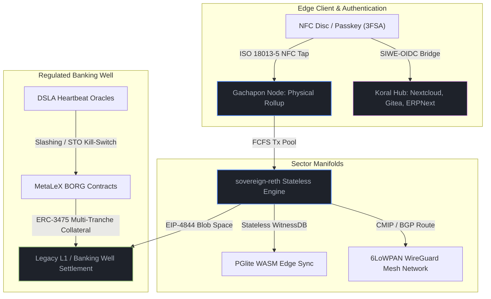

# Sovereignty Stack: Federated, Post-ICANN Sovereignty

### A Verifiable, Full-Stack Architecture Bridging Physical Hardware & Cryptographic Manifolds

---

## 1. The Vision

The "World Computer" paradigm has reached its thermodynamic limit. Monolithic public blockchains, burdened by speculative volatility and gas congestion, are undergoing a process of **Gravitational Stabilization**—transforming into highly regulated, low-entropy settlement networks (**Banking Wells**). 

The **Sovereign Stack** does not resist this stabilization. Instead, it leverages Banking Wells as secure global settlement anchors while routing high-frequency execution to independent, localized **Sector Manifolds**. These manifolds peer directly with one another, routing assets and state changes not through fragile centralized bridges, but via **Quantum-Coupled Membranes** and physical hardware attestation.


```mermaid
graph TD
    subgraph Client Layer [Edge Client & Authentication]
        User["NFC Disc / Passkey (3FSA)"] -->|ISO 18013-5 NFC Tap| Gachapon["Gachapon Node: Physical Rollup"]
        User -->|SIWE-OIDC Bridge| Koral["Koral Hub: Nextcloud, Gitea, ERPNext"]
    end

    subgraph Execution Layer [Sector Manifolds]
        Gachapon -->|FCFS Tx Pool| Reth["sovereign-reth Stateless Engine"]
        Reth -->|Stateless WitnessDB| WASM["PGlite WASM Edge Sync"]
        Reth -->|CMIP / BGP Route| Mesh["6LoWPAN WireGuard Mesh Network"]
    end

    subgraph Settlement Layer [Regulated Banking Well]
        Reth -->|EIP-4844 Blob Space| Base["Legacy L1 / Banking Well Settlement"]
        BORG["MetaLeX BORG Contracts"] -->|ERC-3475 Multi-Tranche Collateral| Base
        DSLA["DSLA Heartbeat Oracles"] -->|Slashing / STO Kill-Switch| BORG
    end

    style Gachapon fill:#1e222a,stroke:#528bff,stroke-width:1.5px,color:#abb2bf
    style Reth fill:#1e222a,stroke:#528bff,stroke-width:1.5px,color:#abb2bf
    style Base fill:#1e222a,stroke:#98c379,stroke-width:1.5px,color:#abb2bf
    style Koral fill:#1e222a,stroke:#c678dd,stroke-width:1px,color:#abb2bf
```

This is a pragmatic, "boring reality" approach to decentralization: bringing real-world systems, legal structures, and physical industrial hardware on-chain and enforcing them via verifiable cryptography.

---

## 2. Key Architecture Components

- **Physicalization of Trust (L0 Hardware):** Trust is anchored directly in physical hardware. `sovereign-reth` runs on bare-metal physical nodes, such as the **Gachapon Machine** (a Physicalized Based Rollup Node) and smart [bit.block microbricks](hardware/bit.block/), using physical [NFC Social Badges / Wahfare discs](hardware/tiny-pay/) for 3-Factor Sovereign Auth and Crypto-Native Cash.
- **Post-ICANN BGP Routing:** Manifolds function as Autonomous Systems (AS), completely replacing legacy IP/DNS. Cross-manifold transactions are routed like IP packets using Althea pay-per-forward economics and $\le 7$-hop KZG Vector Commitment trajectories.
- **Stateless Execution (`sovereign-reth`):** Nodes operate statelessly on physical edge hardware. Embedded WASM CRDT databases (PGlite) handle zero-latency edge synchronization, flushing state diffs to the public chain as succinct zkVM proofs.
- **Universal `did:peer:4` Identity:** Decentralized identities replace IPs and Web2 logins. A single 256-bit entropy seed derives keys for EVM execution (secp256k1), WireGuard peering (Ed25519), and Sync Committees (BLS12-381) via BIP-32.
- **Decentralized Service Level Agreements (DSLA):** Subjective legal contracts are replaced by deterministic hardware **Heartbeat Oracles** and **Actuator Kill-Switches** enforcing pre-emptive, algorithmic compliance.

---

## 3. How to Read This Repository

The Sovereign Stack is a theory-driven architecture. The repository is structured to guide you from foundational physics to technical implementation:

1. 📚 **[Quantum Social Physics (QSP) Paper](QUANTUM_SOCIAL_PHYSICS.md):** Start here. This academic paper defines the formal mathematics behind the stack (Velocity Economics, Topological Pathologies, and Resonant Coherence).
2. 📖 **[The Whitebook](whitebook/):** A comprehensive 15-chapter technical specification detailing how the QSP theory is implemented across Identity, Execution, Routing, and Physical Infrastructure.
3. 🧠 **[Concepts Archive](concepts/):** A rich directory of 36 deep-dive philosophical and technical essays expanding on individual mechanics.
4. 💻 **[`sovereign-reth` Execution Engine](crates/):** The Rust implementation of the Sovereign Stack, featuring custom FCFS transaction pools, stateless execution, and cross-manifold BGP intent routing.

---

## 4. Trust & Security Taxonomy

We approach sovereignty not as a collection of apps, but as a formally verifiable ecosystem defined by a strict **Trust Taxonomy**:
- **L0 (Hardware):** Secure Elements and hardware entropy.
- **L1 (Kernel/OS):** Strict deterministic process isolation.
- **L2 (Network):** Metadata obfuscation and privacy routing.
- **L3 (Identity):** Cryptographically defined DIDs and Verifiable Credentials.
- **L4 (User Agency):** UI/UX designed to prevent dark patterns and enforce informed consent.

The stack solves the "Sovereignty Gap" by replacing the "Trust but Verify" paradigm with a **"Verify, then Trust"** architecture. Through Decentralized Verification, Zero-Trust Orchestration, and transparent threat modeling, the stack guarantees that users own not just their data, but the orchestration logic itself.

### Strategic Roadmap: Eliminating Operator Trust

| Component | Legacy Model | Sovereign Recommendation | Why? |
| :--- | :--- | :--- | :--- |
| **Logic** | Helm / Jinja | OCI Layer Patches (`umoci`) | Eliminates template injection/leaks. |
| **Integrity** | Ansible Scripts | `in-toto` Attestations | Cryptographic proof of physical & digital "Why/How". |
| **Isolation** | Standard Podman | Confidential Containers (CoCo) | Host cannot read container memory. |
| **Trust Root** | Admin Password | Keylime + TPM 2.0 | Hardware-level detection of physical tampering. |
| **Build Env** | Shared VM/Runner | TEE (Intel TDX / AMD SEV) | Build process is a "Black Box" even to root. |

For the formal threat model, see [`docs/architecture/THREAT_MODEL.md`](docs/architecture/THREAT_MODEL.md).
For the tunneling protocol and intent-based routing, see the [Unified Manifold Interface (UMI)](docs/architecture/UNIFIED_MANIFOLD_INTERFACE.md).

---

## 5. Repository Directory Index

The repository contains both hardware specifications and software execution engines:

| Directory | Sub-components & Function | Key Concept Chapters |
|---|---|---|
| [`whitebook/`](whitebook/) | Comprehensive 15-chapter technical specifications. | §01–§15 |
| [`concepts/`](concepts/) | Concept manifesto, $TINY tokenomics, and proof-of-work anchors. | §00–§54 |
| [`hardware/bit.block/`](hardware/bit.block/) | Smart microbrick PCB (KiCAD), 3D prints, and WebGL emulator. | §12, §13, §11 |
| [`hardware/gachapon/`](hardware/gachapon/) | Gachapon machine design — Physicalized Based Rollup Node. | §03, §15, §22 |
| [`hardware/tiny-pay/`](hardware/tiny-pay/) | NFC Tiny Disc (Social Badge + Wahfare branded disc). | §22, §18, §43 |
| [`hardware/tinyblock/`](hardware/tinyblock/) | LDraw set designs (Astronaut, Lighthouse). | §44 |
| [`software/bit.block/`](software/bit.block/) | Arduino WoT firmware — W3C Thing Description PoC. | §12, §16, §11 |
| [`software/tinyblock/`](software/tinyblock/) | LDraw parts submodule + AI training benchmark images. | §44 |
| [`software/web-of-things/`](software/web-of-things/) | RIOT-OS WoT + Arduino WebThings submodules. | §12, §13 |
| [`software/koral/`](software/koral/) | Sovereign Hub — k8s, Nextcloud, ERPNext, OIDC, Istio. | §04, §16, §18, §46 |
| [`software/chain/`](software/chain/) | Smart contract specs: $TINY, ERC-3475, deIBAN. | §39–§43, §46 |

---

## 6. Quick Start

Clone the repository and initialize all hardware/software submodules:

```bash
# Clone with submodules
git clone --recurse-submodules https://github.com/citrullin/sovereign_stack_vision.git

# Or if already cloned, initialize submodules:
git submodule update --init
```

### Submodules Included:
- `software/tinyblock/microblock_ldraw`: LDraw parts library for physical microblocks.
- `software/web-of-things/RIOT-OS`: W3C WoT CoAP module for IoT RIOT-OS.
- `software/web-of-things/arduino`: WebThings fork (WoT TD 1.0) for Arduino/ESP32.
