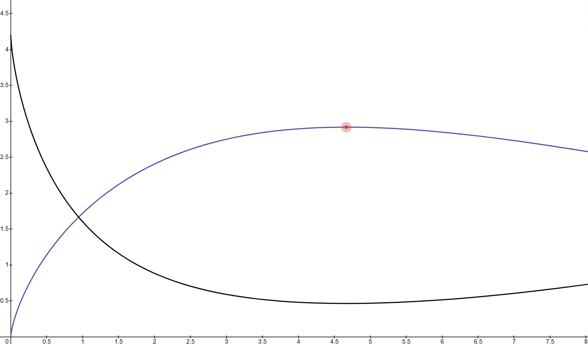

> *Part II: Monetary Policy – The Velocity Engine* — [← Back to Concepts Index](../README.md)

## 5. Beyond Sound Money: Why Scarcity Creates Stagnation and why Velocity ($V$) is the Primary Driver of Industrial $Q$

The "Sound Money" narrative, anchored in absolute scarcity and deflationary
pressure, has long been the holy grail of early cypherpunk economics. However,
within the context of the Unified Sovereign Stack, we identify a critical
failure in this model: Scarcity-induced Stagnation. When an industrial actor
views their currency primarily as a "Store of Value" to be hoarded, they
naturally withdraw it from the productive economy. This leads to a decline in
capital investment, or what we call "Industrial Slop". Which inherently leads to
a "Corporate Slop" environment.

### 5.1. The Stagnation of the Hoarder (The Liquidity Trap)

In a deflationary "Sound Money" regime, the rational actor is incentivized to
wait. Why invest in a new NPU-driven robot arm or a recycling sensor today if
the currency used to buy it will be worth 10% more next year?

- The Opportunity Cost of HODLing: This hoarding behavior causes the Velocity of
  Money ($V$) to collapse.

- The Result: Economic friction increases, innovation cycles slow down, and the
  Industrial Output ($Q$),representing the real-world advancement of the
  stack,stagnates. The currency becomes a museum piece rather than an industrial
  lubricant.

### 5.2. The Non-Linearity of Circulation: A Synthesis of Growth and Instability

The Sovereign Stack reinterprets the classical Equation of Exchange, $MV = PQ$,
as a dynamic control system rather than a static identity. In traditional
monetary theory, Velocity ($V$) is often treated as a residual or a behavioral
constant. We propose that $V$ is the primary exogenous variable, the "heartbeat"
of the network, that dictates the ceiling of Industrial Output ($Q$).

#### 5.2.1. Theoretical Foundations: From Solow to Minsky

The initial "Sovereign Thesis" posits that maximizing $V$ yields a corresponding
maximization of $Q$. However, a rigorous mapping of velocity to real-world
output requires accounting for marginal utility and systemic friction. Drawing
from Solow (1956) and the Cobb–Douglas Production Function, we define the
relationship between circulation and coordination as one of diminishing marginal
returns. Initial increases in $V$ facilitate the division of labor and reduce
Coasean transaction costs. However, as the network nears full utilization, each
marginal unit of velocity produces less incremental $Q$:

$$ Q(V) = k V^{\alpha}, \quad 0 < \alpha < 1 $$

Here, $\alpha$ represents Productive Elasticity, the efficiency with which a
"handshake" (transaction) translates into a "brick" (work unit).

To bridge the gap between growth theory and financial reality, we integrate the
Financial Instability Hypothesis (Minsky, 1992). As the network nears full
utilization, "Overheating" manifests as speculative churn, high $V$ driven by
recursive arbitrage and automated trading loops that do not map to "bricks
manufactured" or "code merged". To model this transition from productive
coordination to entropic churn, we introduce a saturation decay constant
$\delta$, resulting in the Sovereign Output Function:

$$ Q(V) = k V^{\alpha} e^{-\delta V} $$

#### 5.2.2. The Three Regimes of the Sovereign Stack

This mathematical formulation (visualized in Figure 5.2) bifurcates the economic
state into three distinct phenomenological regions based on the interaction of
$\alpha$ (productivity) and $\delta$ (instability):

- _The Underutilized Regime ($V < V_{opt}$)\_: Characterized by liquidity traps
  or high friction. The economy is "sluggish", potential coordination is lost to
  hoarding.
- _The Optimal Regime ($V \approx
  V_{opt}$)_: The "Switzerland Sweet Spot". This
  peak occurs at $V = \alpha / \delta$.
  At this point, velocity is perfectly synchronized with the industrial capacity
  of the DAO. The sheer volume of industrial advancement "soaks up" the money
  supply, allowing for a productivity-driven deflationary environment where the
  purchasing power of the currency rises due to surplus output.
- _The Overheated Regime ($V > V_{opt}$)_: The $\delta$ term dominates. High
  velocity represents noise rather than signal leading to speculative bubbles
  and eventual systemic contraction.

#### 5.2.3. Quantitative Dynamics: The Productivity-Inflation Nexus

The interaction between systemic throughput and monetary stability is visualized
in the model. Industrial Output ($Q$) is represented in purple, while the
Inflation Rate ($\pi$) is represented in black. We model the Inflation Rate as a
function of the gap between Money Supply ($M$) and adjusted Output ($Q$):

$$ \pi(V) = a(M - \beta Q(V)) + b(M - \beta Q(V))^2 $$

The model reveals a critical Stagnation Trap at low velocity. Inflation spikes
because there are too few goods produced to justify the money supply.
Conversely, in the Overheated Regime, as productive output (purple) decays due
to chaos, inflation (black) spikes non-linearly. The "Switzerland" situation
occurs at the base of the black curve, where $\pi$ is minimized because $Q$ is
maximized.

#### 5.2.4. Parameter Selection and Protocol Telemetry

To ensure the "Sovereign Engine" remains within the Optimal Regime, the protocol
monitors $\alpha$ and $\delta$ as real-time telemetry:

- **Elasticity ($\alpha = 0.7$)**: Calibrated to ensure the system is highly
  responsive to coordination while respecting physical and cognitive limits of
  the DAO's maintainers.
- **Decay ($\delta = 0.15$)**: A sensitivity variable for speculative churn. As
  $\delta$ increases (measured by on-chain arbitrage frequency), the "Optimal
  Band" narrows, signaling the protocol to increase burn mechanisms.
- **Inflation Sensitivity ($b$)**: The squared term in the inflation function
  ensures that once the system redlines into the speculative zone, the cost of
  instability rises exponentially, triggering automated friction to protect the
  "Velotile" balance.

#### 5.2.5. Decomposition of Velocity: Signal vs. Noise

To refine interventions, we decompose total velocity:

$$ V = V_p + V_s $$

Where $V_p$ represents productive transactions (wages, procurement) and $V_s$
represents speculative flows. If $V_s \gg V_p$, the system detects an
"Elasticity Drop" ($a \to 0$). This triggers the Velocity Target Band policy:
the protocol increases friction specifically targeting high-frequency recursive
loops to drive the system back toward the productive frontier.

### 5.3. Sociological Implications: Velocity as [Resonant Meritocracy](../tokenomics/45_resonant_meritocracy.md)

Moving beyond the mathematical, $V$ serves as a sociological status signal.
Within the [Resonant Meritocracy](../tokenomics/45_resonant_meritocracy.md), the hoarding of currency, represented by
$V \to 0$ at the individual level, is viewed as a withdrawal of trust from the
system.

By rewarding "Velotile" behavior through the [TinyMeritRank](../identity-governance/17_[tiny](../tokenomics/TINY_token_model.md)meritrank.md) system, we align
individual incentives with the macroeconomic health of the stack. A high
personal $V$ score signifies an actor who is actively facilitating industrial
throughput, thereby increasing their social capital. In this framework, the
currency is no longer a store of value to be locked away, but a Dynamic Signal
of Productivity that must flow to maintain its relevance.

### 5.4. Breaking the Cycle of "Slop"

Industrial "Slop" occurs when capital is misallocated because the currency is
too "expensive" to move. By reclaiming the rails from the banking backend, we
enable:

1. Instant Settlement: No more 3-day interbank wait times, the Based Rollup
   settles at the speed of the AI backbone.

2. Micropayment Fluidity: Paying a sensor for a "Heartbeat" becomes feasible,
   allowing for granular control of industrial processes.

3. Physical P2P Cash: Using `NFC [Tiny](../tokenomics/TINY_token_model.md) Discs` (Banknotes) to maintain physical
   velocity in the "Boring Reality" of daily life.

### 5.5. Phase-Shifted Entropy: The Dynamic Seed-Set Rotation (DSSR) Protocol

To mitigate the risks of early-stage "State Capture" and "Entropy Leakage", we
propose the Dynamic Seed-Set Rotation (DSSR) protocol. This mechanism governs
the transition of the [TinyMeritRank](../identity-governance/17_[tiny](../tokenomics/TINY_token_model.md)meritrank.md) trust-roots from a curated, high-integrity
"Genesis Circle" to a fully stochastic, decentralized selection process.

#### 5.5.1. The Proximity Dynamic & Merit Incentive

The DSSR operates on a periodic epoch basis. During each epoch, the system
designates a subset of nodes as "Root Seeds" for the Personalized PageRank (PPR)
calculation. This creates a Proximity Dynamic: network participants are
incentivized to optimize their "Vibe Weight" and industrial output (Q) to
maintain topological closeness to the current seed-set. Because the seed-set is
dynamic, actors cannot settle into a static rent-seeking position, they must
continuously demonstrate utility to remain within the "Resonant Radius" of the
shifting roots.

#### 5.5.2. The DAO-Mediated Candidate Pool

Rather than immediate random selection from the entire network, which is
vulnerable to sophisticated Sybil attacks in low-liquidity environments, the
seed-set is drawn from a Candidate Ledger.

- **Admission**: The Sovereign Board (DAO) approves nodes for the Candidate
  Ledger based on verifiable physical telemetry ([Heartbeat Oracle](../oracles/12_heartbeat_oracles.md)s) and
  historical uptime.
- **Stochastic Selection**: From this vetted pool, a Verifiable Random Function
  (VRF) selects the active "Root Seeds" for the upcoming epoch. This prevents
  the DAO from hand-picking the active controllers while ensuring all potential
  controllers meet the baseline physical sovereignty requirements.

#### 5.5.3. The Diffusion Threshold

The transition from a small, DAO-curated pool to a large-scale algorithmic
rotation is governed by the Network Diffusion Coefficient ($\mathcal{D}$). Once
the network reaches a critical threshold of token distribution (measured by the
Gini coefficient of Merit-weight) and geographic node dispersion, the DSSR
automatically expands the Candidate Ledger to include all nodes above the 90th
percentile of Reputation Score.

#### 5.5.4. Security Implications

By cycling seeds, the stack introduces "Moving Target Defense" (MTD) logic into
the social layer of the protocol. Even if an adversary captures a segment of the
"Genesis Circle", the scheduled rotation of roots ensures that the network’s
"Source of Truth" remains a moving target, effectively neutralizing long-range
Sybil influence.

### 5.6. The Evidence-Based Appeal & Sovereign Court (EASC)

To prevent "Syndicate" capture or "Social Slag" errors from permanently
excluding valid contributors. The EASC ensures that any rejection from the "Seed
Set" or the "Candidate Ledger" is based on falsifiable on-chain data rather than
subjective bias.

#### 5.6.1. Rejection via "On-Chain Evidence"

A rejection is not a silent failure but a signed attestation of non-compliance.

- **Proof of Failure (PoF)**: Rejections must cite specific on-chain telemetry
  from [Heartbeat Oracle](../oracles/12_heartbeat_oracles.md)s (physical failure) or [DSLA](../identity-governance/20_dsla.md) breach logs (contract
  failure).
- **The "Social Slag" Trigger**: Frequent rejections without evidence are
  themselves recorded as Social Slag penalizing the rejecting entity's own Vibe
  Weight.

#### 5.6.2. The Tiered Appeal & Escalation Ladder

To handle disputes, the protocol follows a three-stage escalation process:

1. **Tier 1 Algorithmic Re-Audit (The Prover Appeal)**: The rejected party can
   trigger a "Re-Audit" by staking a small amount of Velotile Assets. A randomly
   selected 7-member committee of Soulbound AI Agents re-evaluates the submitted
   telemetry using a different PPR (Personalized PageRank) seed-set to check for
   topological bias.

2. **Tier 2 The Sovereign Jury (Social Verification)**: If the automated audit
   is contested, the case moves to a human jury.
   - **Evidence**: The appellant provides a "Beep-to-Verify" record from at
     least three peers with High [TinyMeritRank](../identity-governance/17_[tiny](../tokenomics/TINY_token_model.md)meritrank.md) who can physically attest to the
     appellant's industrial output (Q).
   - **Incentive**: Jurors are paid via BASEFEE redirects, but their own
     MeritRank is slashed if they are found to be part of a "Circular Reporting"
     (Sybil) ring.

3. **Tier 3 The DAO Veto (The Supreme Court)**: For high-stakes rejections (e.g.
   permanent blacklisting of a regional node), the case escalates to a Miner DAO
   Veto Vote.
   - **The Physicality of the Veto**: Because miners control the [Sahara Node](../architecture/08_l1_sahara_node.md)
     (L1), they can refuse to sequence the state update that enforces the
     rejection until the dispute is settled.
   - **Quorum**: Requires a 66% majority of the Miner DAO to override a
     "Sovereign Board" rejection.

#### 5.6.3. The "Restoration Loop"

If the appeal is successful:

- The Penalized Rejector: The entity that issued the initial false rejection
  faces an Automatic Multiplier on their security stake for the next epoch,
  treating their error as a form of "Network Friction".

### 5.7. The Issuance Circuit Breaker & Negative Elasticity (Burning)

The protocol’s issuance function $\mathcal{I}$ is not a linear constant but a
derivative of the Industrial Output ($Q$) and Velocity ($V$). To prevent the
"Recursive Leverage" traps seen in current DeFi (like the Aave/rsETH restaking
contagion), the Sovereign Stack employs a hard "Circuit Breaker" to decouple
token supply from speculative churn.

#### 5.7.1. The Zero-Issuance Threshold (The Halt)

Issuance enters a Halt State when the Efficiency Ratio ($\eta = \frac{Q}{V}$)
drops below a critical floor ($\eta_{min}$).

- **Logic**: If velocity increases (high trading/lending volume) but the
  [Heartbeat Oracle](../oracles/12_heartbeat_oracles.md)s do not report a corresponding increase in physical
  manufacturing ($Q$), the protocol identifies the activity as "Noise"
  (speculative leverage).
- **Action**: New issuance ($\mathcal{I}$) hits absolute zero. The "Security
  Salary" for miners and maintainers shifts entirely to BASEFEE redirects,
  ensuring no new supply enters an overheated, unproductive market.

#### 5.7.2. Negative Elasticity: The "Thermodynamic Drain" (Burning)

If $Q$ drops below a survival threshold (e.g. massive industrial shutdown or
network attack), the protocol enters Contraction Mode:

- **The Burn**: The "Recycling Drain" increases its capture rate. A portion of
  the existing supply is systematically burned from the Sovereign Board’s
  treasury or through a "Social Slag Tax" on high-velocity, low-output accounts.
- **Purpose**: This creates a "monetary vacuum" that forces the value of the
  remaining tokens up by reducing supply, compensating for the lack of physical
  production and preventing a currency death-spiral.

#### 5.7.3. On-Chain Evidence for Halting

Unlike legacy DeFi protocols that require manual "Emergency Pauser" multisigs
(which failed to stop the 2026 Kelp DAO drain in time), the Sovereign Stack's
halt is Programmatic and Evidence-Based:

- **Heartbeat Failure**: If $>30\%$ of registered industrial actuators report a
  "[DSLA](../identity-governance/20_dsla.md) Breach" or power failure, issuance halts within a single block.
- **Oracle Divergence**: If the price of the "Velotile Asset" deviates from the
  Industrial Index (the real-world cost of raw materials produced by the stack),
  the breaker triggers.
