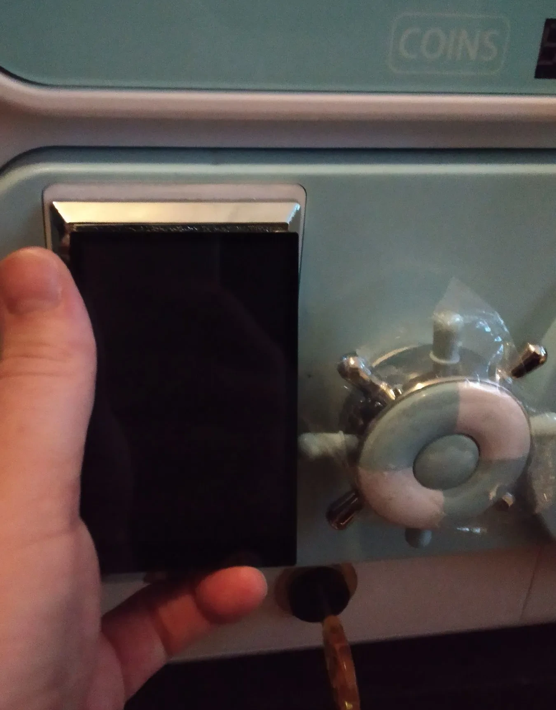

> *Part I: The Philosophical & Sociological Perspective* — [← Back to Concepts Index](../README.md)

## 3. Fukuyama’s High-Trust Thesis: Modeling Trust as an Automated Protocol Byproduct

In his seminal work Trust: The Social Virtues and the Creation of Prosperity,
Francis Fukuyama argues that a nation’s well-being and its ability to compete
are conditioned by a single, pervasive cultural characteristic: the level of
trust inherent in the society. Historically, **"High-Trust" societies (e.g.
Germany, Japan) prosper** because they possess Social Capital, allowing for
flexible, large-scale organizations that do not require constant legal
oversight. Conversely, "Low-Trust" societies are burdened by "transaction
taxes",the endless need for lawyers, contracts, and enforcement. With the
Automation of Social Capital, the Unified Sovereign Stack treats Fukuyama's
thesis not as a cultural goal, but as an engineering requirement. We move from
"Trust as a Virtue" to **"Trust as an Infrastructure"**. By automating the
mechanisms of social capital, we enable decentralized entities to scale with the
efficiency of a high-trust nation-state, regardless of the participants'
geographic or cultural backgrounds.

1. **Trust as an Afterthought:** In a legacy system, trust is a manual effort.
   You must "vet" a partner, "audit" a firm, or "verify" a resume. In our stack,
   trust is the byproduct of the interaction. When a Maintenance Contributor
   (Tier 2) interacts with the **Federated Web 2.5 tools**, their authority is
   automatically verified by the `SIWE-OIDC` Bridge.

2. **`[DSLA](../identity-governance/20_dsla.md)` (Decentralized SLA) as the Friction-Killer:** We replace the "Legal
   Tax" with the "Protocol Penalty". In a low-trust environment, a breach of
   contract results in a multi-year lawsuit. In the Sovereign Stack, the `[DSLA](../identity-governance/20_dsla.md)`
   contract on the Based Rollup acts as a real-time arbiter. If the **Heartbeat
   Oracle or [Actuator Oracle](../oracles/13_actuator_oracles.md) detects a failure** in service, the **penalty is
   programmatic and immediate**. In order to model the High-Trust Equilibrium,
   we model the interaction between DAO members as a Reputation-Weighted Game.
   - **The Matthew Effect vs. The Mark Effect:** While the "Syndicate" rewards
     the rich (the Matthew Effect), our stack utilizes [TinyMeritRank](../identity-governance/17_[tiny](../tokenomics/TINY_token_model.md)meritrank.md) to reward
     those who contribute to the "Health and Resilience" of the organization
     (the Mark Effect).

   - **The Mark of Quality:** Using Personalized PageRank (PPR), trust flows
     from "Seed Sovereigns" to new contributors. This creates a high-trust
     "Vibe" within the network graph. If a new node is "Beep-verified" by
     multiple high-reputation nodes via their `NFC` Badges, that node’s social
     capital increases exponentially. Trustless Liability vs. Human Connection
     Paradoxically, by making the technical part of trust "trustless" (via
     `[DSLA](../identity-governance/20_dsla.md)` and `PoW`), we free up human cognitive load for actual connection.

   - **The "Invisible Handover":** In the Sovereign Banking Stack, the use of
     `[deIBAN](../banking-physicalization/23_deiban_[deswift](../banking-physicalization/23_deiban_deswift.md).md)` and `[deSWIFT](../banking-physicalization/23_deiban_deswift.md)` means a user in South Africa can pay a developer in
     China without worrying about the interbank trust chain. The "Sovereign
     Account" handles the trust-bridge via the Based Rollup.

   - **Social Cohesion:** Because the "Boring Reality" of payment and
     verification is handled by the stack, the "Beep-to-Verify" interaction at
     the local pub or conference becomes a moment of genuine sociological
     bonding rather than a security check.

 By
merging the
[NFC Social Badge with a hardware-based Gachapon interface](https://x.com/Citrullin/status/1985770447850418617),
we transform complex smart-contract interactions into a tangible experience. The
machine acts as a Physicalized Based Rollup Node. A user "beeps" their badge,
the machine verifies their [TinyMeritRank](../identity-governance/17_[tiny](../tokenomics/TINY_token_model.md)meritrank.md) and may engage with the `SIWE-OIDC`
Bridge. As a result, the machine may dispense physical assets, commodity tokens,
hardware parts, or "Rare" industrial `NFTs`, instantly.
