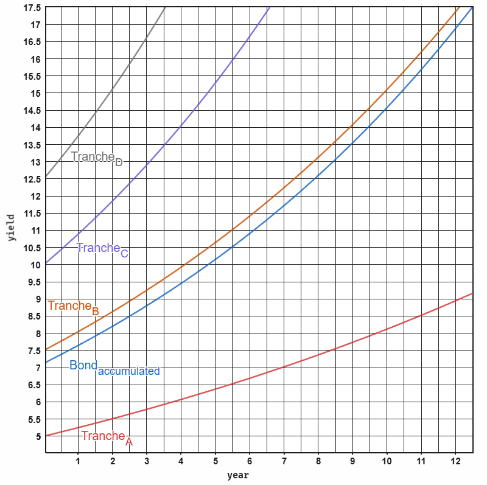

> *Part XI: Advanced AI & Tokenomics* — [← Back to Concepts Index](../README.md)

## 39. Web3 Collateralized Bonds

Web3 collateralized bonds are structured in risk-adjusted tranches as ERC-3475
contracts. We define a generalized bond growth function as:

<!-- prettier-ignore -->
$$ b_i(t_i, r_i, d_i, W_i) = W_i r_i e^{(r_i - d_i)t_i} $$

Where $t$ represents time, $r$ is the yield rate, $d$ is the default rate, and
$W$ is the tranche weight. This exponential function includes compounding yields
despite defaults. For simplicity, assuming a process for defaults with no
recovery. A prediction and insurance market for those can be established.

For the accumulated portfolio, the total value is given by:

<!-- prettier-ignore -->
$$ B_{\text{accumulated}}(t) = b_A(t, r_A, d_A, W_A) + b_B(t, r_B, d_B, W_B) + b_C(t, r_C, d_C, W_C) + b_D(t, r_D, d_D, W_D) $$

Defining four levels of tranches A to D for our ERC-4626 vault. Where A is the
most senior tranche and D the most junior tranche.

Where:

- $W_A = 0.50$, $r_A = 0.05$, $d_A = 0.0015$
- $W_B = 0.25$, $r_B = 0.075$, $d_B = 0.005$
- $W_C = 0.15$, $r_C = 0.10$, $d_C = 0.015$
- $W_D = 0.10$, $r_D = 0.125$, $d_D = 0.03$

Assuming low default rates for developed economies and higher for micro-credits.
The vault aggregating the weighted contributions across all tranches
diversifying risk and accumulating higher yield.

Normalized individual tranche growth functions, assuming unit weight for
isolated analysis, are:

- $T_A(t) = b_A(t, 0.05, 0.0015, 1)$
- $T_B(t) = b_B(t, 0.075, 0.005, 1)$
- $T_C(t) = b_C(t, 0.10, 0.015, 1)$
- $T_D(t) = b_D(t, 0.125, 0.03, 1)$

These formulas enable precise simulation and plotting, as demonstrated, creating
investor projections of long-term value under varying economic scenarios.

This model contrasts stable, low-yield developed markets with high-risk,
high-reward emerging markets, utilizing blockchain and AI to bridge the gap in
credit reliability.

### The Tranche Spectrum

The framework uses a tiered risk structure to accommodate different investor
profiles:

- Senior Tranches (Tranche A): Modeled after OECD investment-grade bonds and
  CLOs. It targets a 0.15% default rate and 5% yield, backed by high-quality
  secured lending standards.
- Junior Tranches (Tranche D): Reflects emerging market private credit (e.g.
  Latin America or South Asia), where default rates typically range from 2.5% to
  6.3%. This tranche offers a 12.5% yield to compensate for a modeled 3% default
  rate.

### Social & AI Enforcement

To stabilize emerging market risks, the model adapts "social enforcement"
(pioneered by microfinance leaders like Grameen Bank) for the blockchain:

- On-Chain Reputation: Leveraging projects like Ethos, the system uses social
  "Proof of Stake" and credibility scores to incentivize repayment through peer
  accountability.
- Agentic Scoring: AI agents monitor borrower behavior across social media and
  platform activity to provide real-time risk adjustments and "slashing"
  (penalizing) of bad actors.
- Trust Networks: Interconnected groups of lenders and borrowers share
  collective reputation stakes, capping effective default rates at a 3% ceiling.

### Operational Integration: The Alibaba Use Case

The model moves beyond theory by integrating directly with B2B supply chains to
create a closed-loop economy:

- Collateralized Inventory: Bonds finance purchases on platforms like Alibaba.
  Real-time data from Order Management APIs act as an oracle, allowing smart
  contracts to monitor shipment status and asset integrity.
- Automated Waterfalls: Once products are sold, revenue is distributed on-chain.
  Smart contracts automatically prioritize payouts to senior tranches, reducing
  intermediary friction and opacity.
- Community Audits: High-trust participants perform decentralized verification
  of physical assets, replacing centralized custodians with transparent,
  open-ledger auditing.
