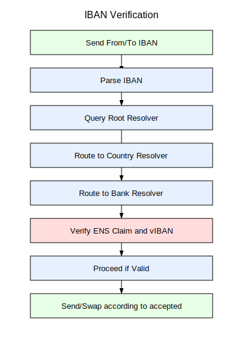
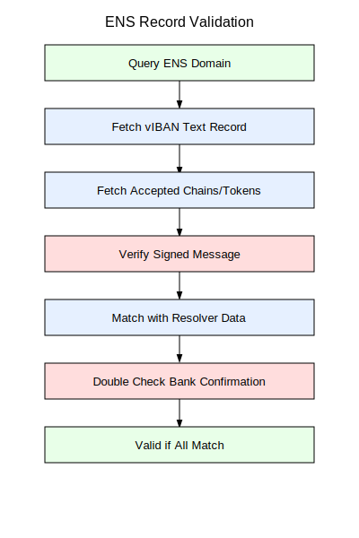

> *Part XI: Advanced AI & Tokenomics* — [← Back to Concepts Index](../README.md)

## 42. Extending ENS (Ethereum Name Service) with IBAN

ENS has revolutionized decentralized identity. It maps human-readable names to
blockchain addresses, enabling intuitive interactions in web3. However, TradFi
(Traditional Finance) still functions on the legacy IBAN and SWIFT systems. By
bridging nuances, we explicitly split the architecture into `vIBAN` (Virtual
IBAN) and `[deIBAN](../banking-physicalization/23_deiban_[deswift](../banking-physicalization/23_deiban_deswift.md).md)` (Decentralized Exchange IBAN) layers.

### 42.1. The vIBAN (Virtual IBAN) Mechanism

The `vIBAN` represents the on-chain, ENS-routable virtual IBAN directly attached
to a domain’s text record. Extending ENS to host vIBANs, verifiable IBAN strings
(e.g. `EE471000001020145685`) in a `viban` text record, creates a decentralized
directory. A resolver chain parses the IBAN structure to route queries,
verifying ownership and enabling strictly on-chain execution.

To enable this feature, users require an ENS domain with a `viban` text record.
This `vIBAN` is a standard-compliant IBAN, claimed post-KYC via a resolver.
Double Verification ensures validity:

1. The wallet queries the resolver for the recipient's ENS.
2. The system checks the ENS record and signed message containing the claimed
   `viban`.

If resolved successfully on-chain, the system executes locally, converting the
intent into lightning-fast, native Smart Contract transfers.



### 42.2. The [deIBAN](../banking-physicalization/23_deiban_[deswift](../banking-physicalization/23_deiban_deswift.md).md) (Decentralized IBAN) Fallback

If an IBAN query fails to resolve an equivalent `vIBAN` on-chain (or returns a
`NOROUTE` signal), the `[deIBAN](../banking-physicalization/23_deiban_[deswift](../banking-physicalization/23_deiban_deswift.md).md)` fallback mechanism is engaged. The `[deIBAN](../banking-physicalization/23_deiban_[deswift](../banking-physicalization/23_deiban_deswift.md).md)`
serves as the decentralized routing layer handling offline or cross-border Forex
conversions and off-ramping.

Transactions use only matching stablecoins on explicitly listed chains (
`accepted=eth@taiko,usdc@base,eure@etc`). Mismatches route off-chain via
regulated proxies within an Intent-based architecture. For example, the `[deIBAN](../banking-physicalization/23_deiban_[deswift](../banking-physicalization/23_deiban_deswift.md).md)`
gateway handles localized swaps (USDC to EURe) and notifies users: "Swap
executed with X% slippage at Y rate".

Unresolvable domains default to a burn/destroy address (e.g. a Monerium-like
redemption contract). The wallet sends a signed tx with the `toIBAN`, enabling
off-chain SEPA clearing through the legacy system. The `[deIBAN](../banking-physicalization/23_deiban_[deswift](../banking-physicalization/23_deiban_deswift.md).md)` dynamically
abstracts TradFi and DeFi complexities away from the end user.


### 42.3. Contract Example

```solidity
contract CountryResolver {
    mapping(bytes2 => address) public bankResolvers;

    function resolve(string calldata iban) external view
      returns (address wallet, string memory ens) {
        (string memory country, string memory bban) = parseIBAN(iban);
        if (bankResolvers[country] != address(0)) {
            return IBankResolver(bankResolvers[country]).resolve(bban);
        }
        return (BURN_ADDRESS, "NOROUTE");
    }
}
```


