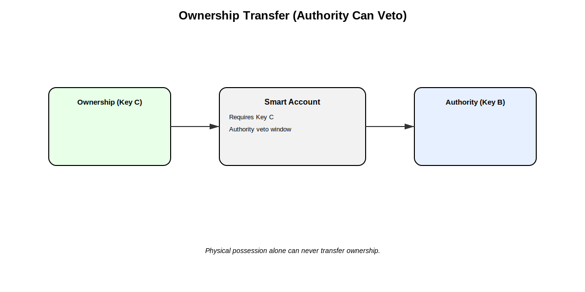

> *Part XI: Advanced AI & Tokenomics* — [← Back to Concepts Index](../README.md)

## 43. [Crypto Native Cash](../banking-physicalization/22_crypto_native_cash.md): p2p physical crypto cash

[Crypto Native Cash](../banking-physicalization/22_crypto_native_cash.md) represents a hybrid of digital blockchain value and physical,
everyday usability. By combining account abstraction, NFC hardware, flexible
spending rules, and physical possessory logic, we create a tool that mirrors the
experience of using banknotes while maintaining the sovereignty of a
decentralized ledger.

### 43.1. Physical, Digital and Technical Concept

[Crypto Native Cash](../banking-physicalization/22_crypto_native_cash.md) is a physical NFC tag, card or paper money that represents a
programmable crypto value instrument tied to an on-chain smart account with
on-chain spending rules and governance logic.

1. **Physical Form Factor**: Designed to be fun, inexpensive (around 0.3 EUR),
   and collectible. Physical and digital NFTs.
2. **Programmable Spending Rules**: Transactions over a threshold require
   digital approval via a connected account (e.g. Parents, Central Banks).
3. **Loss & Recovery Protections**: If lost, owners can revoke or freeze a tag’s
   permissions through a higher-trust wallet.
4. **Threshold Signatures**: Families or small groups can share a tag via
   threshold ECDSA or FROST so multiple guardians must approve high-value
   transactions.
5. **Account Abstraction Integration**: Smart contracts define validation logic.
6. **On-Chain Revenue Distribution**: All fees are distributed automatically via
   DAO smart contracts.

### 43.2. Consortium Model Structure

- **Physical possession (Key A)**: The NFC chip. Proves physical possession but
  cannot unilaterally break safety rules. Written once, locked, and
  tamper-resistant.
- **Authority (Key B)**: Revocable governance capability. Able to veto
  high-value moves, freeze lost tags, or authorize reissuance.
- **Ownership Claim (Key C)**: The ultimate economic right to assets (smart
  wallet, ownership NFT).

Key C holds ultimate economic control. The NFC tag never "owns" anything. Moving
stablecoins to a new smart account requires explicit approval by Key C AND no
objection by Key B. Physical loss does not imply economic loss, the on-chain
revocation is the real kill switch.

