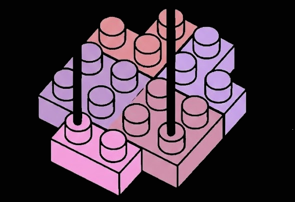

> *Part XI: Advanced AI & Tokenomics* — [← Back to Concepts Index](../README.md)

## 44. Parsing instructions and genAI microblock sets

The digitization of physical microblock instructions (Nanoblock, Loz etc.) into
3D formats (LDraw) is currently a labor-intensive and manual process. This paper
proposes an automated pipeline utilizing Mobile Vision Transformers (MobileViT)
to parse 2D instruction manuals into 3D CAD models.

Microblocks offer a higher resolution than standard bricks due to their smaller
dimensions. They are also more price competitive and have a larger, diverse and
distributed ecosystem, despite lacking a unified digital standard. Current
Optical Character Recognition (OCR) and standard Object Detection models
struggle with the specific hierarchical logic of block instructions:
`Step -> Layer -> Brick`. We present a solution that treats instruction parsing
as a structured language problem solved through AI/ML and a Rule Engine.

 Identifying and
segmenting the layer steps

### 44.1. The Layer 0 "Ground Truth"

The architecture uses a coordinate-based approach. It establishes a zero point
at the first layer and calculates the relative offset of following layers by
identifying visual markers in the instructions (Ground Truth). The DAO-governed
ecosystem incentivizes validation, correcting offsets and refining the Rule
Engine logic to create a universal standard for digital modeling.

1. **The Anchor**: The center point of the brick assembly in Step 1 is defined
   as the Global Origin $(0,0,0)$ or Ground Truth.
2. **Calibration**: All future brick positions are calculated as relative
   vectors (offsets) from this null point.
3. **The Offset Solver**: Maps the local 2D coordinates of the current step to
   the global 3D coordinates.

<!-- prettier-ignore -->
$$ \text{Offset}_{\text{global}} = \text{Position}_{\text{marker(previous)}} - \text{Position}_{\text{marker(current)}} $$

Identifying and processing the first layer of the build

### 44.2. Strategic Hardware Independence

This architecture is designed for hardware agnosticism:

- **Tier 1 (Cloud)**: Token-funded, high-speed processing for bulk uploads.
- **Tier 2 (Consumer Edge)**: A quantized lite version of the model that runs
  locally on Android (NPU) and iOS (CoreML). This ensures the parser remains
  functional indefinitely, independent of cloud infrastructure.

Overlapping incorrect brick identification
