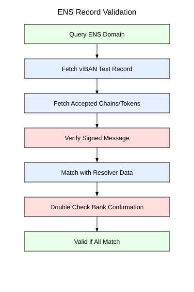
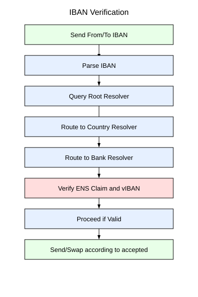
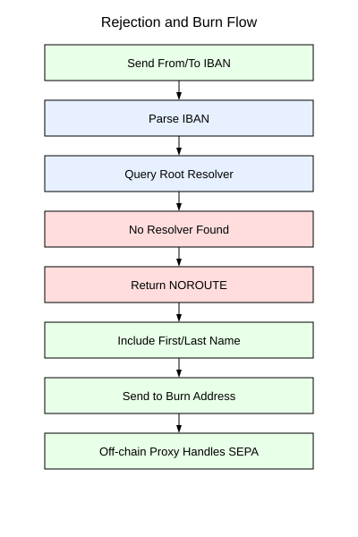

# Chapter 12: SIWE OIDC Bridge, `did:peer:4` Federation, & Koral K3s Pod Architecture

## 12.1 Universal `did:peer:4` Reference Standard

Traditional domain registries (ICANN, Web3 ENS domains) function as speculative real estate casinos. The Sovereign Stack replaces them with **Universal `did:peer:4` Cryptographic Identifiers**.

Every entity within the Sovereign Stack, whether a BGP Border Router, a validator node, an ERC-4337 smart wallet, an IoT Heartbeat Oracle, a local manifold node, or a MetaLeX enterprise org, is natively represented and indexed internally as a **`did:peer` Document**.

---

## 12.2 Single Master Seed, Multi-Algorithm Key Derivation

Operators manage a single master 256-bit entropy seed ($S_{\text{master}} \in \{0,1\}^{256}$). From this single root, sub-keys across diverse cryptographic curves are deterministically derived using **BIP-32 / SLIP-0010** derivation paths:

$$\text{Seed} \xrightarrow{\text{BIP-39 / HKDF}} S_{\text{master}}$$

1. **WireGuard / P2P Transport Key (Ed25519 / X25519):** $m / 44' / 60' / 0' / 0 / 0 \to \text{Ed25519}$
2. **EVM Transaction Key (secp256k1):** $m / 44' / 60' / 0' / 0 / 1 \to \text{secp256k1}$
3. **Sync Committee Attestation Key (BLS12-381):** $m / 12381' / 3600' / 0' / 0 \to \text{BLS12-381}$
4. **NFC Bearer Cash Key (secp256r1 / Passkey):** $m / 44' / 100' / 0' / 0 / 0 \to \text{secp256r1}$

---

## 12.3 `did:peer:4` Mathematical Generation & Flow

1. **DID Document Composition ($D$):** Compiles public keys $K_{\text{ed25519}}, K_{\text{secp256k1}}, K_{\text{bls}}$, service endpoints $E$, and capability invocations.
2. **Multicodec & Multibase Hashing:**
   $$D_{\text{bytes}} = \text{CBOR}(D)$$
   $$H = \text{SHA2-256}(D_{\text{bytes}})$$
   $$\text{Short-Form DID} = \text{did:peer:4z} \parallel \text{Base58BTC}(H)$$
3. **Offline Handshake (ISO/IEC 18013-5):** During physical contact, two operators tap devices using NFC (NTAG215) or tap an NFC disc at a local manifold node. The short-form hash trades in **<100ms** over NFC, automatically upgrading to high-bandwidth Bluetooth Low Energy (BLE) or WireGuard (`wg0`) to sync heavier data.


*Figure 12.1: Resolving text records and cryptographic public keys against DID resolvers.*

---

## 12.4 IBAN & SWIFT Routing Protocol (vIBAN / deIBAN)

To bridge decentralized identity with legacy banking infrastructure (PSD2 / SEPA), the stack splits financial routing into two operational layers:

1. **vIBAN (Virtual IBAN):** Human-readable on-chain endpoint directly attached to a `viban` text record on an ENS/`did:peer` resolver.
2. **deIBAN (Decentralized IBAN Fallback):** If an IBAN query fails to resolve an equivalent vIBAN on-chain, the deIBAN gateway executes localized stablecoin swaps (e.g. USDC to EURe) and routes via off-chain SEPA proxies.


*Figure 12.2: Decentralized IBAN verification and SEPA resolution pipeline.*


*Figure 12.3: Rejection handling and dynamic fee burn mechanisms during transaction settlement failure.*

---

## 12.5 Koral Hub Architecture: The SIWE-OIDC Bridge as a K3s Pod

In legacy enterprise setups, web suites like Nextcloud, ERPNext, and Gitea do not natively support Web3 wallets or `did:peer:4` identifiers. The Sovereign Stack deploys the **SIWE-OIDC Bridge Proxy** as a native **K3s Pod** within the **Koral pan-European federated hub**.

```text
+-----------------------------------------------------------------------------------+
|                           Koral Hub K3s Cluster Pod Topology                       |
+-----------------------------------------------------------------------------------+
|                                                                                   |
|    [ User Browser / NFC Wallet ]                                                  |
|                  |                                                                |
|                  | (1) OIDC Redirect                                              |
|                  v                                                                |
|      +------------------------+      mTLS (Istio)      +-----------------------+  |
|      | Authentik OIDC Gateway | <--------------------> | SIWE-OIDC Bridge Pod  |  |
|      +------------------------+                        +-----------------------+  |
|                  |                                                 |              |
|                  | (2) Validated OIDC Token                        | (SIWE EIP-4361|
|                  v                                                 |  Challenge)  |
|      +-----------------------------------------+                   v              |
|      | Federated Enterprise Suite (Nextcloud/  |        [ Passkey / Hardware Disc ]|
|      | ERPNext / Gitea / Bookstack Pods)       |                                  |
|      +-----------------------------------------+                                  |
+-----------------------------------------------------------------------------------+
```

---

## 12.6 Cryptographic Token Synthesis & OIDC Claim Mapping

When an operator signs an EIP-4361 SIWE challenge via NFC disc or Passkey, the SIWE-OIDC Bridge verifies the cryptographic signature natively and synthesizes a fully compliant OpenID Connect JWT ID Token:

```json
{
  "iss": "https://auth.koral.sovereign.local",
  "sub": "did:peer:4zQmdXgBZDvotDkL5257faiztiGiC2QtKLGpbnnEGta2doK",
  "aud": "koral-nextcloud-enterprise",
  "exp": 1784155000,
  "iat": 1784151400,
  "email": "0x9bb78f3a21@koral.local",
  "email_verified": true,
  "name": "Sovereign Operator",
  "preferred_username": "did_peer_4zQmdXgBZ"
}
```

---

## 12.7 Database Federation Schema for Enterprise Suites

To force enterprise suites (Nextcloud, Gitea, ERPNext) to recognize autonomous DID identities, database migrations alter primary user keys:

```sql
CREATE TABLE IF NOT EXISTS sovereign_user_federation (
    did_peer_id VARCHAR(255) PRIMARY KEY,
    eth_address CHAR(42) NOT NULL,
    pubkey_ed25519 CHAR(64) NOT NULL,
    oidc_sub VARCHAR(255) UNIQUE NOT NULL,
    created_at TIMESTAMP WITH TIME ZONE DEFAULT CURRENT_TIMESTAMP
);

UPDATE oc_users 
SET uid = 'did:peer:4zQmdXgBZDvotDkL5257faiztiGiC2QtKLGpbnnEGta2doK'
WHERE email = '0x9bb78f3a21@koral.local';
```

---

## Codebase Implementation in `sovereign-reth` & `koral`

- **Universal DID Document Generator:** Implemented in [`crates/identity/src/did.rs`](file:///home/citrullin/git/sovereign-reth/crates/identity/src/did.rs).
- **ZKP Auth & SIWE Verification:** Implemented in [`crates/identity/src/zkp_auth.rs`](file:///home/citrullin/git/sovereign-reth/crates/identity/src/zkp_auth.rs).
- **Koral OIDC Recipe & Helm Chart:** Implemented in [`software/koral/build_factory/image_recipes/`](file:///home/citrullin/git/sovereign_stack_vision/software/koral/build_factory/image_recipes/).
