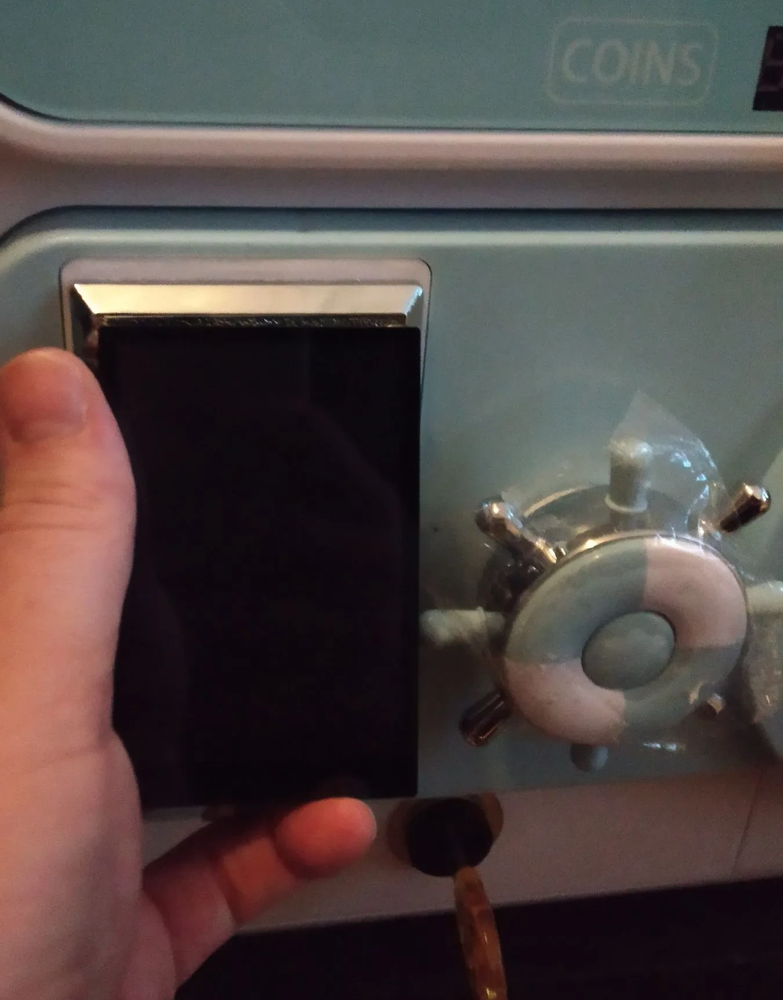

# Chapter 01: Gravitational Stabilization, Banking Wells, & Quantum Social Physics

## 1.1 Quantum Social Physics (QSP) Formalism & Superposition Mechanics

Traditional blockchain architectures model decentralized systems as classical, deterministic, monolithic state machines. The **Sovereign Stack** introduces **Quantum Social Physics (QSP)**, framing network state evolution as a thermodynamic and quantum-mechanical system governed by human sociological intent.

Rather than modeling a blockchain as a singular static ledger state $T$, QSP represents the state of a sovereign network as a state vector $|\Psi(t)\rangle$ inside a Hilbert space $\mathcal{H}$, expressing a superposition of all candidate transactions, financial intent trajectories, and sociological requirements inside the mempool:

$$i\hbar \frac{\partial}{\partial t} |\Psi(t)\rangle = \hat{H}_{\text{coord}} |\Psi(t)\rangle$$

Where $\hat{H}_{\text{coord}}$ is the **Coordination Hamiltonian**, encapsulating the kinetic economic energy of transaction velocity and the potential energy of regulatory and legal compliance constraints. Block finalization acts as a quantum measurement event, collapsing $|\Psi(t)\rangle$ into a deterministic, observable block header state $S_{n+1}$.


*Figure 1.1: Physical NFC Social Badge embedding hardware-attested identity key roots.*

---

## 1.2 Gherkin Intent Specifications & AI Agent Superposition Emulation

Human sociological intent is expressed in structured, machine-interpretable **Gherkin Intent Specifications** (`Given / When / Then` `.feature` definitions).

```text
+-----------------------------------------------------------------------------------+
|               Gherkin Intent Superposition & AI Emulation Pipeline                |
+-----------------------------------------------------------------------------------+
| 1. Sociological Intent Definition (Gherkin Feature):                              |
|    Scenario: Automated Financial Liquidity Rebalancing                            |
|      Given a regional mesh partition in Manifold A                                |
|      When institutional capital gravity $G_i$ exceeds threshold                   |
|      Then execute atomic cross-manifold settlement via EURe                       |
|                                                                                   |
| 2. Quantum Superposition State Vector Expansion:                                  |
|    $|\Psi(t)\rangle = \sum_i c_i | \text{Gherkin\_Intent}_i \rangle$            |
|                                                                                   |
| 3. AI Agent Superposition Emulation (Shadow / QEMU / `swTPM`):                    |
|    - Autonomous Agentic Auditors run parallel discrete-event simulations.         |
|    - Evaluates probability amplitudes $|c_i|^2$ across all candidate outcomes.    |
|    - Optimizes financial operator trading routes & risk parameters in real-time.  |
|                                                                                   |
| 4. Measurement & State Collapse:                                                  |
|    - Optimal intent trajectory collapses into finalized block header $S_{n+1}$.    |
+-----------------------------------------------------------------------------------+
```

### 1.2.1 Mathematical State Vector Expansion
Let a set of human sociological intents and trading strategy routes be formalized as orthogonal basis states $\{ |\phi_1\rangle, |\phi_2\rangle, \dots, |\phi_k\rangle \}$ derived from Gherkin `.feature` specifications. The un-collapsed mempool superposition $|\Psi(t)\rangle$ is:

$$|\Psi(t)\rangle = \sum_{i=1}^{k} c_i(t) |\phi_i\rangle \quad \text{where } \sum_{i=1}^{k} |c_i(t)|^2 = 1$$

Where $|c_i(t)|^2$ represents the probability density of intent path $|\phi_i\rangle$ achieving optimal execution.

### 1.2.2 AI Agent Realistic Emulation Engine
To optimize financial operator strategies, risk exposures, and high-frequency trading arbitrage before on-chain commitment, autonomous **AI Agentic Auditors** execute parallel discrete-event simulations (using QEMU, the `Shadow` discrete-event network simulator, and `swTPM` hardware emulators):

- **Probability Amplitude Exploration:** AI agents run thousands of parallel scenario branches, testing how market volatility, network partitioning, or liquidity drops impact each intent trajectory $|\phi_i\rangle$.
- **Financial Operator Optimization:** The emulation engine outputs deterministic probability distributions, allowing financial relayers and trading solvers to select optimal cross-manifold paths with minimal slippage and zero counterparty risk.

---

## 1.3 The Thermodynamics of Gravitational Stabilization ($G_i$)

As monolithic base layers (e.g. Ethereum) mature, institutional capital functions as a stabilizing **Gravitational Mass**. Institutional capital introduces an **Institutional Gravitational Constant ($G_i$)** that deforms the topological metric tensor $g_{\mu\nu}$ of the transaction space.

### 1.3.1 Formal Derivation of Network Stability ($\mathcal{S}$)
Let $E_{\text{comp}}$ be the potential energy of compliant institutional settlement, and $E_{\text{spec}}$ be the kinetic energy of speculative arbitrage. The overall topological stability $\mathcal{S}$ of a network is defined by the partial derivative:

$$\mathcal{S} = \frac{\partial E_{\text{comp}}}{\partial G_i} - \frac{\partial E_{\text{spec}}}{\partial G_i}$$

When institutional density reaches critical threshold $G_i \ge G_{\text{critical}}$, $\frac{\partial E_{\text{spec}}}{\partial G_i} \to 0$ and $\mathcal{S} > 0$, forming a **Banking Well**. The Sovereign Stack does not resist this stabilization. It leverages Banking Wells as dense, low-entropy ground states for global settlement while routing high-velocity execution to independent edge sector manifolds.

---

## 1.4 Topological Pathologies of Monolithic Rails

Monolithic chains suffer from three structural pathologies when forced to process both institutional settlement and high-velocity edge coordination:

1. **Klein Bottle Architectures (Self-Referential Sclerosis):** Economic yields backed exclusively by endogenous token emissions create non-orientable topological manifolds where energy flows infinitely without real-world economic output ($\oint_{\partial \mathcal{M}} \vec{J}_{\text{real}} \cdot d\vec{A} = 0$).
2. **Topological Jamming:** System latency approaches infinity ($\lim_{J(\omega) \to J_c} \tau_{\text{latency}} = \infty$) as incoming intent volume saturates legacy token-holder cartel lock limits.

---

## 1.5 Physicalized Based Rollup Nodes: The Gachapon Machine Architecture

To bypass cloud-hosted sequencer centralization and escape topological jamming, `sovereign-reth` executes directly on bare-metal **Physicalized Based Rollup Nodes** (Gachapon machines).


*Figure 1.2: Hardware-attested physical Based Rollup Node (Gachapon Machine) running `sovereign-reth`.*

- **Hardware Execution:** Executes `sovereign-reth` stateless witness building directly in RAM.
- **Physical NFC Cash Integration:** Interfaced over ISO/IEC 18013-5 NFC discs (Wahfare discs) to trigger instant microblock dispensing and DAO revenue splits.

---

## Technical Mapping to `sovereign-reth`

- **Stateless Validator / Sequencer Engine:** Implemented in [`crates/consensus/src/stateless.rs`](file:///home/citrullin/git/sovereign-reth/crates/consensus/src/stateless.rs).
- **Physical NFC Cash & Auth Integration:** Implemented in [`crates/identity/src/zkp_auth.rs`](file:///home/citrullin/git/sovereign-reth/crates/identity/src/zkp_auth.rs).
- **Gherkin Verification Framework:** Implemented in [`docs/architecture/verification/53_agentic_protocol_auditor.md`](file:///home/citrullin/git/sovereign_stack_vision/docs/architecture/verification/53_agentic_protocol_auditor.md).
