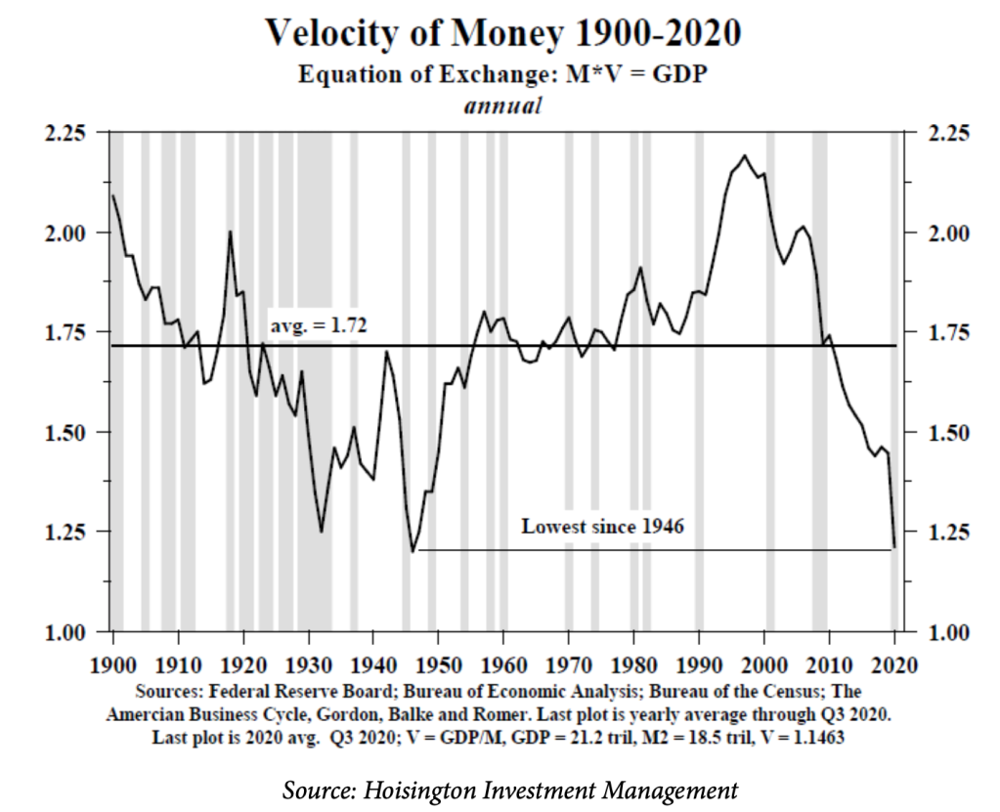
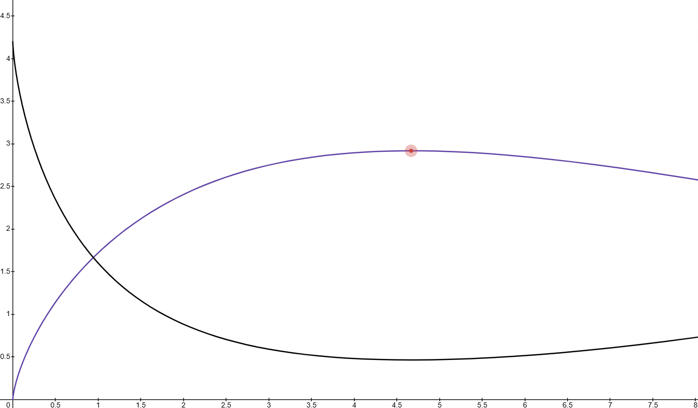

# Chapter 02: Velocity Economics, Solow-Minsky Growth, & Fisher Circuit Breakers

## 2.1 The Velocity Engine ($MV = PQ$)

Traditional Web3 tokenomics optimize for static hoarding ("HODLing"), locking liquidity inside zero-productivity staking contracts. The Sovereign Stack rejects static rent-seeking, designing economic manifolds around **Velocity Economics**, where value creation is driven by the rapid circulation of capital grounded in real-world physical output.

Following the Fisher Equation of Exchange:

$$M \cdot V = P \cdot Q$$

Where:
- $M$ is the effective circulating monetary supply (Stablecoins, EURe, e-CNY, Manifold tokens).
- $V$ is the transactional velocity of capital across the manifold per unit time ($V = \frac{\text{Total Volume}}{M}$).
- $P$ is the average price index of goods, compute services, and bandwidth.
- $Q$ is the real-world physical and industrial output verified by **IoT Heartbeat Oracles** and **Sovereign Point-of-Sale Nodes**.


*Figure 2.1: Macroeconomic velocity of money cycles illustrating systemic collapse under zero-velocity financial stagnation.*

---

## 2.2 The Solow-Minsky Productivity Function

In pure financialized systems, increasing monetary velocity past a critical threshold triggers systemic instability, a phenomenon described by Hyman Minsky's Financial Instability Hypothesis. We model real manifold productivity $Q(V)$ using a combined **Solow-Minsky Growth Curve**:

$$Q(V) = k \cdot V^\alpha \cdot e^{-\delta V}$$


*Figure 2.2: Solow-Minsky mathematical curve showing optimal velocity $V_{\text{opt}}$ peak and Minsky entropic decay region.*

### 2.2.1 Parameter Definitions & Derivation
- $k > 0$: Baseline technological efficiency constant of the manifold execution engine (`sovereign-reth`).
- $\alpha \in (0, 1)$: Solow elastic exponent representing network network-effect returns.
- $\delta > 0$: Minsky entropic decay parameter, capturing systemic leverage risks and speculative state bloat.

### 2.2.2 Optimal Monetary Velocity ($V_{\text{opt}}$)
To find the exact transactional velocity $V_{\text{opt}}$ that maximizes real economic output $Q(V)$, we compute the first derivative with respect to velocity and set it to zero:

$$\frac{dQ}{dV} = k \left( \alpha V^{\alpha-1} e^{-\delta V} - \delta V^\alpha e^{-\delta V} \right) = 0$$

$$\alpha V^{\alpha-1} = \delta V^\alpha \implies V_{\text{opt}} = \frac{\alpha}{\delta}$$

---

## 2.3 Algorithmic Fisher Circuit Breakers

When speculative hyper-velocity forces $V > V_{\text{opt}}$, derivative productivity becomes negative ($\frac{dQ}{dV} < 0$), signaling that capital velocity is degrading real network utility through gas congestion and state bloat.

```text
+-----------------------------------------------------------------------------------+
|                  Algorithmic Fisher Circuit Breaker State Machine                 |
+-----------------------------------------------------------------------------------+
| 1. Real-Time Velocity Monitoring:                                                 |
|    - Heartbeat Oracles stream telemetry $Q_{\text{measured}}$                      |
|    - Sequencer calculates instantaneous velocity $V_{\text{inst}} = \frac{\text{Volume}}{M}$|
|                                                                                   |
| 2. Threshold Check ($\frac{dQ}{dV} < 0$):                                         |
|    If $V_{\text{inst}} > \frac{\alpha}{\delta}$:                                  |
|      -> Trigger Dynamic Fee Multiplier $\gamma = \exp\left(\beta (V_{\text{inst}} - V_{\text{opt}})\right)$|
|      -> Burn non-productive gas proceeds                                          |
|      -> Pause automated minting of manifold yield tokens                         |
|                                                                                   |
| 3. Equilibrium Recovery:                                                          |
|    Velocity cools down back to $V \le V_{\text{opt}}$, restoring maximum output $Q_{\text{max}}$.|
+-----------------------------------------------------------------------------------+
```

---

## 2.4 Solow-Minsky Differential Rate Equations

The continuous time-evolution of manifold capital accumulation $K(t)$ and debt fragility $D(t)$ follows coupled differential equations:

$$\frac{dK}{dt} = s \cdot Q(V) - \gamma_{\text{deprec}} K$$

$$\frac{dD}{dt} = r_{\text{interest}} D - \phi \left( Q(V) - K \right)$$

Where $s$ is the savings rate reinvested into physical hardware nodes (local manifold nodes, microbricks), $\gamma_{\text{deprec}}$ is hardware depreciation, $r_{\text{interest}}$ is the cross-manifold borrow rate, and $\phi$ is the debt repayment rate enforced by **MetaLeX BORG smart contracts**.

---

## Codebase Implementation in `sovereign-reth`

- **Velocity Calculation Engine:** Implemented in [`crates/consensus/src/slashing.rs`](file:///home/citrullin/git/sovereign-reth/crates/consensus/src/slashing.rs).
- **Dynamic Fee Circuit Breakers:** Implemented in [`crates/consensus/src/precompile.rs`](file:///home/citrullin/git/sovereign-reth/crates/consensus/src/precompile.rs).
