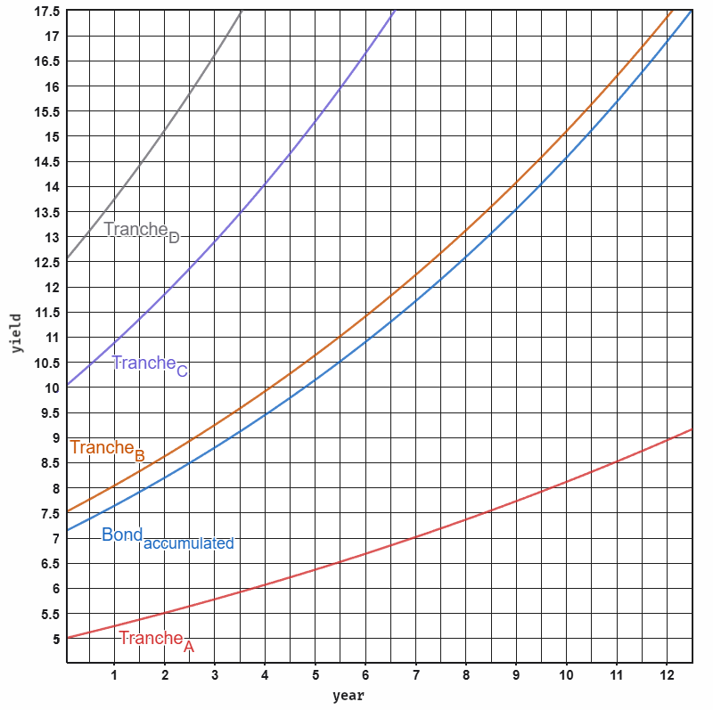

# Chapter 03: Web3 Collateralized Bonds (ERC-3475) & Systemic Valuation

## 3.1 ERC-3475 Multi-Tranche Bond Standard

Traditional Web3 lending platforms rely on primitive single-token liquidations that exacerbate cascading market crashes. The Sovereign Stack introduces **ERC-3475 Multi-Tranche Bonds** as the fundamental legal-financial primitive for melting static Real-World Assets (RWAs) into fluid, programmable collateral.

An ERC-3475 contract manages non-fungible bond collections containing multiple sub-tranches ($T_1, T_2, \dots, T_n$), where each tranche specifies distinct risk profiles, maturity dates, and interest yields:


*Figure 3.1: Risk and yield distribution across ERC-3475 bond tranches.*

---

## 3.2 Systemic Valuation & Resonant Coherence Gating ($\Phi(C_r)$)

Bond tranche valuation $b_i(t)$ over time $t$ with risk premium $r_i$, decay rate $d_i$, and baseline valuation $W_0$ is governed by the continuous valuation equation:

$$b_i(t, r_i, d_i, W_0) = W_0 \cdot e^{(r_i - d_i)t} \cdot \Phi(C_r)$$

Where $\Phi(C_r)$ is a step-function operator gated by the manifold's **Resonant Coherence ($C_r$)**:

$$\Phi(C_r) = \begin{cases} 1 & \text{if } C_r \ge C_{\text{threshold}} \\ 0 & \text{if } C_r < C_{\text{threshold}} \text{ (Yield Frozen / Circuit Breaker)} \end{cases}$$

### 3.2.1 Resonant Coherence Formalism ($C_r$)
Resonant Coherence measures the vector alignment between individual operator intents ($\hat{V}_{\text{intent}}$) and collective network topological frequency ($\vec{V}_{\text{collective}}$):

$$C_r = \frac{|\vec{V}_{\text{collective}} \cdot \hat{V}_{\text{intent}}|}{|\vec{V}_{\text{collective}}|}$$

If an operator or cartel attempts governance extraction or protocol manipulation, $C_r$ drops below $C_{\text{threshold}}$, instantly freezing ERC-3475 tranche yield payouts ($\Phi(C_r) \to 0$) until topological resonance is restored.

---

## 3.3 Collateral Meltdown Primitive

Static physical assets (manufacturing plants, real estate, hardware fleets) suffer from structural liquidity sclerosis. MetaLeX BORG contracts execute an automated **Collateral Meltdown**:

```text
  [ Physical Asset Crystal ] === (Legal BORG Wrapper) ==> [ ERC-3475 Multi-Tranche Contract ]
                                                                       |
                                         +-----------------------------+-----------------------------+
                                         |                                                           |
                                         v                                                           v
                              [ Senior Liquidity Pool ]                                   [ DSLA Heartbeat Oracle ]
                           (Instant Commercial Paper)                                   (Monitors Physical Health)
```

1. **Asset Appraisal & SMT Commitment:** The asset's legal registration and physical audit telemetry are hashed into a Sparse Merkle Tree (SMT).
2. **Tranche Issuance:** The BORG contract mints ERC-3475 bond tokens. Senior tranches provide instant operational working capital. Equity tranches absorb local operational risks.
3. **Automated Debt Service:** Heartbeat Oracles stream real-world productivity telemetry ($Q$), automatically executing tranche coupon payouts directly from operational revenue streams.

---

## Codebase Implementation in `sovereign-reth`

- **ERC-3475 Bond Precompile Handler:** Implemented in [`crates/consensus/src/metalex.rs`](file:///home/citrullin/git/sovereign-reth/crates/consensus/src/metalex.rs).
- **Resonant Coherence Verification:** Implemented in [`crates/consensus/src/registry.rs`](file:///home/citrullin/git/sovereign-reth/crates/consensus/src/registry.rs).
