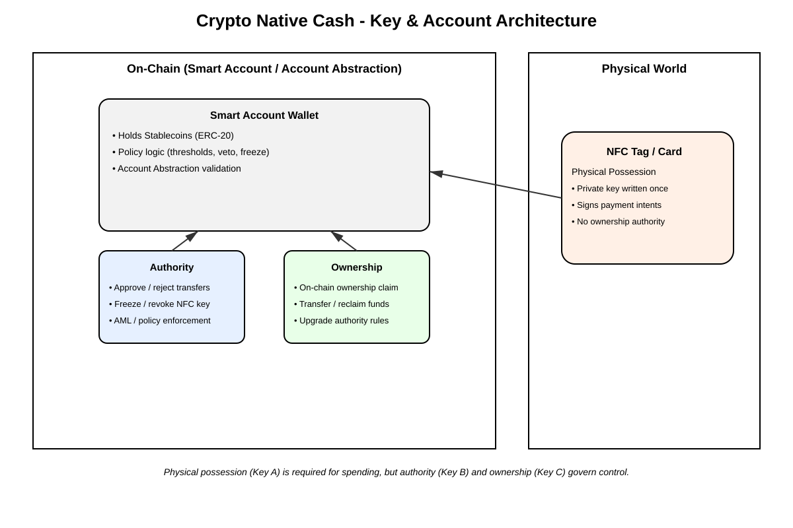
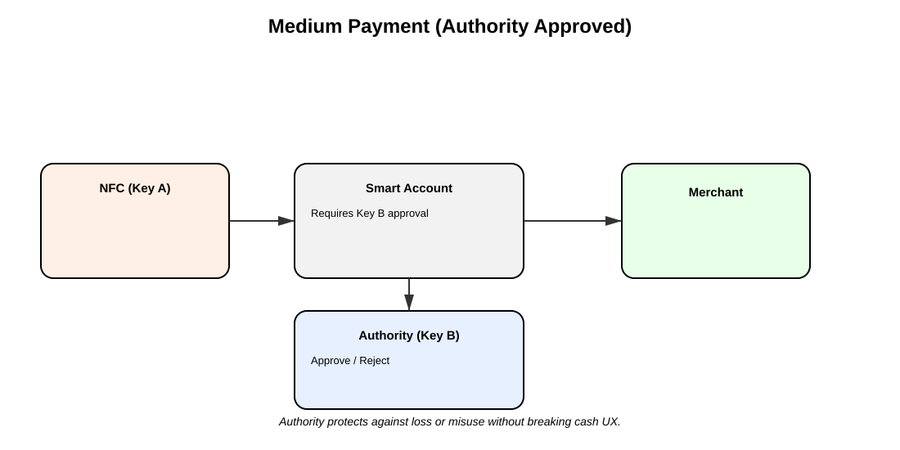
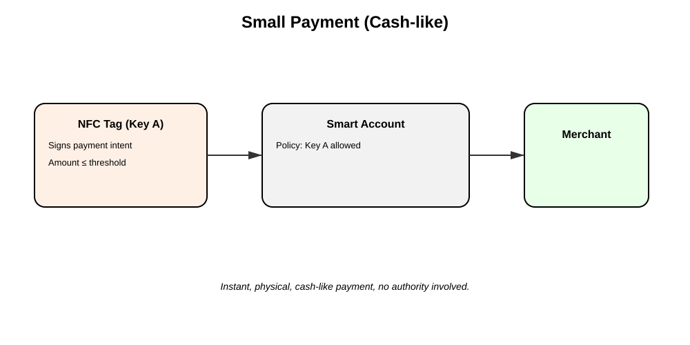
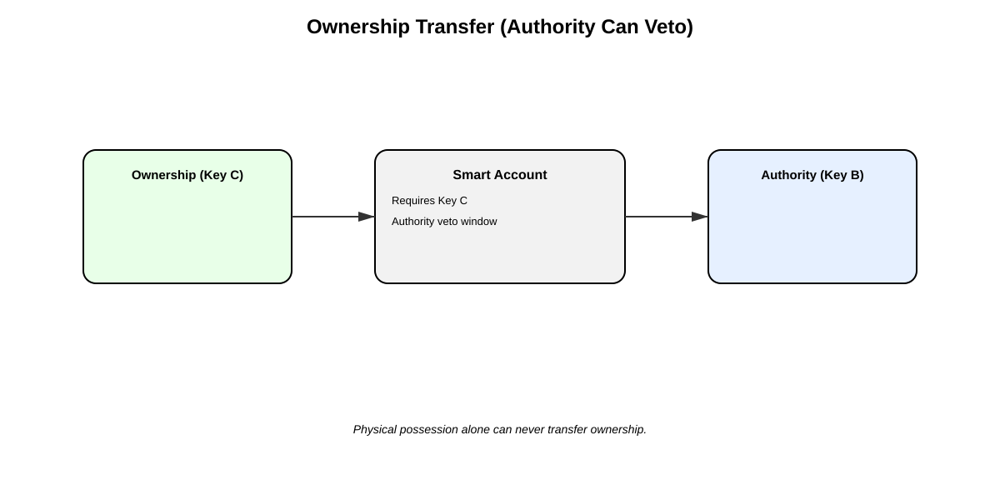

# Chapter 13: Crypto-Native Cash, 3-Factor Sovereign Auth, & Offline NFC Protocol

## 13.1 3-Factor Sovereign Auth Architecture (3FSA)

Centralized identity providers (Google, Web2 OAuth) and vulnerable single-key seed phrases fail to provide resilient security for physical edge operators. The Sovereign Stack enforces **3-Factor Sovereign Auth (3FSA)**, requiring three distinct cryptographic authentication factors before granting root control:


*Figure 13.1: 3-Factor Smart Account key management and multi-authority structure.*


*Figure 13.2: Physical NFC Wahfare Disc (Tiny Disc) used for bearer hardware authentication.*

---

## 13.2 ISO/IEC 18013-5 Offline Bearer Cash Protocol

In physical retail and disaster recovery environments, edge nodes must process payments when completely disconnected from WireGuard mesh backbones or internet connectivity.

The **Crypto-Native Cash Protocol** implements **ISO/IEC 18013-5 (mDL)** offline proximity transfer mechanics over NFC (NTAG215) and Bluetooth Low Energy (BLE).


*Figure 13.3: Cryptographic authority pipeline for offline bearer cash minting.*


*Figure 13.4: Offline proximity tap transfer protocol between NFC bearer discs.*


*Figure 13.5: Final on-chain ownership reconciliation and settlement flow.*

```text
 0                   1                   2                   3
 0 1 2 3 4 5 6 7 8 9 0 1 2 3 4 5 6 7 8 9 0 1 2 3 4 5 6 7 8 9 0 1
+-+-+-+-+-+-+-+-+-+-+-+-+-+-+-+-+-+-+-+-+-+-+-+-+-+-+-+-+-+-+-+-+
| Magic (0xCC)  | Protocol (0x01)|       Payload Length         |
+-+-+-+-+-+-+-+-+-+-+-+-+-+-+-+-+-+-+-+-+-+-+-+-+-+-+-+-+-+-+-+-+
|                       Offline Token ID                        |
|                     (32-byte Blinded Hash)                    |
+-+-+-+-+-+-+-+-+-+-+-+-+-+-+-+-+-+-+-+-+-+-+-+-+-+-+-+-+-+-+-+-+
|                       Denomination Value                      |
|                  (e.g., 5.00 EURe / 50.00 CNY)                |
+-+-+-+-+-+-+-+-+-+-+-+-+-+-+-+-+-+-+-+-+-+-+-+-+-+-+-+-+-+-+-+-+
|                                                               |
+                     Ephemeral Schnorr Signature               +
|                             (64 bytes)                        |
+-+-+-+-+-+-+-+-+-+-+-+-+-+-+-+-+-+-+-+-+-+-+-+-+-+-+-+-+-+-+-+-+
```

---

## 13.3 Double-Spending Resistance via Blinded Ephemeral Signatures

To prevent an offline user from cloning an NFC disc payload and spending the same offline bearer cash token at two disconnected Gachapon terminals:

1. **Blinded Nonce Derivation:** The physical NTAG215 secure element generates an ephemeral keypair $(r, R = r \cdot G)$ for every NFC tap attempt.
2. **Challenge Exchange:** The terminal challenges the disc with a 32-byte random salt $c = \text{SHA256}(R \parallel \text{TerminalID} \parallel \text{Timestamp})$.
3. **Hardware Signature Response:** The disc emits signature response $s = r + c \cdot x \pmod q$.
4. **Offline Audit Log Assertion:** The merchant terminal verifies $s \cdot G \stackrel{?}{=} R + c \cdot P$. If the same key root $P$ attempts to reuse nonce $R$ across two transactions, the merchant terminal extracts the private key $x$ via linear algebra:
   $$x = \frac{s_1 - s_2}{c_1 - c_2} \pmod q$$
   Instantly revealing the double-spender's identity and slashing their network security bond automatically upon reconnection.

---

## Codebase Implementation in `sovereign-reth` & Hardware

- **NFC Auth & ZKP Verification:** Implemented in [`crates/identity/src/zkp_auth.rs`](file:///home/citrullin/git/sovereign-reth/crates/identity/src/zkp_auth.rs).
- **Physical NFC Wahfare Disc Firmware:** Implemented in [`hardware/tiny-pay/`](file:///home/citrullin/git/sovereign_stack_vision/hardware/tiny-pay/).
