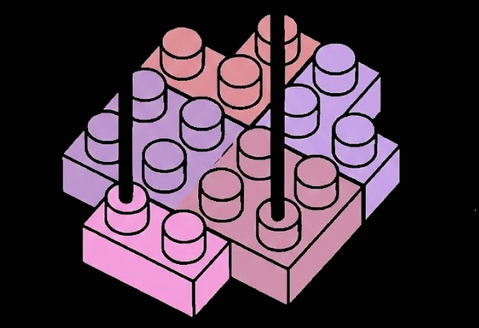
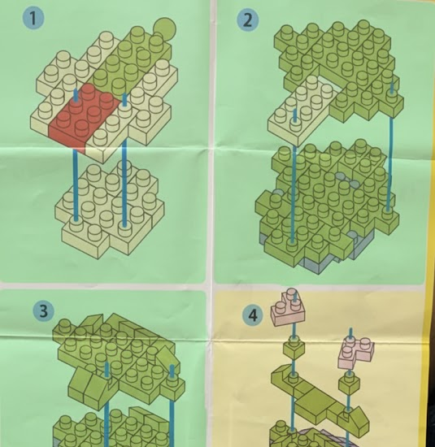
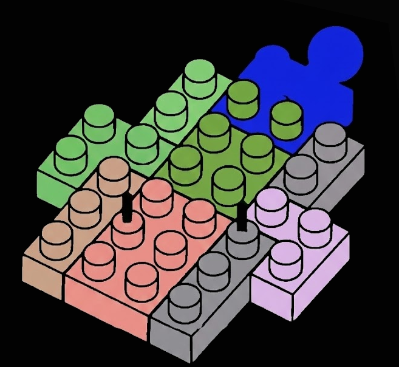

# Chapter 14: DSLA, Heartbeat Oracles, SIL-3 Interlocks, & Edge AI Vision

## 14.1 Decentralized Service Level Agreements (DSLA)

In sovereign industrial infrastructure, subjective "trust" and post-facto legal lawsuits are replaced by verifiable physical consequence. A **Decentralized Service Level Agreement (DSLA)** moves operational liability into smart contract penalty matrices executed directly on hardware nodes.


*Figure 14.1: Web of Things Industrial Hardware Network & DAO Topology.*

```text
+-----------------------------------------------------------------------------------+
|                     DSLA & SIL-3 Actuator Interlock Architecture                  |
+-----------------------------------------------------------------------------------+
| [ Industrial Hardware Node ] (Solar Inverter / PLC / Assembly Machine)            |
|         |                                                                         |
|         v (Continuous 100ms Heartbeat Packet)                                     |
| [ TEE / SE Heartbeat Oracle ] ---> Signed Telemetry Proof ($MV = PQ$)             |
|                                                |                                  |
|                                                v                                  |
|                                    [ DSLA Penalty Contract ]                      |
|                                                |                                  |
|         +--------------------------------------+----------------------------------+
|         | (Normal Uptime)                                                       | (DSLA Violation / Default)
|         v                                                                       v
| [ Yield Release ]                                              [ SIL-3 Hardware Interlock ]
|                                                                (Safe Torque Off - STO Relay)
+-----------------------------------------------------------------------------------+
```

---

## 14.2 Heartbeat Oracles & Silicon Root-of-Trust

A **Heartbeat Oracle** is a firmware module running within a Trusted Execution Environment (TEE) or Secure Element (SE) embedded inside industrial machinery (e.g. AI NPU Gateway, PLC, solar inverter, local manifold node).

### 14.2.1 Real-World Productivity Telemetry ($MV = PQ$)
Every 100ms, the Heartbeat Oracle constructs a signed telemetry packet:

$$\text{Packet} = \text{Sign}_{K_{\text{SE}}}\left( \text{Timestamp} \parallel \text{RPM} \parallel \text{Torque} \parallel \text{KW\_Output} \parallel \text{Units\_Produced} \right)$$

The telemetry data proves real-world industrial output ($Q$), satisfying the Fisher Equation of Exchange ($MV = PQ$). If internal voltage sensors detect physical casing tampering or environmental anomalies, the Secure Element self-erases its private key root, halting valid heartbeat signatures.

---

## 14.3 SIL-3 Hardware Interlocks: The "Safe Torque Off" (STO) Kill-Switch

Soft contract logic can contain software bugs. Actuators controlling physical power mains or gas valves are decoupled by a **SIL-3 Hardware Interlock** (Safety Instrumented System - IEC 61508):

1. **Hardware Power Relay (Safe Torque Off - STO):** The Actuator Oracle is hard-wired into the machinery's power circuit main.
2. **Deterministic Contract Trigger:** If a facility defaults on security stakes or breaches environmental DSLA thresholds, the DSLA emits a signed `Cutoff` command.
3. **Continuity Heartbeat & Timeout:** The Actuator Oracle requires a signed heartbeat pulse every 100ms. If network partitions or software deadlocks exceed **200ms**, the SIL-3 hardware interlock mechanically drops the STO relay, severing power main connections safely.

---

## 14.4 Edge AI Vision Transformers (Microblock Assembly Parsing)

For edge assembly lines and local vision systems running MobileViT / YOLO vision models on local NPUs:


*Figure 14.2: Layer 0 Ground Truth origin placement for assembly vision parsing.*


*Figure 14.3: 3D Microblock layer segmentation step resolution.*


*Figure 14.4: Automated error identification and offset correction during physical assembly.*

```text
Center Point of Microblock Step 1 Assembly := Global Origin (0,0,0)

Offset Solver Differential Vector:
  Offset_global = Position_marker(previous) - Position_marker(current)
```

1. **Layer 0 Ground Truth Alignment:** The center of microblock assembly Step 1 is established as Global Origin $(0,0,0)$.
2. **Relative Offset Solver:** Quantized MobileViT running on local NPUs (ARM Cortex / NPU) calculates 3D bounding offsets:
   $$\vec{\Delta}_{\text{offset}} = \begin{bmatrix} x_{\text{curr}} - x_{\text{target}} \\ y_{\text{curr}} - y_{\text{target}} \\ z_{\text{curr}} - z_{\text{target}} \end{bmatrix}$$
3. **Local Attestation:** If $\left\| \vec{\Delta}_{\text{offset}} \right\|_2 < 0.5\text{mm}$, the NPU signs a physical assembly verification proof attached to the Heartbeat Oracle packet.

---

## Codebase Implementation in `sovereign-reth`

- **DSLA Slashing Engine:** Implemented in [`crates/consensus/src/slashing.rs`](file:///home/citrullin/git/sovereign-reth/crates/consensus/src/slashing.rs).
- **MetaLeX Borg Actuator Relays:** Implemented in [`crates/consensus/src/metalex.rs`](file:///home/citrullin/git/sovereign-reth/crates/consensus/src/metalex.rs).
